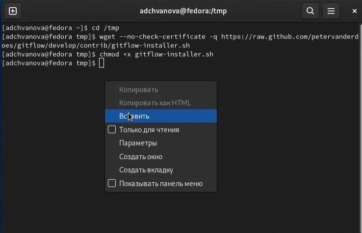
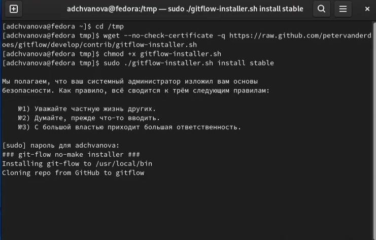
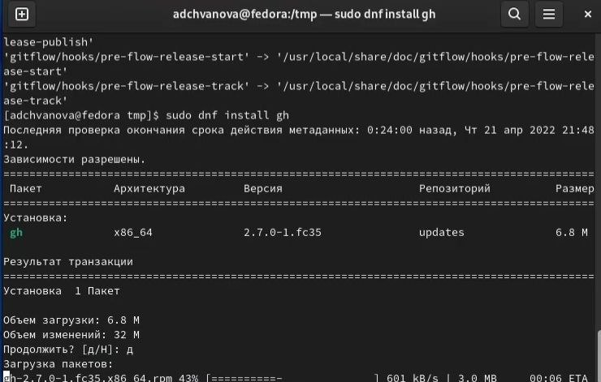
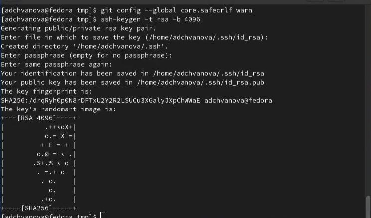
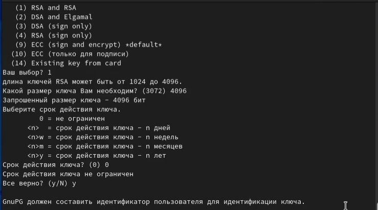
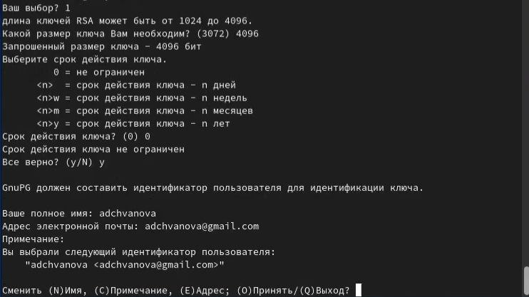
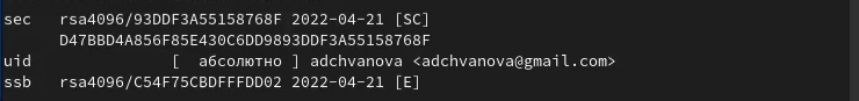
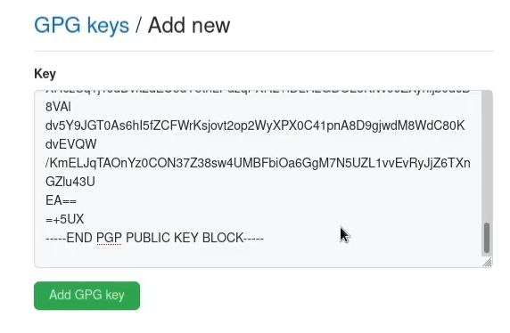
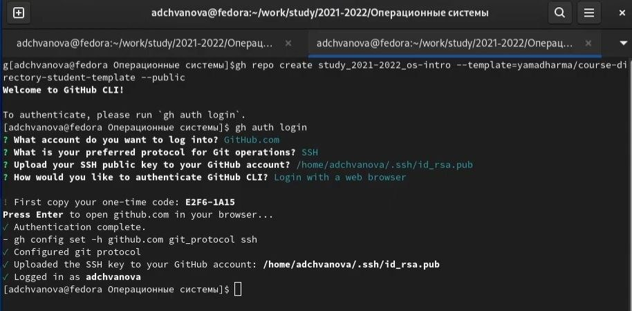
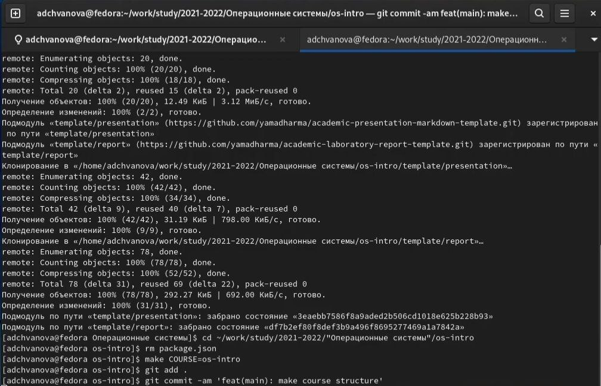

---
## Front matter
title: отчёт по лабораторной работе №2"
subtitle: "Управление версиями"
author: "Чванова Ангелина Дмитриевна"

## Generic otions
lang: ru-RU
toc-title: "Содержание"

## Bibliography
bibliography: bib/cite.bib
csl: pandoc/csl/gost-r-7-0-5-2008-numeric.csl

## Pdf output format
toc: true # Table of contents
toc-depth: 2
lof: true # List of figures
#lot: true # List of tables
fontsize: 12pt
linestretch: 1.5
papersize: a4
documentclass: scrreprt
## I18n polyglossia
polyglossia-lang:
  name: russian
  options:
	- spelling=modern
	- babelshorthands=true
polyglossia-otherlangs:
  name: english
## I18n babel
babel-lang: russian
babel-otherlangs: english
## Fonts
mainfont: PT Serif
romanfont: PT Serif
sansfont: PT Sans
monofont: PT Mono
mainfontoptions: Ligatures=TeX
romanfontoptions: Ligatures=TeX
sansfontoptions: Ligatures=TeX,Scale=MatchLowercase
monofontoptions: Scale=MatchLowercase,Scale=0.9
## Biblatex
biblatex: true
biblio-style: "gost-numeric"
biblatexoptions:
  - parentracker=true
  - backend=biber
  - hyperref=auto
  - language=auto
  - autolang=other*
  - citestyle=gost-numeric
## Pandoc-crossref LaTeX customization
figureTitle: "Рис."
tableTitle: "Таблица"
listingTitle: "Листинг"
lofTitle: "Список иллюстраций"
lotTitle: "Список таблиц"
lolTitle: "Листинги"
## Misc options
indent: true
header-includes:
  - \usepackage{indentfirst}
  - \usepackage{float} # keep figures where there are in the text
  - \floatplacement{figure}{H} # keep figures where there are in the text
---

# Цель работы

 изучить идеологию и применение средств контроля версий,  а также освоить умения по работе с git.

# Задание

– Создать базовую конфигурацию для работы с git.
– Создать ключ SSH.
– Создать ключ PGP.
– Настроить подписи git.
– Зарегистрироваться на Github.
– Создать локальный каталог для выполнения заданий по предмету

# Теоретическое введение
## Системы контроля версий. Общие понятия
Системы контроля версий (Version Control System, VCS) применяются при работе нескольких человек над одним проектом. Обычно основное дерево проекта хранится в локальном
или удалённом репозитории, к которому настроен доступ для участников проекта. При
внесении изменений в содержание проекта система контроля версий позволяет их
фиксировать, совмещать изменения, произведённые разными участниками проекта,
производить откат к любой более ранней версии проекта, если это требуется.
В классических системах контроля версий используется централизованная модель,
предполагающая наличие единого репозитория для хранения файлов. Выполнение большинства функций по управлению версиями осуществляется специальным сервером.
Участник проекта (пользователь) перед началом работы посредством определённых
команд получает нужную ему версию файлов. После внесения изменений, пользователь
размещает новую версию в хранилище. При этом предыдущие версии не удаляются
из центрального хранилища и к ним можно вернуться в любой момент. Сервер может
сохранять не полную версию изменённых файлов, а производить так называемую дельтакомпрессию — сохранять только изменения между последовательными версиями, что позволяет уменьшить объём хранимых данных

 В табл. [-@tbl:std-dir] приведено краткое описание стандартных каталогов Unix.

: Описание некоторых каталогов файловой системы GNU Linux {#tbl:std-dir}

| Имя каталога | Описание каталога                                                                                                          |
|--------------|----------------------------------------------------------------------------------------------------------------------------|
| `/`          | Корневая директория, содержащая всю файловую                                                                               |
| `/bin `      | Основные системные утилиты, необходимые как в однопользовательском режиме, так и при обычной работе всем пользователям     |
| `/etc`       | Общесистемные конфигурационные файлы и файлы конфигурации установленных программ                                           |
| `/home`      | Содержит домашние директории пользователей, которые, в свою очередь, содержат персональные настройки и данные пользователя |
| `/media`     | Точки монтирования для сменных носителей                                                                                   |
| `/root`      | Домашняя директория пользователя  `root`                                                                                   |
| `/tmp`       | Временные файлы                                                                                                            |
| `/usr`       | Вторичная иерархия для данных пользователя                                                                                 |

Более подробно об Unix см. в [@gnu-doc:bash;@newham:2005:bash;@zarrelli:2017:bash;@robbins:2013:bash;@tannenbaum:arch-pc:ru;@tannenbaum:modern-os:ru].

# Выполнение лабораторной работы

1.Установка git-flow в Fedora Linux 

Установка проходила вручную с помощью данных команд(рис. [-@fig:001] -[-@fig:002] )

 
 cd /tmp

 wget --no-check-certificate -q https://raw.github.com/petervanderdoes ⌋

↪ /gitflow/develop/contrib/gitflow-installer.sh
 
chmod +x gitflow-installer.sh

sudo ./gitflow-installer.sh install stable 

{ #fig:001 width=70% }

{ #fig:002 width=70% }

2.Установка gh в Fedora Linux с помощью команды

 sudo dnf install gh(рис[-@fig:003])
 
{ #fig:003 width=70% }

3.Базовая настройка git(рис [-@fig:004]-[-@fig:005])

– Задаем имя и email владельца репозитория с помощью команд:

git config --global user.name "Name Surname"

 git config --global user.email "work@mail"

Настройка utf-8 в выводе сообщений git:

 git config --global core.quotepath false

{ #fig:004 width=70% }

Настройте верификацию и подписание коммитов git.

– Зададаем имя начальной ветки (будем называть её master):

 git config --global init.defaultBranch master

– Параметр autocrlf:

 git config --global core.autocrlf input

– Параметр safecrlf:

 git config --global core.safecrlf warn

{ #fig:005 width=70% }

4.Создание ключей ssh(рис[-@fig:006])

Ключ создавался по алгоритму rsa с размером для ключа 4096 бит:

 ssh-keygen -t rsa -b 4096

{ #fig:006 width=70% }

5.Создание ключей pgp(рис[-@fig:007]-[-@fig:008])

– Генерируем ключ

 gpg --full-generate-key

– Из предложенных опций (рис[-@fig:007]) выбираем:

– тип RSA and RSA;

– размер 4096;

– выберите срок действия; значение по умолчанию— 0 (срок действия не истекает никогда).

– GPG запросит личную информацию, которая сохранится в ключе:

– Имя (не менее 5 символов).

– Адрес электронной почты.

– При вводе email убедитесь, что он соответствует адресу, используемому на
GitHub.

– Комментарий. 

{ #fig:007 width=70% }

{ #fig:008 width=70% }

6.Добавление PGP ключа в GitHub(рис[-@fig:009],[-@fig:010],[-@fig:011])

– Выводим список ключей и копируем отпечаток приватного ключа:
 gpg --list-secret-keys --keyid-format LONG

– Формат строки (рис [-@fig:009]):

sec Алгоритм/Отпечаток_ключа Дата_создания [Флаги] [Годен_до] ID_ключа

{ #fig:009 width=70% }

– Копирование сгенерированного PGP ключа в буфер обмена(рис[-@fig:010]):

 gpg --armor --export <PGP Fingerprint> | xclip -sel clip

{ #fig:010 width=70% }

{ #fig:011 width=70% }

7.Настройка автоматических подписей коммитов git (рис [-@fig:012])

– Используя введёный email, указываем Git применять его при подписи коммитов:

git config --global user.signingkey <PGP Fingerprint>

 git config --global commit.gpgsign true

git config --global gpg.program $(which gpg2)
{ #fig:012 width=70% }

8.Настройка gh(рис[-@fig:013])

–команда для авторизации

 gh auth login

 { #fig:013 width=70% }

 9.Сознание репозитория курса на основе шаблона и настройка каталога курса (рис [-@fig:014])

–создание шаблона рабочего пространства.

 mkdir -p ~/work/study/2021-2022/"Операционные системы"

cd ~/work/study/2021-2022/"Операционные системы"

 gh repo create study_2021-2022_os-intro

↪ --template=yamadharma/course-directory-student-template --public

 git clone --recursive

↪ git@github.com:<owner>/study_2021-2022_os-intro.git os-intro

– Переход в каталог курса:

cd ~/work/study/2021-2022/"Операционные системы"/os-intro

– Удаление лишних файлов:

 rm package.json

– Создайте необходимые каталоги:

make COURSE=os-intro

– Отправьте файлы на сервер:

 git add .

 git commit -am 'feat(main): make course structure'

 git push

{ #fig:014 width=70% }

# Выводы

 были изучены некоторые команды в консоли для работы с GitHub и применены средства контроля версий, а также освоены умения по работе с git. Удалось создать репозиторий курса на основе шаблона и настроить его. Файлы были отправлены на сервер.

# Контрольные вопросы

 1.Что такое системы контроля версий (VCS) и для решения каких задач они предназначаются?
Системы контроля версий (Version Control System, VCS) применяются при работе нескольких человек над одним проектом. Обычно основное дерево проекта хранится в локальном или удалённом репозитории, к которому настроен доступ для участников проекта. При внесении изменений в содержание проекта система контроля версий позволяет их фиксировать, совмещать изменения, произведённые разными участниками проекта, производить откат к любой более ранней версии проекта, если это требуется.

2.Объясните следующие понятия VCS и их отношения: хранилище, commit, история, рабочая копия.
Хранилище – место хранения файлов. После внесения изменений, пользователь размещает новую версию в хранилище. При этом предыдущие версии не удаляются из центрального хранилища и к ним можно вернуться в любой момент. Сервер может сохранять не полную версию изменённых файлов.
Commit позволяется отправлять изменения на сервер VCS.
История — список всех изменений проекта с возможностью отката в любую точку истории.
Рабочая копия (working copy) — текущее состояние файлов проекта (любой версии), полученных из хранилища и, возможно, измененных.

3.Что представляют собой и чем отличаются централизованные и децентрализованныеVCS? Приведите примеры VCS каждого вида.
В децентрализованных системах каждый узел принимает свое собственное решение. Конечное поведение системы является совокупностью решений отдельных узлов. Обратите внимание, что нет единого объекта, который получает и отвечает на запрос.
Bitcoin. Давайте возьмем биткойны, например, потому что это самый популярный пример использования децентрализованных систем. Ни одна организация / организация не владеет сетью биткойнов. Сеть представляет собой сумму всех узлов, которые общаются друг с другом для поддержания количества биткойнов, которое есть у каждого владельца счета.
Централизованные системы — это системы, которые используют архитектуру клиент / сервер, где один или несколько клиентских узлов напрямую подключены к центральному серверу. Это наиболее часто используемый тип систем во многих организациях, где клиент отправляет запрос на сервер компании и получает ответ.
Wikipedia. Рассмотрим огромный сервер, на который мы отправляем наши запросы, и сервер отвечает запрашиваемой статьей. Предположим, мы ввели поисковый запрос «нездоровая пища» в строке поиска Википедии. Этот поисковый запрос отправляется как запрос на серверы Википедии (в основном, расположенные в штате Вирджиния, США), которые затем возвращают статьи, основанные на релевантности. В этой ситуации мы являемся клиентским узлом, серверы Википедии являются центральным сервером.

4.Опишите действия с VCS при единоличной работе с хранилищем.
Создадим локальный репозиторий. Сначала сделаем предварительную конфигурацию, указав имя и email владельца репозитория:

git config —global user.name"Имя Фамилия"

git config —global user.email"work@mail"

и настроив utf-8 в выводе сообщенийgit:

git config —global quotepath false

Для инициализации локального репозитория, расположенного, например, в каталоге ~/tutorial, необходимо ввести в командной строке:

cd

mkdir tutorial

cd tutorial

git init

5. Опишите порядок работы с общим хранилищем VCS.
Для последующей идентификации пользователя на сервере репозиториев необходимо сгенерировать пару ключей (приватный и открытый):
ssh-keygen -C"Имя Фамилия <work@mail>"

Ключи сохраняться в каталоге~/.ssh/.
Скопировав из локальной консоли ключ в буфер обмена

cat ~/.ssh/id_rsa.pub | xclip -sel clip

вставляем ключ в появившееся на сайте поле.

6. Каковы основные задачи, решаемые инструментальным средством git?
У Git две основных задачи: первая — хранить информацию о всех изменениях в вашем коде, начиная с самой первой строчки, а вторая — обеспечение удобства командной работы над кодом. А также ведение истории изменений, фиксирование изменений, совмещение версий, веток, откат к прошлым версиям.

7. Назовите и дайте краткую характеристику командам git.

git init - инициализирует локальный репозиторий

git add * или add. - добавляет файлы в репозиторий

git commit - версия фиксации

git pull - загружает текущую версию проекта

git push - отправляет измененный проект на сервер

git checkout - позволяет переключаться между ветками

git status - текущий статус проекта

git branch - просмотреть доступные ветки

git remote add - добавить удаленный репозиторий

8. Приведите примеры использования при работе с локальным и удалённым репозиториями.
Использование git с локальными репозиториями используется для добавления, например, текстового файла в локальный репозиторий 

git add file.txt

git commit –am ФАЙЛ

9. Что такое и зачем могут быть нужны ветви (branches)?
Ветви необходимы, чтобы иметь возможность "разделять" части работы и работать отдельно над каждой имплементацией. Использование ветвей дает возможность обрабатывать нововведения в основную ветвь, которая чаще всего является релизной.

10. Как и зачем можно игнорировать некоторые файлы при commit?
Игнорировать файлы при commit можно с помощью .gitignore файла.
В нем указываются пути, названия, расширения и другие идентификации
нежелательных объектов которые не будут учитываться в commit. Это
полезно для исключения как "мусорных" файлов, которые не являются
значимой частью проекта, а также конфиденциальных файлов, которые
содержат в себе приватную информацию, такую как пароли и токены.

