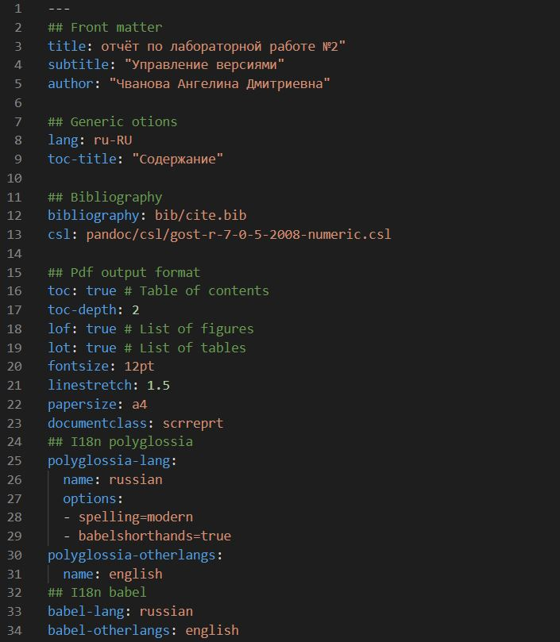
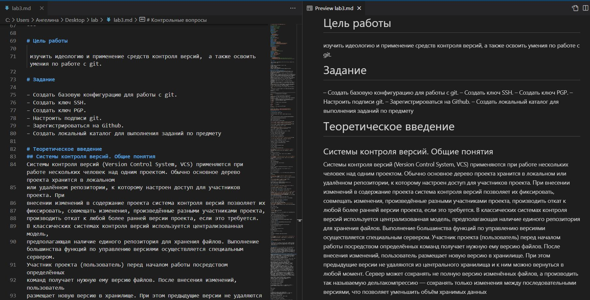
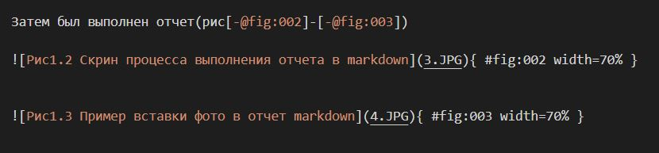
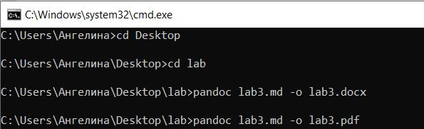
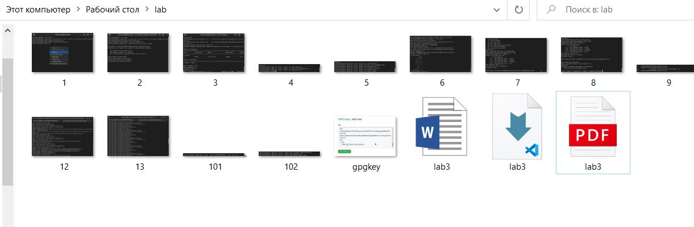

---
## Front matter
title: "Отчет по лабораторной работе 3"
subtitle: "Markdown"
author: "Чванова Ангелина Дмитриевна"

## Generic otions
lang: ru-RU
toc-title: "Содержание"

## Bibliography
bibliography: bib/cite.bib
csl: pandoc/csl/gost-r-7-0-5-2008-numeric.csl

## Pdf output format
toc: true # Table of contents
toc-depth: 2
lof: true # List of figures
#lot: true # List of tables
fontsize: 12pt
linestretch: 1.5
papersize: a4
documentclass: scrreprt
## I18n polyglossia
polyglossia-lang:
  name: russian
  options:
	- spelling=modern
	- babelshorthands=true
polyglossia-otherlangs:
  name: english
## I18n babel
babel-lang: russian
babel-otherlangs: english
## Fonts
mainfont: PT Serif
romanfont: PT Serif
sansfont: PT Sans
monofont: PT Mono
mainfontoptions: Ligatures=TeX
romanfontoptions: Ligatures=TeX
sansfontoptions: Ligatures=TeX,Scale=MatchLowercase
monofontoptions: Scale=MatchLowercase,Scale=0.9
## Biblatex
biblatex: true
biblio-style: "gost-numeric"
biblatexoptions:
  - parentracker=true
  - backend=biber
  - hyperref=auto
  - language=auto
  - autolang=other*
  - citestyle=gost-numeric
## Pandoc-crossref LaTeX customization
figureTitle: "Рис."
tableTitle: "Таблица"
listingTitle: "Листинг"
lofTitle: "Список иллюстраций"
lotTitle: "Список таблиц"
lolTitle: "Листинги"
## Misc options
indent: true
header-includes:
  - \usepackage{indentfirst}
  - \usepackage{float} # keep figures where there are in the text
  - \floatplacement{figure}{H} # keep figures where there are in the text
---

# Цель работы

Научиться оформлять отчёты с помощью легковесного языка разметки Markdown

# Задание

– Сделайте отчёт по предыдущей лабораторной работе в формате Markdown.

– В качестве отчёта просьба предоставить отчёты в 3 форматах: pdf, docx и md (в архиве,
поскольку он должен содержать скриншоты, Makefile и т.д.)

# Теоретическое введение

Чтобы создать заголовок, используйте знак ( # ).

Чтобы задать для текста полужирное начертание, заключите его в двойные звездочк.

Чтобы задать для текста курсивное начертание, заключите его в одинарные звездочки.

Чтобы задать для текста полужирное и курсивное начертание, заключите его в тройные
звездочки.

Блоки цитирования создаются с помощью символа >.

Неупорядоченный (маркированный) список можно отформатировать с помощью звездочек или тире. Также упорядоченный список можно отформатировать с помощью соответствующих цифр.

Синтаксис Markdown для встроенной ссылки состоит из части [link text] , представляющей текст гиперссылки, и части (file-name.md) – URL-адреса или имени файла,
на который дается ссылка.

Markdown поддерживает как встраивание фрагментов кода в предложение, так и их
размещение между предложениями в виде отдельных огражденных блоков. Огражденные
блоки кода — это простой способ выделить синтаксис для фрагментов кода.

Для обработки файлов в формате Markdown можно использовать Pandoc
https://pandoc.org/. Конкретно, нам понадобится программа pandoc ,
pandoc-citeproc https://github.com/jgm/pandoc/releases, pandoc-crossref
https://github.com/lierdakil/pandoc-crossref/releases.

Преобразовать файл README.md можно следующим образом:

 pandoc README.md -o README.pdf

 pandoc README.md -o README.docx

# Выполнение лабораторной работы

1. Выполнение отчёта по предыдущей лабораторной работе номер 2 в формате Markdown.(рис[-@fig:001],[-@fig:002],[-@fig:003])

Был скачен файл шаблона для отчета в markdown и запущен в Visual Studio Code.(рис[-@fig:001])

{ #fig:001 width=70% }

Затем был выполнен отчет(рис[-@fig:002]-[-@fig:003])

{ #fig:002 width=70% }

{ #fig:003 width=70% }

2. Преобразование файла из markdown в форматы pdf, docx с помощью Pandoc в консоли.(рис[-@fig:004]-[-@fig:005])

Для этого скачали Pandoc, открыли консоль,перешли в нужную папку и введи необходимые команды.

pandoc file-name.md -o file-name.pdf

pandoc file-name.md -o file-name.docx

{ #fig:004 width=70% }

{ #fig:005 width=70% }

# Выводы

Мы изучили оформление отчёты с помощью легковесного языка разметки Markdown, а также преобразование формата md в docx, pdf с помощью Pandoc.
