---
## Front matter
lang: ru-RU
title: Презентация лабораторной работы 3 Markdown
author: |
	Cvanova Angelin D
institute: |
	RUDN University, Moscow, Russian Federation
	
date: 2022

## Formatting
toc: false
slide_level: 2
theme: metropolis
header-includes: 
 - \metroset{progressbar=frametitle,sectionpage=progressbar,numbering=fraction}
 - '\makeatletter'
 - '\beamer@ignorenonframefalse'
 - '\makeatother'
aspectratio: 43
section-titles: true
---

# Лабораторная работа 4.

## Цель работы

-Приобретение практических навыков взаимодействия пользователя с системой посредством командной строки.

## # Теоретическое введение

В операционной системе типа Linux взаимодействие пользователя с системой обычно осуществляется с помощью командной строки посредством построчного ввода команд.

**Команда man.** ,  **Команда cd.** ,  **Команда pwd.** 

**Команда ls.** ,  **Команда mkdir.** , **Команда rm.**

Формат команды:

rm [-опции] [файл]

## Выполнение лабораторной работы
1.Определите полное имя вашего домашнего каталога. (рис[-@fig:001])

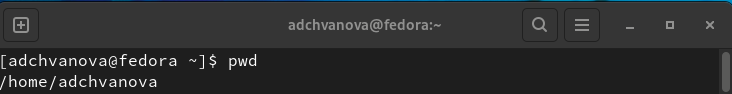{ #fig:001 width=70% }

## Выполнение лабораторной работы

2.Работа с терминалом по поиску каталогов: (рис[-@fig:002],[-@fig:003],[-@fig:004])

2.1. Перейдите в каталог /tmp.

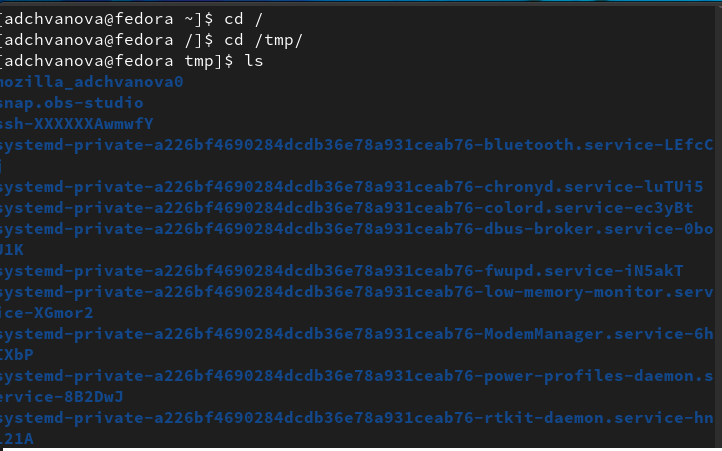{ #fig:002 width=70% }

## Выполнение лабораторной работы

2.2. Выведите на экран содержимое каталога /tmp. Для этого используйте команду ls с различными опциями.(рис[-@fig:024])

 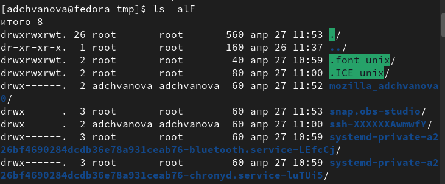{ #fig:024 width=70% }

## Выполнение лабораторной работы

2.3. Определить, есть ли в каталоге /var/spool подкаталог с именем cron.(рис[-@fig:003])

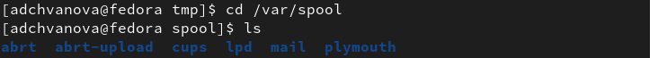{ #fig:003 width=70% }

## Выполнение лабораторной работы

2.4. Переход в  домашний каталог и вывод на экран его содержимого. Определить, кто является владельцем файлов и подкаталогов. (рис [-@fig:004])

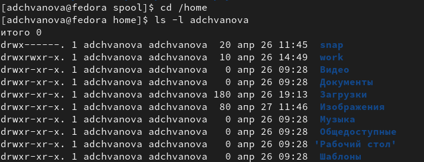{ #fig:004 width=70% }

## Выполнение лабораторной работы

3.1. В домашнем каталоге создайте новый каталог с именем newdir. В каталоге ~/newdir создайте новый каталог с именем morefun.(рис [-@fig:005])

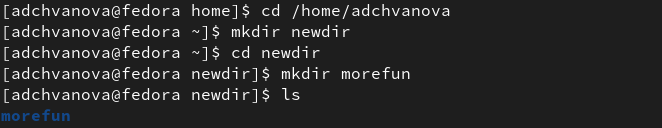{ #fig:005 width=70% }

## Выполнение лабораторной работы

3.2. В домашнем каталоге создайте одной командой три новых каталога с именами letters, memos, misk. Затем удалите эти каталоги одной командой.(рис[-@fig:006])

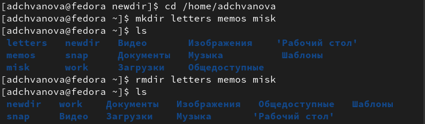{ #fig:006 width=70% }

## Выполнение лабораторной работы

3.3. Попытка удалить ранее созданный каталог ~/newdir командой rm. Проверка,был ли каталог удалён.(рис[-@fig:007])

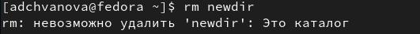{ #fig:007 width=70% }

## Выполнение лабораторной работы

3.4. Удалите каталог ~/newdir/morefun из домашнего каталога. Проверьте, был ли каталог удалён.(рис[-@fig:008])

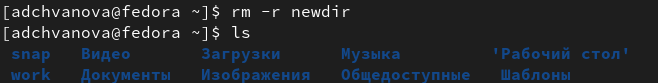{ #fig:008 width=70% }

## Выполнение лабораторной работы

4.С помощью команды man определите, какую опцию команды ls нужно использовать для просмотра содержимое не только указанного каталога, но и подкаталогов,входящих в него. (рис[-@fig:009])

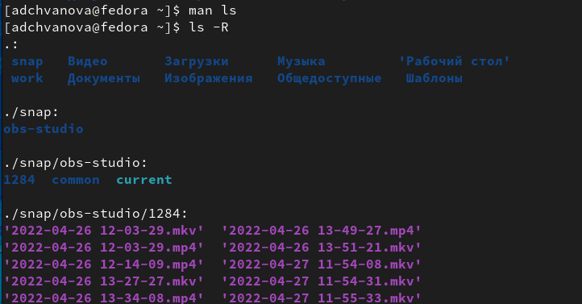{ #fig:009 width=70% }

## Выполнение лабораторной работы

5.С помощью команды man определите набор опций команды ls, позволяющий отсортировать по времени последнего изменения выводимый список содержимого каталога с развёрнутым описанием файлов.(рис [-@fig:010])

{ #fig:010 width=70% }

## Выполнение лабораторной работы

6.Используйте команду man для просмотра описания следующих команд: cd, pwd, mkdir, rmdir, rm. Поясните основные опции этих команд.(рис [-@fig:011])

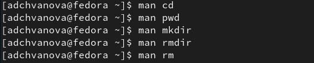{ #fig:011 width=70% }

## Выполнение лабораторной работы

7.Используя информацию, полученную при помощи команды history, выполните модификацию и исполнение нескольких команд из буфера команд.(рис [-@fig:012],[-@fig:014])

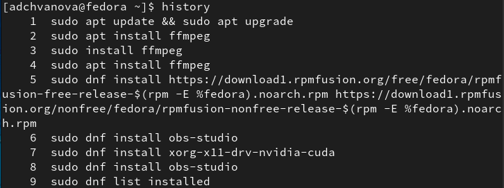{ #fig:012 width=70% }

## Выполнение лабораторной работы

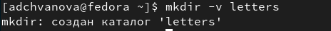{ #fig:014 width=70% }

## Выводы

Были приобретены практические навыки взаимодействия пользователя с системой посредством командной строки. Были изучены основные команды и их опции.

Спасибо за внимание!
