---
## Front matter
title: "Oтчёт по лабораторной работе 4"
subtitle: " Основы интерфейса взаимодействия
пользователя с системой Unix на уровне командной строки"
author: "Чванова Ангелина Дмитриевна"

## Generic otions
lang: ru-RU
toc-title: "Содержание"

## Bibliography
bibliography: bib/cite.bib
csl: pandoc/csl/gost-r-7-0-5-2008-numeric.csl

## Pdf output format
toc: true # Table of contents
toc-depth: 2
lof: true # List of figures
#lot: true # List of tables
fontsize: 12pt
linestretch: 1.5
papersize: a4
documentclass: scrreprt
## I18n polyglossia
polyglossia-lang:
  name: russian
  options:
	- spelling=modern
	- babelshorthands=true
polyglossia-otherlangs:
  name: english
## I18n babel
babel-lang: russian
babel-otherlangs: english
## Fonts
mainfont: PT Serif
romanfont: PT Serif
sansfont: PT Sans
monofont: PT Mono
mainfontoptions: Ligatures=TeX
romanfontoptions: Ligatures=TeX
sansfontoptions: Ligatures=TeX,Scale=MatchLowercase
monofontoptions: Scale=MatchLowercase,Scale=0.9
## Biblatex
biblatex: true
biblio-style: "gost-numeric"
biblatexoptions:
  - parentracker=true
  - backend=biber
  - hyperref=auto
  - language=auto
  - autolang=other*
  - citestyle=gost-numeric
## Pandoc-crossref LaTeX customization
figureTitle: "Рис."
tableTitle: "Таблица"
listingTitle: "Листинг"
lofTitle: "Список иллюстраций"
lotTitle: "Список таблиц"
lolTitle: "Листинги"
## Misc options
indent: true
header-includes:
  - \usepackage{indentfirst}
  - \usepackage{float} # keep figures where there are in the text
  - \floatplacement{figure}{H} # keep figures where there are in the text
---

# Цель работы

Приобретение практических навыков взаимодействия пользователя с системой посредством командной строки.

# Задание

1 Определите полное имя вашего домашнего каталога.

2 Выполните следующие действия: 

  2.1 Перейдите в каталог /tmp. 

  2.2. Выведите на экран содержимое каталога /tmp. Для этого используйте команду lsс различными опциями. Поясните разницу в выводимой на экран информации.

  2.3. Определите, есть ли в каталоге /var/spool подкаталог с именем cron?

2.4. Перейдите в Ваш домашний каталог и выведите на экран его содержимое. Определите, кто является владельцем файлов и подкаталогов?

3 Выполните следующие действия:

3.1. В домашнем каталоге создайте новый каталог с именем newdir.

3.2. В каталоге ~/newdir создайте новый каталог с именем morefun.

3.3. В домашнем каталоге создайте одной командой три новых каталога с именами letters, memos, misk. Затем удалите эти каталоги одной командой.

3.4. Попробуйте удалить ранее созданный каталог ~/newdir командой rm. Проверьте, был ли каталог удалён.

3.5. Удалите каталог ~/newdir/morefun из домашнего каталога. Проверьте, был ли каталог удалён.

4 С помощью команды man определите, какую опцию команды ls нужно использовать для просмотра содержимое не только указанного каталога, но и подкаталогов, входящих в него.

5 С помощью команды man определите набор опций команды ls, позволяющий отсортировать по времени последнего изменения выводимый список содержимого каталога с развёрнутым описанием файлов.

6 Используйте команду man для просмотра описания следующих команд: cd, pwd, mkdir, rmdir, rm. Поясните основные опции этих команд.

7 Используя информацию, полученную при помощи команды history, выполните модификацию и исполнение нескольких команд из буфера команд

# Теоретическое введение

В операционной системе типа Linux взаимодействие пользователя с системой обычно осуществляется с помощью командной строки посредством построчного ввода команд.

Командой в операционной системе называется записанный по
специальным правилам текст (возможно с аргументами), представляющий собой указание на выполнение какой-либо функций (или действий) в операционной системе. Обычно первым словом идёт имя команды, остальной текст — аргументы или опции, конкретизирующие действие.

Общий формат команд можно представить следующим образом:

<имя_команды><разделитель><аргументы>

**Команда man.** Команда man используется для просмотра (оперативная помощь) в диалоговом режиме руководства (manual) по основным командам операционной системы типа Linux.

**Команда cd.** Команда cd используется для перемещения по файловой системе операционной системы типа Linux.

**Команда pwd.** Для определения абсолютного пути к текущему каталогу используется команда pwd (print working directory).

**Команда ls.** Команда ls используется для просмотра содержимого каталога.
Некоторые файлы в операционной системе скрыты от просмотра и обычно используются для настройки рабочей среды. Имена таких файлов начинаются с точки. Для того, чтобы отобразить имена скрытых файлов, необходимо использовать команду ls с опцией a. Можно также получить информацию о типах файлов (каталог, исполняемый файл, ссылка), для чего используется опция F. Чтобы вывести на экран подробную информацию о файлах и каталогах, необходимо
использовать опцию l.

**Команда mkdir.** Команда mkdir используется для создания каталогов.

**Команда rm.** Команда rm используется для удаления файлов и/или каталогов.

Формат команды:

rm [-опции] [файл]

Если требуется, чтобы выдавался запрос подтверждения на удаление файла, то необходимо использовать опцию i.
Чтобы удалить каталог, содержащий файлы, нужно использовать опцию r. Без указания этой опции команда не будет выполняться.

**Команда history.** Для вывода на экран списка ранее выполненных команд используется команда history. Выводимые на экран команды в списке нумеруются. К любой команде из выведенного на экран списка можно обратиться по её номеру в списке, воспользовавшись конструкцией !<номер_команды>.

# Выполнение лабораторной работы

1. Определите полное имя вашего домашнего каталога. (рис[-@fig:001])

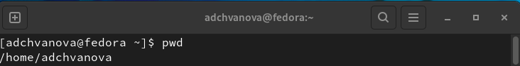{ #fig:001 width=70% }

2. Работа с терминалом по поиску каталогов: (рис[-@fig:002],[-@fig:003],[-@fig:004])

2.1. Перейдите в каталог /tmp.

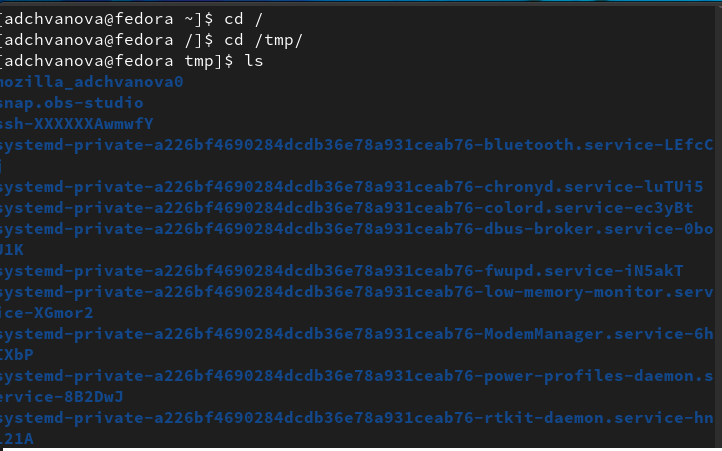{ #fig:002 width=70% }

2.2. Выведите на экран содержимое каталога /tmp. Для этого используйте команду ls с различными опциями. Поясните разницу в выводимой на экран информации.(рис[-@fig:021],[-@fig:022],[-@fig:023],[-@fig:024])

 ls с опцией a отображает имена скрытых файлов, необходимо использовать команду. (рис[-@fig:021])

 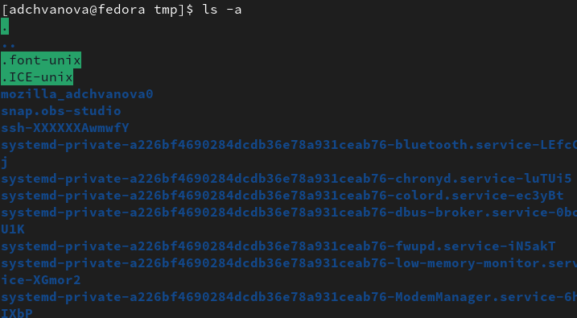{ #fig:021 width=70% }

Получить информацию о типах файлов (каталог, исполняемый файл, ссылка) можно опцией F.(рис[-@fig:022])

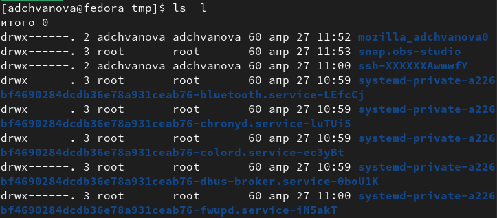{ #fig:022 width=70% }

 Чтобы вывести на экран подробную информацию о файлах и каталогах, необходимо использовать опцию l.(рис[-@fig:023])

 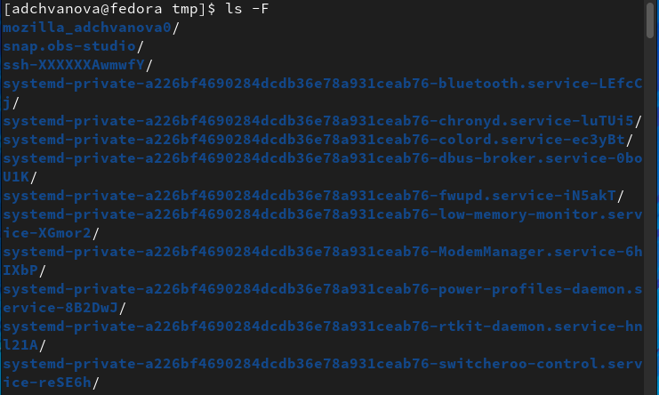{ #fig:023 width=70% }

 
 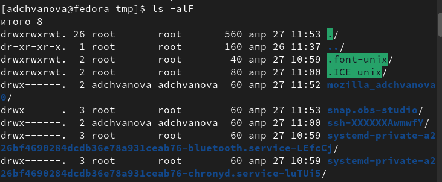{ #fig:024 width=70% }

2.3. Определить, есть ли в каталоге /var/spool подкаталог с именем cron.(рис[-@fig:003])

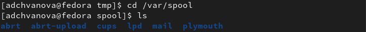{ #fig:003 width=70% }

Мы можем наблюдать, что такого подкаталога нет.

2.4. Переход в  домашний каталог и вывод на экран его содержимого. Определить, кто является владельцем файлов и подкаталогов. (рис [-@fig:004])

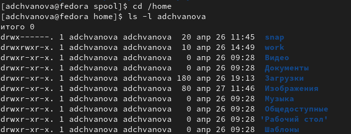{ #fig:004 width=70% }

3. Работа с терминалом по созданиюи удалению каталогов:

3.1. В домашнем каталоге создайте новый каталог с именем newdir. В каталоге ~/newdir создайте новый каталог с именем morefun.(рис [-@fig:005])

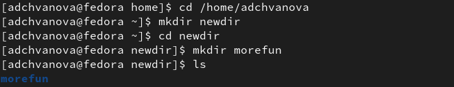{ #fig:005 width=70% }

3.2. В домашнем каталоге создайте одной командой три новых каталога с именами letters, memos, misk. Затем удалите эти каталоги одной командой.(рис[-@fig:006])

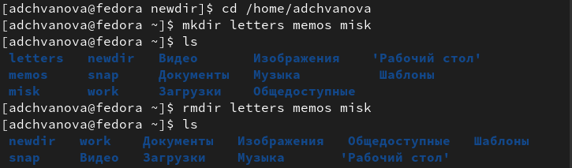{ #fig:006 width=70% }

3.3. Попытка удалить ранее созданный каталог ~/newdir командой rm. Проверка,был ли каталог удалён.(рис[-@fig:007])

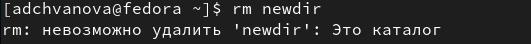{ #fig:007 width=70% }

3.4. Удалите каталог ~/newdir/morefun из домашнего каталога. Проверьте, был ли каталог удалён.(рис[-@fig:008])

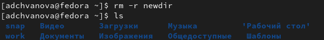{ #fig:008 width=70% }

Каталог успешно удалился этой командой.

4. С помощью команды man определите, какую опцию команды ls нужно использовать для просмотра содержимое не только указанного каталога, но и подкаталогов,входящих в него. (рис[-@fig:009])

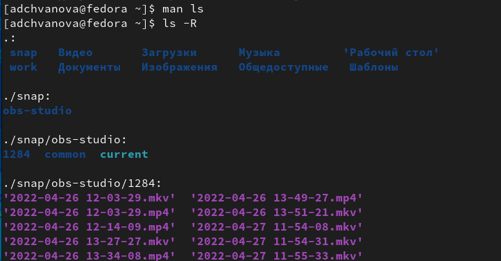{ #fig:009 width=70% }

5. С помощью команды man определите набор опций команды ls, позволяющий отсортировать по времени последнего изменения выводимый список содержимого каталога с развёрнутым описанием файлов.(рис [-@fig:010])

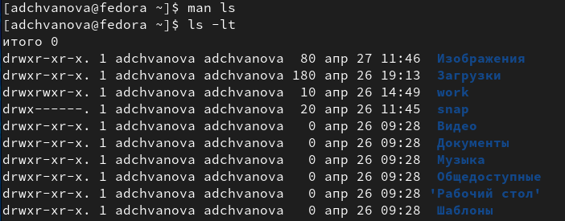{ #fig:010 width=70% }

6. Используйте команду man для просмотра описания следующих команд: cd, pwd, mkdir, rmdir, rm. Поясните основные опции этих команд.(рис [-@fig:011])

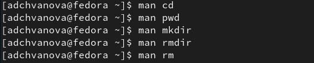{ #fig:011 width=70% }

7. Используя информацию, полученную при помощи команды history, выполните модификацию и исполнение нескольких команд из буфера команд.(рис [-@fig:012],[-@fig:013],[-@fig:014])

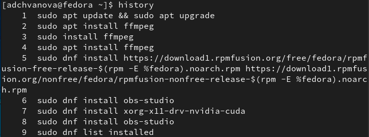{ #fig:012 width=70% }

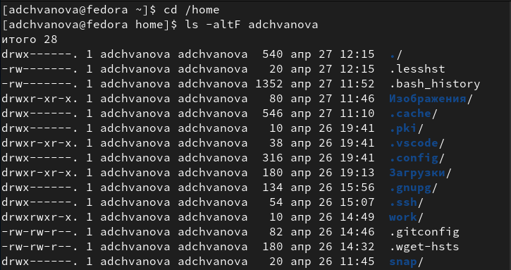{ #fig:013 width=70% }

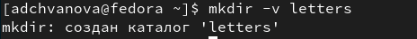{ #fig:014 width=70% }

# Выводы

Были приобретены практические навыки взаимодействия пользователя с системой посредством командной строки. Были изучены основные команды и их опции.

# Контрольные вопросы

1. Что такое командная строка?

Командой в операционной системе называется записанный по специальным правилам текст (возможно с аргументами), представляющий собой указание на выполнение какой-либо функций (или действий) в операционной системе. Обычно первым словом идёт имя команды, остальной текст — аргументы или опции, конкретизирующие действие.

2. При помощи какой команды можно определить абсолютный путь текущего каталога? Приведите пример.

Pwd

/afs/dk.sci.pfu.edu.ru/home/d/h/dharma

3. При помощи какой команды и каких опций можно определить только тип файлов
и их имена в текущем каталоге? Приведите примеры.

Можно получить информацию о типах файлов (каталог, исполняемый файл, ссылка, для чего используется опция F с командой ls.

ls -F

4. Каким образом отобразить информацию о скрытых файлах? Приведите примеры.

Для того, чтобы отобразить имена скрытых файлов, необходимо использовать команду ls с опцией a: 

ls -a

5. При помощи каких команд можно удалить файл и каталог? Можно ли это сделать одной и той же командой? Приведите примеры.

rm -r – удаляет любые каталоги, даже не пустые

rm -r newdir

rmdir – удаляет только пустые каталоги

rmdir letters memos misk

6. Каким образом можно вывести информацию о последних выполненных пользователем командах? работы?

С помощью команды history.

7. Как воспользоваться историей команд для их модифицированного выполнения? Приведите примеры.

Если вы хотите повторно использовать команду из списка истории, введите восклицательный знак (!) И номер команды без пробелов между ними.
Например, чтобы повторить команду номер 37, вы должны ввести эту команду:
!37

8. Приведите примеры запуска нескольких команд в одной строке.

В командной строке Linux можно объединять сразу несколько команд в одну строку (в один запуск). Например, вам нужно выполнить сначала одну команду, за ней вторую и так далее. Но вы хотите сразу вбить в командной строке одну инструкцию, которая все сделает. Для этого можно воспользоваться служебными символами.

Например, мы хотим выполнить сначала одну команду. Затем, когда она отработает (вернет управление в командную строку), нам нужно запустить вторую команду. Для этого служит символ точка с запятой ;. Таким образом, если вы выполните в терминале:

mycommand1; mycommand2; mycommand3

mkdir book; rm game; cd book

9. Дайте определение и приведите примера символов экранирования.

Экранирование -- это способ заключения в кавычки одиночного символа. Экранирующий (escape) символ () сообщает интерпретатору, что следующий за ним символ должен восприниматься как обычный символ. С отдельными командами и утилитами, такими как echo и sed, экранирующий символ может применяться для получения обратного эффекта - когда обычные символы при экранировании приобретают специальное значение.

10. Охарактеризуйте вывод информации на экран после выполнения команды ls с опцией l.

Чтобы вывести на экран подробную информацию о файлах и каталогах, необходимо использовать опцию l. При этом о каждом файле и каталоге будет выведена следующая информация: 

– тип файла,

 – право доступа, 

– число ссылок, 

– владелец, 

– размер, 

– дата последней ревизии, 

– имя файла или каталога.

11. Что такое относительный путь к файлу? Приведите примеры использования относительного и абсолютного пути при выполнении какой-либо команды.

Абсолютный путь показывает точное местонахождение файла(/home/adchvanova/tmp/file1), а относительный показывает путь к файлу относительно какой-либо "отправной точки" (файл, программа и т.д.)( ~/tmp/file1).

12. Как получить информацию об интересующей вас команде?

С помощью команды man

Man cd

13. Какая клавиша или комбинация клавиш служит для автоматического дополнения вводимых команд?

Tab

Нужно начать вводить команду, имя файла, имя каталога или даже параметры команды и нажать клавишу табуляции. Она либо автоматически завершит то, что вы набираете, либо покажет все возможные результаты для вас.
