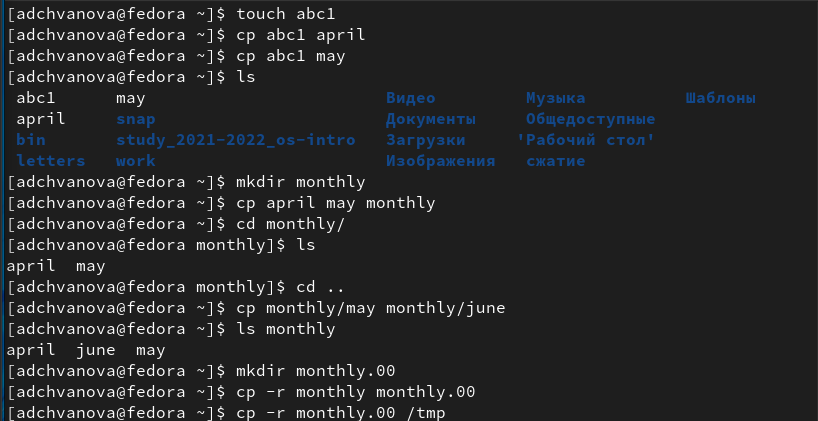
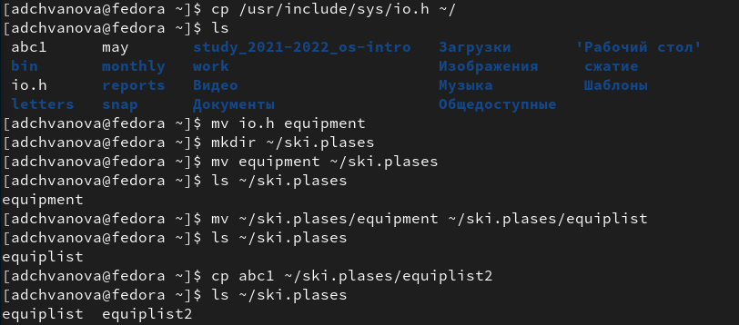
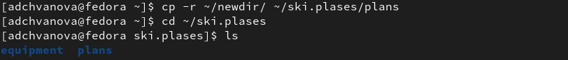
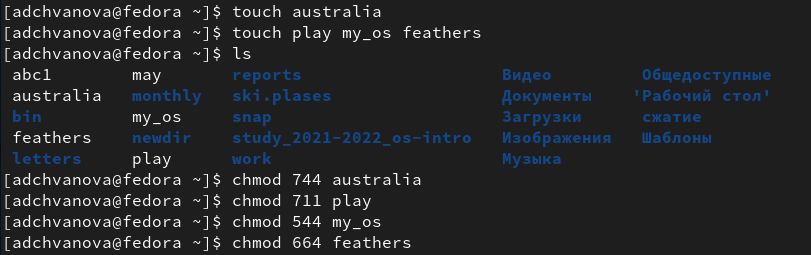
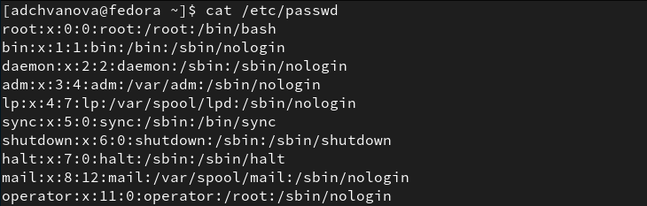
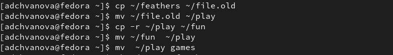
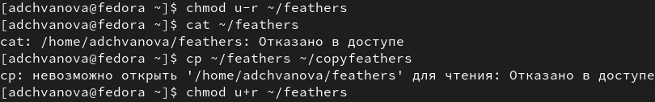
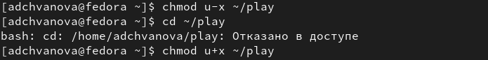
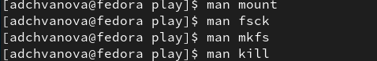

---
## Front matter
lang: ru-RU
title: Лабораторная работа № 5. Анализ файловой системы Linux.Команды для работы с файлами и каталогами
author: |
	Chvanova A.D.
institute: |
	RUDN University, Moscow, Russian Federation
	
date: NEC--2022, 4 May

## Formatting
toc: false
slide_level: 2
theme: metropolis
header-includes: 
 - \metroset{progressbar=frametitle,sectionpage=progressbar,numbering=fraction}
 - '\makeatletter'
 - '\beamer@ignorenonframefalse'
 - '\makeatother'
aspectratio: 43
section-titles: true
---

## Цель работы

Ознакомление с файловой системой Linux, её структурой, именами и содержанием
каталогов. Приобретение практических навыков по применению команд для работы
с файлами и каталогами, по управлению процессами (и работами), по проверке использования диска и обслуживанию файловой системы.

## Теоретическое введение

Для создания текстового файла можно использовать команду touch. Для просмотра файлов небольшого размера можно использовать команду cat. Для просмотра файлов постранично удобнее использовать команду less.Команда cp используется для копирования файлов и каталогов.

Команды mv и mvdir предназначены для перемещения и переименования файлов
и каталогов.

## Теоретическое введение

Каждый файл или каталог имеет права доступа.
В сведениях о файле или каталоге указываются:

– тип файла (символ (-) обозначает файл, а символ (d) — каталог);
– права для владельца файла (r — разрешено чтение, w — разрешена запись, x — разрешено выполнение, - — право доступа отсутствует);

– права для членов группы (r — разрешено чтение, w — разрешена запись, x — разрешено
выполнение, - — право доступа отсутствует);

– права для всех остальных (r — разрешено чтение, w — разрешена запись, x — разрешено
выполнение, - — право доступа отсутствует).

## Выполнение лабораторной работы

1.Выполнение всех примеров, приведённых в первой части описания лабораторной работы.(рис. [-@fig:001]- [-@fig:002])

{ #fig:001 width=70% }

## Выполнение лабораторной работы

{ #fig:002 width=70% }

## Выполнение лабораторной работы

2.1. Скопируйте файл /usr/include/sys/io.h в домашний каталог и назовите его
equipment. Если файла io.h нет, то используйте любой другой файл в каталоге
/usr/include/sys/ вместо него. В домашнем каталоге создайте директорию ~/ski.plases.  Переместите файл equipment в каталог ~/ski.plases. Переименуйте файл ~/ski.plases/equipment в ~/ski.plases/equiplist. Создайте в домашнем каталоге файл abc1 и скопируйте его в каталог ~/ski.plases, назовите его equiplist2. (рис. [-@fig:003])

{ #fig:003 width=70% }

## Выполнение лабораторной работы

2.2. Создайте каталог с именем equipment в каталоге ~/ski.plases.  Переместите файлы ~/ski.plases/equiplist и equiplist2 в каталог
~/ski.plases/equipment.  (рис. [-@fig:004])

{ #fig:004 width=70% }

## Выполнение лабораторной работы

2.3. Создайте и переместите каталог ~/newdir в каталог ~/ski.plases и назовите
его plans. (рис. [-@fig:005])

{ #fig:005 width=70% }

## Выполнение лабораторной работы

3.Определите опции команды chmod, необходимые для того, чтобы присвоить перечисленным ниже файлам выделенные права доступа, считая, что в начале таких прав нет: (рис. [-@fig:006])

 drwxr--r-- ... australia

 drwx--x--x ... play

 -r-xr--r-- ... my_os

 -rw-rw-r-- ... feathers

При необходимости создайте нужные файлы.

{ #fig:006 width=70% }

## Выполнение лабораторной работы

4.1. Просмотрите содержимое файла /etc/passwd. (рис. [-@fig:007])

{ #fig:007 width=70% }

## Выполнение лабораторной работы

4.2. Скопируйте файл ~/feathers в файл ~/file.old. Переместите файл ~/file.old в каталог ~/play. Скопируйте каталог ~/play в каталог ~/fun. Переместите каталог ~/fun в каталог ~/play и назовите его games. (рис. [-@fig:008])

{ #fig:008 width=70% }

## Выполнение лабораторной работы

4.3. Лишите владельца файла ~/feathers права на чтение. Что произойдёт, если вы попытаетесь просмотреть файл ~/feathers командой
cat? Что произойдёт, если вы попытаетесь скопировать файл ~/feathers?  Дайте владельцу файла ~/feathers право на чтение. (рис. [-@fig:009])

{ #fig:009 width=70% }

## Выполнение лабораторной работы

4.4. Лишите владельца каталога ~/play права на выполнение. Перейдите в каталог ~/play. Что произошло? Дайте владельцу каталога ~/play право на выполнение. (рис. [-@fig:010])

{ #fig:010 width=70% }

## Выполнение лабораторной работы

5.Прочитайте man по командам mount, fsck, mkfs, kill и кратко их охарактеризуйте,
приведя примеры.(рис. [-@fig:011], [-@fig:012],[-@fig:013],[-@fig:014],[-@fig:015])

{ #fig:011 width=70% }

## Выводы

Я ознакомилась с файловой системой Linux, её структурой, именами и содержанием
каталогов. Были приобретены практические навыки по применению команд для работы
с файлами и каталогами, по управлению процессами (и работами), по проверке использования диска и обслуживанию файловой системы.

# Спасибо за внимание

