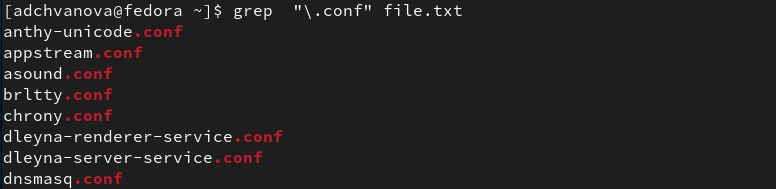
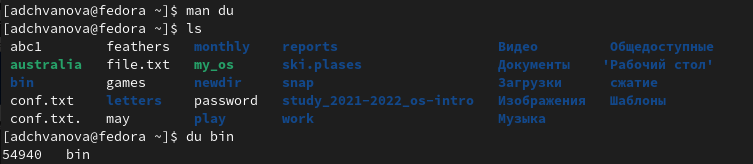

---
## Front matter
lang: ru-RU
title: Лабораторная работа № 6. Поиск файлов. Перенаправление ввода-вывода. Просмотр запущенных процессов
author: |
	Chvanova A.D.
institute: |
	RUDN University, Moscow, Russian Federation
	
date: NEC--2022, 5 May, Moscow

## Formatting
toc: false
slide_level: 2
theme: metropolis
header-includes: 
 - \metroset{progressbar=frametitle,sectionpage=progressbar,numbering=fraction}
 - '\makeatletter'
 - '\beamer@ignorenonframefalse'
 - '\makeatother'
aspectratio: 43
section-titles: true
---

## Цель работы

Ознакомление с инструментами поиска файлов и фильтрации текстовых данных.
Приобретение практических навыков: по управлению процессами (и заданиями), по
проверке использования диска и обслуживанию файловых систем.

## Теоретическое введение

В системе по умолчанию открыто три специальных потока:

– stdin — стандартный поток ввода (по умолчанию: клавиатура), файловый дескриптор
0;

– stdout — стандартный поток вывода (по умолчанию: консоль), файловый дескриптор
1;

– stderr — стандартный поток вывод сообщений об ошибках (по умолчанию: консоль),
файловый дескриптор 2.

## Теоретическое введение

Большинство используемых в консоли команд и программ записывают результаты
своей работы в стандартный поток вывода stdout. Например, команда ls выводит в стандартный поток вывода (консоль) список файлов в текущей директории. Потоки вывода
и ввода можно перенаправлять на другие файлы или устройства. Проще всего это делается
с помощью символов >, >>, <, <<.

## Выполнение лабораторной работы

1. Осуществите вход в систему, используя соответствующее имя пользователя.(рис. [-@fig:001])

{ #fig:001 width=70% }

## Выполнение лабораторной работы

2. Запишите в файл file.txt названия файлов, содержащихся в каталоге /etc. Допишите в этот же файл названия файлов, содержащихся в вашем домашнем каталоге.(рис. [-@fig:002])

{ #fig:002 width=70% }

## Выполнение лабораторной работы

3. Выведите имена всех файлов из file.txt, имеющих расширение .conf, после чего
запишите их в новый текстовой файл conf.txt.(рис. [-@fig:003]- [-@fig:004])

{ #fig:003 width=70% }

## Выполнение лабораторной работы

{ #fig:004 width=70% }

## Выполнение лабораторной работы

4. Определите, какие файлы в вашем домашнем каталоге имеют имена, начинавшиеся
с символа c? (рис. [-@fig:005])

{ #fig:005 width=70% }

## Выполнение лабораторной работы

5. Выведите на экран (по странично) имена файлов из каталога /etc, начинающиеся
с символа h.(рис. [-@fig:006])

{ #fig:006 width=70% }

## Выполнение лабораторной работы

6. Запустите в фоновом режиме процесс, который будет записывать в файл ~/logfile
файлы, имена которых начинаются с log.(рис. [-@fig:007])

{ #fig:007 width=70% }

## Выполнение лабораторной работы

7. Удалите файл ~/logfile.(рис. [-@fig:008])

{ #fig:008 width=70% }

## Выполнение лабораторной работы

8. Запустите из консоли в фоновом режиме редактор gedit.(рис. [-@fig:009])

{ #fig:009 width=70% }

## Выполнение лабораторной работы

9. Определите идентификатор процесса gedit, используя команду ps, конвейер и фильтр
grep. Как ещё можно определить идентификатор процесса?(рис. -@fig:010])

{ #fig:010 width=70% }

## Выполнение лабораторной работы

10. Прочтите справку (man) команды kill, после чего используйте её для завершения
процесса gedit.(рис. [-@fig:011])

{ #fig:011 width=70% }

## Выполнение лабораторной работы

11. Выполните команды df и du, предварительно получив более подробную информацию
об этих командах, с помощью команды man.(рис. [-@fig:012] - [-@fig:013])

{ #fig:012 width=70% }

## Выполнение лабораторной работы

{ #fig:013 width=70% }

## Выполнение лабораторной работы

12. Воспользовавшись справкой команды find, выведите имена всех директорий, имеющихся в вашем домашнем каталоге. (рис. [-@fig:014])

{ #fig:014 width=70% }

## Выводы

Я ознакомилась с инструментами поиска файлов и фильтрации текстовых данных.
Были приобретены практические навыков: по управлению процессами (и заданиями), по
проверке использования диска и обслуживанию файловых систем.

# Спасибо за внимание!
