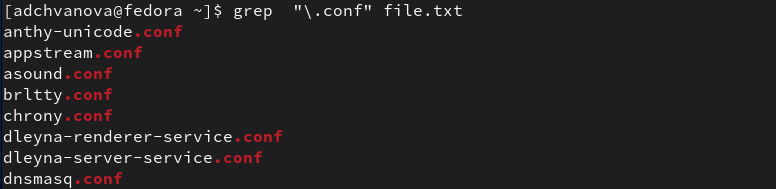
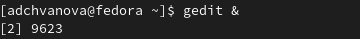
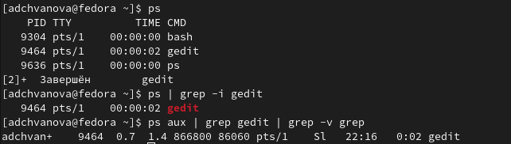
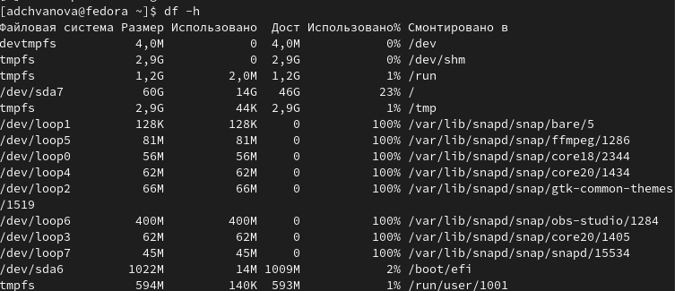
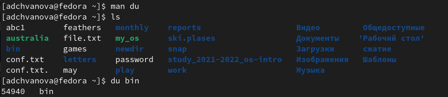
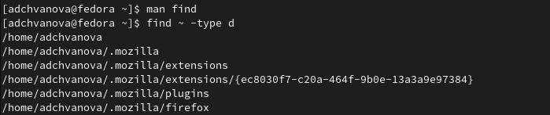

---
## Front matter
title: "Отчёт по лабораторной работе 6"
subtitle: " Поиск файлов. Перенаправление
ввода-вывода. Просмотр запущенных процессов"
author: "Ангелина Дмитриевна Чванова"

## Generic otions
lang: ru-RU
toc-title: "Содержание"

## Bibliography
bibliography: bib/cite.bib
csl: pandoc/csl/gost-r-7-0-5-2008-numeric.csl

## Pdf output format
toc: true # Table of contents
toc-depth: 2
lof: true # List of figures
lot: true # List of tables
fontsize: 12pt
linestretch: 1.5
papersize: a4
documentclass: scrreprt
## I18n polyglossia
polyglossia-lang:
  name: russian
  options:
	- spelling=modern
	- babelshorthands=true
polyglossia-otherlangs:
  name: english
## I18n babel
babel-lang: russian
babel-otherlangs: english
## Fonts
mainfont: PT Serif
romanfont: PT Serif
sansfont: PT Sans
monofont: PT Mono
mainfontoptions: Ligatures=TeX
romanfontoptions: Ligatures=TeX
sansfontoptions: Ligatures=TeX,Scale=MatchLowercase
monofontoptions: Scale=MatchLowercase,Scale=0.9
## Biblatex
biblatex: true
biblio-style: "gost-numeric"
biblatexoptions:
  - parentracker=true
  - backend=biber
  - hyperref=auto
  - language=auto
  - autolang=other*
  - citestyle=gost-numeric
## Pandoc-crossref LaTeX customization
figureTitle: "Рис."
tableTitle: "Таблица"
listingTitle: "Листинг"
lofTitle: "Список иллюстраций"
lotTitle: "Список таблиц"
lolTitle: "Листинги"
## Misc options
indent: true
header-includes:
  - \usepackage{indentfirst}
  - \usepackage{float} # keep figures where there are in the text
  - \floatplacement{figure}{H} # keep figures where there are in the text
---

# Цель работы

Ознакомление с инструментами поиска файлов и фильтрации текстовых данных.
Приобретение практических навыков: по управлению процессами (и заданиями), по
проверке использования диска и обслуживанию файловых систем.

# Задание

1. Осуществите вход в систему, используя соответствующее имя пользователя.

2. Запишите в файл file.txt названия файлов, содержащихся в каталоге /etc. Допишите в этот же файл названия файлов, содержащихся в вашем домашнем каталоге.

3. Выведите имена всех файлов из file.txt, имеющих расширение .conf, после чего
запишите их в новый текстовой файл conf.txt.

4. Определите, какие файлы в вашем домашнем каталоге имеют имена, начинавшиеся
с символа c? Предложите несколько вариантов, как это сделать.

5. Выведите на экран (по странично) имена файлов из каталога /etc, начинающиеся
с символа h.

6. Запустите в фоновом режиме процесс, который будет записывать в файл ~/logfile
файлы, имена которых начинаются с log.

7. Удалите файл ~/logfile.

8. Запустите из консоли в фоновом режиме редактор gedit.

9. Определите идентификатор процесса gedit, используя команду ps, конвейер и фильтр
grep. Как ещё можно определить идентификатор процесса?

10. Прочтите справку (man) команды kill, после чего используйте её для завершения
процесса gedit.

11. Выполните команды df и du, предварительно получив более подробную информацию
об этих командах, с помощью команды man.

12. Воспользовавшись справкой команды find, выведите имена всех директорий, имеющихся в вашем домашнем каталоге.

# Теоретическое введение

В системе по умолчанию открыто три специальных потока:

– stdin — стандартный поток ввода (по умолчанию: клавиатура), файловый дескриптор
0;

– stdout — стандартный поток вывода (по умолчанию: консоль), файловый дескриптор
1;

– stderr — стандартный поток вывод сообщений об ошибках (по умолчанию: консоль),
файловый дескриптор 2.

Большинство используемых в консоли команд и программ записывают результаты
своей работы в стандартный поток вывода stdout. Например, команда ls выводит в стандартный поток вывода (консоль) список файлов в текущей директории. Потоки вывода
и ввода можно перенаправлять на другие файлы или устройства. Проще всего это делается
с помощью символов >, >>, <, <<.

Конвейер (pipe) служит для объединения простых команд или утилит в цепочки, в которых результат работы предыдущей команды передаётся последующей. 

Команда find используется для поиска и отображения на экран имён файлов, соответствующих заданной строке символов.

Команда df показывает размер каждого смонтированного раздела диска.Команда du показывает число килобайт, используемое каждым файлом или каталогом.

# Выполнение лабораторной работы

1. Осуществите вход в систему, используя соответствующее имя пользователя.(рис. [-@fig:001])

{ #fig:001 width=70% }

2. Запишите в файл file.txt названия файлов, содержащихся в каталоге /etc. Допишите в этот же файл названия файлов, содержащихся в вашем домашнем каталоге.(рис. [-@fig:002])

{ #fig:002 width=70% }

3. Выведите имена всех файлов из file.txt, имеющих расширение .conf, после чего
запишите их в новый текстовой файл conf.txt.(рис. [-@fig:003]- [-@fig:004])

{ #fig:003 width=70% }

{ #fig:004 width=70% }

4. Определите, какие файлы в вашем домашнем каталоге имеют имена, начинавшиеся
с символа c? (рис. [-@fig:005])

{ #fig:005 width=70% }

5. Выведите на экран (по странично) имена файлов из каталога /etc, начинающиеся
с символа h.(рис. [-@fig:006])

{ #fig:006 width=70% }

6. Запустите в фоновом режиме процесс, который будет записывать в файл ~/logfile
файлы, имена которых начинаются с log.(рис. [-@fig:007])

{ #fig:007 width=70% }

7. Удалите файл ~/logfile.(рис. [-@fig:008])

{ #fig:008 width=70% }

8. Запустите из консоли в фоновом режиме редактор gedit.(рис. [-@fig:009])

{ #fig:009 width=70% }

9. Определите идентификатор процесса gedit, используя команду ps, конвейер и фильтр
grep. Как ещё можно определить идентификатор процесса?(рис. -@fig:010])

{ #fig:010 width=70% }

10. Прочтите справку (man) команды kill, после чего используйте её для завершения
процесса gedit.(рис. [-@fig:011])

{ #fig:011 width=70% }

11. Выполните команды df и du, предварительно получив более подробную информацию
об этих командах, с помощью команды man.(рис. [-@fig:012] - [-@fig:013])

{ #fig:012 width=70% }

{ #fig:013 width=70% }

12. Воспользовавшись справкой команды find, выведите имена всех директорий, имеющихся в вашем домашнем каталоге. (рис. [-@fig:014])

{ #fig:014 width=70% }

# Выводы

Я ознакомилась с инструментами поиска файлов и фильтрации текстовых данных.
Были приобретены практические навыков: по управлению процессами (и заданиями), по
проверке использования диска и обслуживанию файловых систем.

#  Контрольные вопросы

1. Какие потоки ввода вывода вы знаете?

В системе по умолчанию открыто три специальных потока:

– stdin — стандартный поток ввода (по умолчанию: клавиатура), файловый дескриптор
0;

– stdout — стандартный поток вывода (по умолчанию: консоль), файловый дескриптор
1;

– stderr — стандартный поток вывод сообщений об ошибках (по умолчанию: консоль),
файловый дескриптор 2.

2. Объясните разницу между операцией > и >>.

.> перезаписывает файл
.>> файл открывается в режиме добавления 

3. Что такое конвейер?

Конвейер (pipe) - это то, что служит для объединения простых команд или утилит в цепочки, в которых результат работы предыдущей команды передаётся последующей

4. Что такое процесс? Чем это понятие отличается от программы?

Программа и процесс являются родственными терминами. Основное различие между программой и процессом заключается в том, что программа представляет собой группу инструкций для выполнения определенной задачи, тогда как процесс представляет собой программу в процессе выполнения.

5. Что такое PID и GID?

PID - (process ID) идентификатор каждого процесса 

GID - реальный идентификатор пользователя и его группы, запустившего данный процесс. 

6. Что такое задачи и какая команда позволяет ими управлять?

Любую выполняющуюся в консоли команду или внешнюю программу можно запустить
в фоновом режиме. Для этого следует в конце имени команды указать знак амперсанда
&. Запущенные фоном программы называются задачами (jobs). Ими можно управлять
с помощью команды jobs, которая выводит список запущенных в данный момент задач. Для завершения задачи необходимо выполнить команду
kill.

7. Найдите информацию об утилитах top и htop. Каковы их функции?

Команда htop похожа на команду top по выполняемой функции: они обе показывают информацию о процессах в реальном времени, выводят данные о потреблении системных ресурсов и позволяют искать, останавливать и управлять процессами.

У обеих команд есть свои преимущества. Например, в программе htop реализован очень удобный поиск по процессам, а также их фильтрация. В команде top это не так удобно — нужно знать кнопку для вывода функции поиска.

Зато в top можно разделять область окна и выводить информацию о процессах в соответствии с разными настройками. В целом top намного более гибкая в настройке отображения процессов.

8. Назовите и дайте характеристику команде поиска файлов. Приведите примеры использования этой команды.

Команда find используется для поиска и отображения на экран имён файлов, соответствующих заданной строке символов.

Путь определяет каталог, начиная с которого по всем подкаталогам будет вестись
поиск.

Вывести на экран имена файлов из вашего домашнего каталога и его подкаталогов,
начинающихся на f:

find ~ -name "f*" -print

Найти в Вашем домашнем каталоге файлы, имена которых заканчиваются символом
~ и удалить их:

find ~ -name "*~" -exec rm "{}" \;

9. Можно ли по контексту (содержанию) найти файл? Если да, то как?

Да. Так:

grep -rnw '/путь/к/папке/с/файлами' -e "шаблон"

-r или -R - рекурсивный поиск.

-n - вывод номера строки.

-w - только целые слова.

-l (нижний регистр от L) - вывод имени файла, где было совпадение.

10. Как определить объем свободной памяти на жёстком диске?

Для определения информации о свободном и занятом месте на диске используется команда df.

Например команда:

df -ah

Выведет информацию о всех используемых файловых системах в удобном виде.

11. Как определить объем вашего домашнего каталога?

Команда du выводит информацию о занятом дисковом пространстве для файла (файлов) имена которых заданы с помощью параметров команды.

12. Как удалить зависший процесс?

Перед тем, как выполнить остановку процесса, нужно определить его PID. Для этого воспользуемся командами ps и grep. Команда ps предназначена для вывода списка активных процессов в системе и информации о них. Команда grep запускается одновременно с ps (в канале) и будет выполнять поиск по результатам команды ps. 

Когда известен PID процесса, мы можем убить его командой kill. Команда kill принимает в качестве параметра PID процесса.