---
## Front matter
lang: ru-RU
title: Лабораторная работа 7. Командная оболочка Midnight Commander
author: |
	Chvanova A.D.
institute: |
	RUDN University, Moscow, Russian Federation
	
date: NEC--2022, 11 May, Moscow

## Formatting
toc: false
slide_level: 2
theme: metropolis
header-includes: 
 - \metroset{progressbar=frametitle,sectionpage=progressbar,numbering=fraction}
 - '\makeatletter'
 - '\beamer@ignorenonframefalse'
 - '\makeatother'
aspectratio: 43
section-titles: true
---

## Цель работы

Освоение основных возможностей командной оболочки Midnight Commander. Приобретение навыков практической работы по просмотру каталогов и файлов; манипуляций с ними.

## Теоретическое введение

Командная оболочка — интерфейс взаимодействия пользователя с операционной системой и программным обеспечением посредством команд.
Midnight Commander (или mc) — псевдографическая командная оболочка для UNIX/Linux систем. Для запуска mc необходимо в командной строке набрать mc и нажать Enter .

Рабочее пространство mc имеет две панели, отображающие по умолчанию списки
файлов двух каталогов.

Над панелями располагается меню, доступ к которому осуществляется с помощью
клавиши F9 . Под панелями внизу расположены управляющие экранные кнопки, ассоциированные с функциональными клавишами F1 – F10.

## Выполнение лабораторной работы

1. Изучите информацию о mc, вызвав в командной строке man mc.
(рис. [-@fig:001])

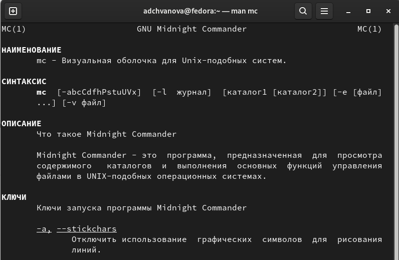{ #fig:001 width=70% }

## Выполнение лабораторной работы

2. Запустите из командной строки mc, изучите его структуру и меню.
(рис. [-@fig:002]- [-@fig:003])

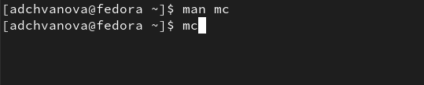{ #fig:002 width=70% }

## Выполнение лабораторной работы

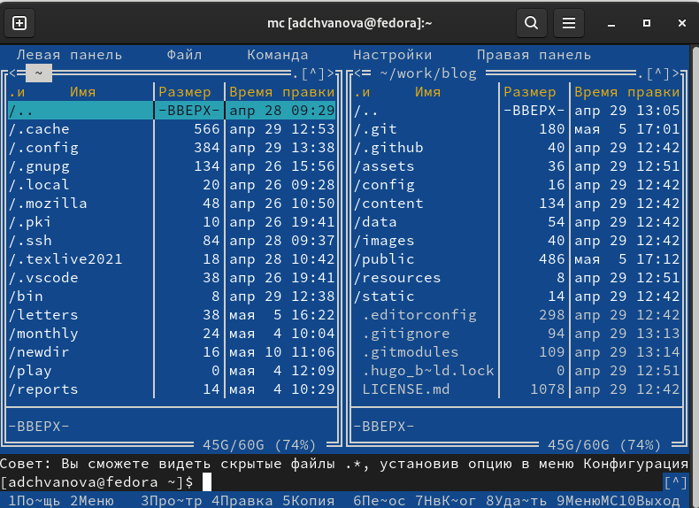{ #fig:003 width=70% }

## Выполнение лабораторной работы

3. Выполните несколько операций в mc, используя управляющие клавиши (операции с панелями; выделение/отмена выделения файлов, копирование/перемещение файлов, получение информации о размере и правах доступа на файлы и/или каталоги и т.п.)
(рис. [-@fig:004])

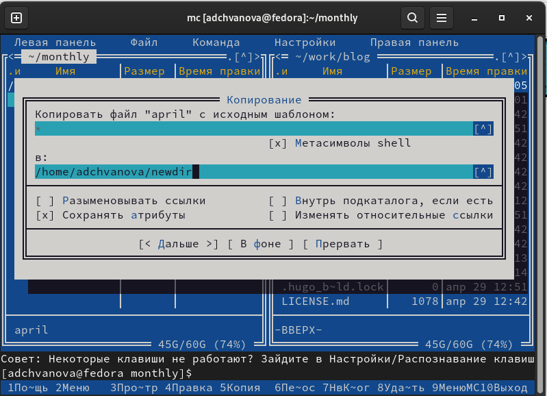{ #fig:004 width=70% }

## Выполнение лабораторной работы

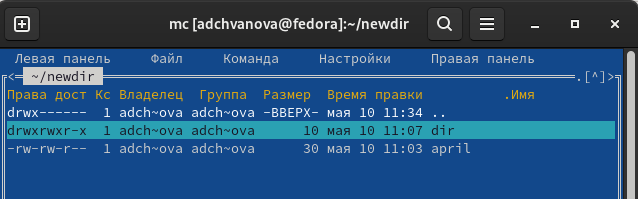{ #fig:005 width=70% }

## Выполнение лабораторной работы

4. 
– просмотр содержимого текстового файла;(рис. [-@fig:007])

– редактирование содержимого текстового файла (без сохранения результатов
редактирования);(рис. [-@fig:008])

– создание каталога;(рис. [-@fig:009])

– копирование в файлов в созданный каталог.
(рис. [-@fig:010])

## Выполнение лабораторной работы

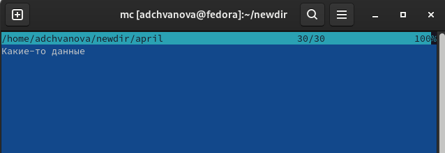{ #fig:007 width=70% }

## Выполнение лабораторной работы

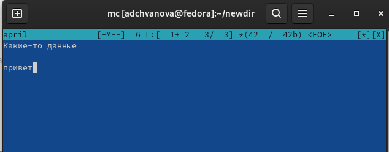{ #fig:008 width=70% }

## Выполнение лабораторной работы

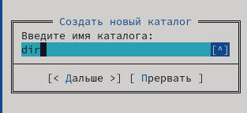{ #fig:009 width=70% }

## Выполнение лабораторной работы

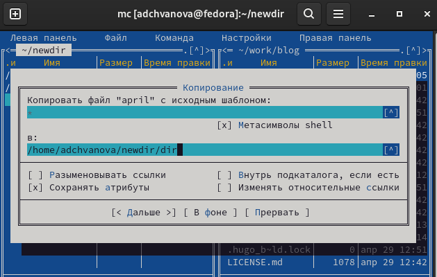{ #fig:010 width=70% }

5. С помощью соответствующих средств подменю Команда осуществите:

– поиск в файловой системе файла с заданными условиями (например, файла
с расширением .c или .cpp, содержащего строку main);(рис. [-@fig:011])

– выбор и повторение одной из предыдущих команд;(рис. [-@fig:012])

– переход в домашний каталог;(рис. [-@fig:013])

– анализ файла меню и файла расширений.(рис. [-@fig:014] - [-@fig:015])

## Выполнение лабораторной работы

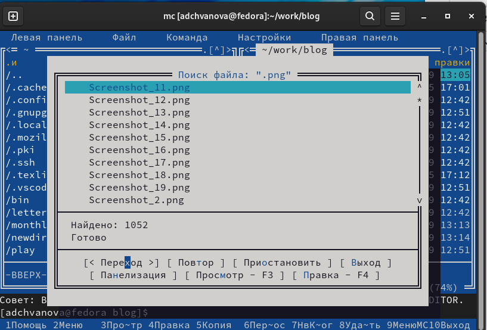{ #fig:011 width=70% }

## Выполнение лабораторной работы

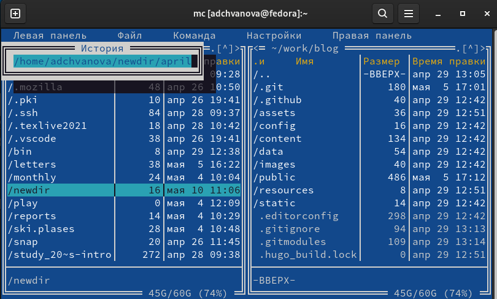{ #fig:012 width=70% }

## Выполнение лабораторной работы

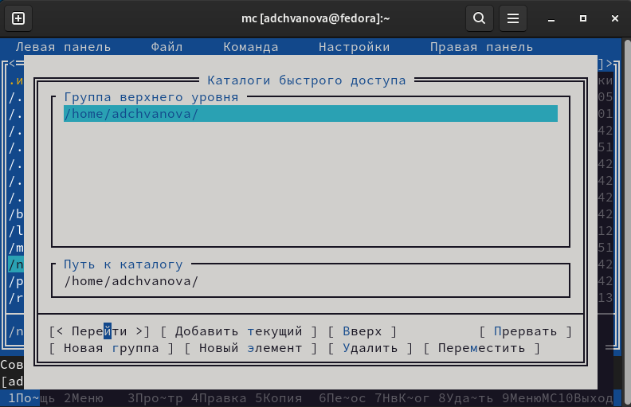{ #fig:013 width=70% }

## Выполнение лабораторной работы

7. Вызовите подменю Настройки . Освойте операции, определяющие структуру экрана mc(Full screen, Double Width, Show Hidden Files и т.д.)(рис. [-@fig:017])

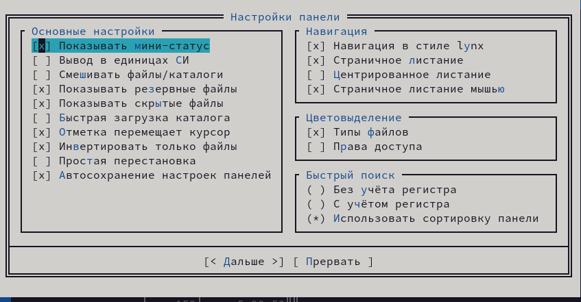{ #fig:017 width=70% }

## Выполнение лабораторной работы

1. Создайте текстовой файл text.txt.(рис. [-@fig:018])

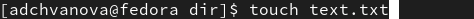{ #fig:018 width=70% }

## Выполнение лабораторной работы

2. Откройте этот файл с помощью встроенного в mc редактора.Вставьте в открытый файл небольшой фрагмент текста, скопированный из любого другого файла или Интернета.(рис. [-@fig:019])

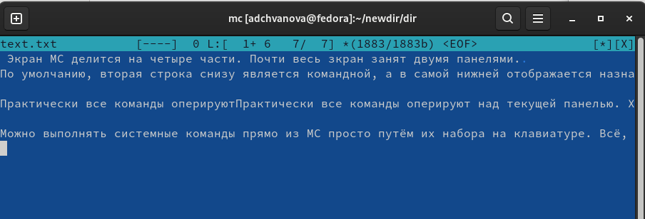{ #fig:019 width=70% }

## Выполнение лабораторной работы

3. Проделайте с текстом следующие манипуляции, используя горячие клавиши:

- Удалите строку текста.

- Выделите фрагмент текста и скопируйте его на новую строку.

- Выделите фрагмент текста и перенесите его на новую строку.

- Сохраните файл.

- Отмените последнее действие.

- Перейдите в конец файла (нажав комбинацию клавиш) и напишите некоторый
текст.

- Перейдите в начало файла (нажав комбинацию клавиш) и напишите некоторый
текст.

- Сохраните и закройте файл.(рис. [-@fig:020])

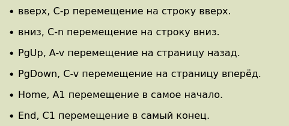{ #fig:020 width=70% }

## Выполнение лабораторной работы

5. Откройте файл с исходным текстом на некотором языке программирования (например C или Java)(рис. [-@fig:021])

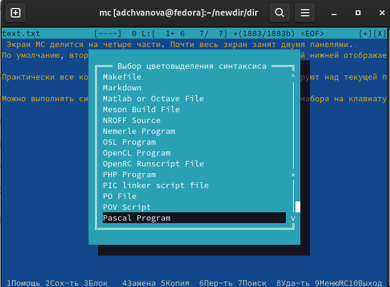{ #fig:021 width=70% }

## Выполнение лабораторной работы

6. Используя меню редактора, включите подсветку синтаксиса, если она не включена, или выключите, если она включена. (рис. [-@fig:022])

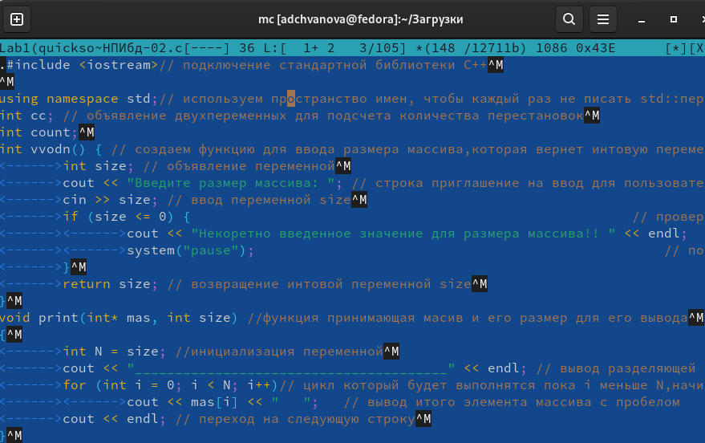{ #fig:022 width=70% }

## Выводы

Были освоены основные возможности командной оболочки Midnight Commander. Также были приобретены навыков практической работы по просмотру каталогов и файлов; манипуляций с ними.

# Спасибо за внимание!