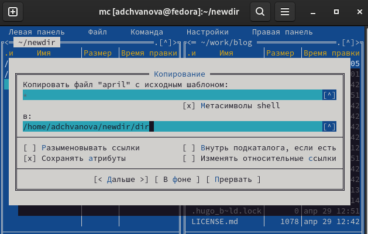

---
## Front matter
title: "Oтчёт по лабораторной работе 7"
subtitle: " Командная оболочка Midnight Commander"
author: " Ангелина Дмитриевна Чванова"

## Generic otions
lang: ru-RU
toc-title: "Содержание"

## Bibliography
bibliography: bib/cite.bib
csl: pandoc/csl/gost-r-7-0-5-2008-numeric.csl

## Pdf output format
toc: true # Table of contents
toc-depth: 2
lof: true # List of figures
lot: true # List of tables
fontsize: 12pt
linestretch: 1.5
papersize: a4
documentclass: scrreprt
## I18n polyglossia
polyglossia-lang:
  name: russian
  options:
	- spelling=modern
	- babelshorthands=true
polyglossia-otherlangs:
  name: english
## I18n babel
babel-lang: russian
babel-otherlangs: english
## Fonts
mainfont: PT Serif
romanfont: PT Serif
sansfont: PT Sans
monofont: PT Mono
mainfontoptions: Ligatures=TeX
romanfontoptions: Ligatures=TeX
sansfontoptions: Ligatures=TeX,Scale=MatchLowercase
monofontoptions: Scale=MatchLowercase,Scale=0.9
## Biblatex
biblatex: true
biblio-style: "gost-numeric"
biblatexoptions:
  - parentracker=true
  - backend=biber
  - hyperref=auto
  - language=auto
  - autolang=other*
  - citestyle=gost-numeric
## Pandoc-crossref LaTeX customization
figureTitle: "Рис."
tableTitle: "Таблица"
listingTitle: "Листинг"
lofTitle: "Список иллюстраций"
lotTitle: "Список таблиц"
lolTitle: "Листинги"
## Misc options
indent: true
header-includes:
  - \usepackage{indentfirst}
  - \usepackage{float} # keep figures where there are in the text
  - \floatplacement{figure}{H} # keep figures where there are in the text
---

# Цель работы

Освоение основных возможностей командной оболочки Midnight Commander. Приобретение навыков практической работы по просмотру каталогов и файлов; манипуляций с ними.

# Задание

Задание по mc:

1. Изучите информацию о mc, вызвав в командной строке man mc.

2. Запустите из командной строки mc, изучите его структуру и меню.

3. Выполните несколько операций в mc, используя управляющие клавиши (операции с панелями; выделение/отмена выделения файлов, копирование/перемещение файлов, получение информации о размере и правах доступа на файлы и/или каталоги и т.п.)

4. Выполните основные команды меню левой (или правой) панели. Оцените степень подробности вывода информации о файлах.

5. Используя возможности подменю Файл , выполните:

– просмотр содержимого текстового файла;

– редактирование содержимого текстового файла (без сохранения результатов
редактирования);

– создание каталога;

– копирование в файлов в созданный каталог.

6. С помощью соответствующих средств подменю Команда осуществите:

– поиск в файловой системе файла с заданными условиями (например, файла
с расширением .c или .cpp, содержащего строку main);

– выбор и повторение одной из предыдущих команд;

– переход в домашний каталог;

– анализ файла меню и файла расширений.

7. Вызовите подменю Настройки . Освойте операции, определяющие структуру экрана mc(Full screen, Double Width, Show Hidden Files и т.д.)

Задание по встроенному редактору mc:

1. Создайте текстовой файл text.txt.

2. Откройте этот файл с помощью встроенного в mc редактора.

3. Вставьте в открытый файл небольшой фрагмент текста, скопированный из любого другого файла или Интернета.

4. Проделайте с текстом следующие манипуляции, используя горячие клавиши:

4.1. Удалите строку текста.

4.2. Выделите фрагмент текста и скопируйте его на новую строку.

4.3. Выделите фрагмент текста и перенесите его на новую строку.

4.4. Сохраните файл.

4.5. Отмените последнее действие.

4.6. Перейдите в конец файла (нажав комбинацию клавиш) и напишите некоторый
текст.

4.7. Перейдите в начало файла (нажав комбинацию клавиш) и напишите некоторый
текст.

4.8. Сохраните и закройте файл.

5. Откройте файл с исходным текстом на некотором языке программирования (например C или Java)

6. Используя меню редактора, включите подсветку синтаксиса, если она не включена, или выключите, если она включена.

# Теоретическое введение

Командная оболочка — интерфейс взаимодействия пользователя с операционной системой и программным обеспечением посредством команд.
Midnight Commander (или mc) — псевдографическая командная оболочка для UNIX/Linux систем. Для запуска mc необходимо в командной строке набрать mc и нажать Enter .

Рабочее пространство mc имеет две панели, отображающие по умолчанию списки
файлов двух каталогов.

Над панелями располагается меню, доступ к которому осуществляется с помощью
клавиши F9 . Под панелями внизу расположены управляющие экранные кнопки, ассоциированные с функциональными клавишами F1 – F10.

# Выполнение лабораторной работы

Задание по mc:

1. Изучите информацию о mc, вызвав в командной строке man mc.
(рис. [-@fig:001])

{ #fig:001 width=70% }

2. Запустите из командной строки mc, изучите его структуру и меню.
(рис. [-@fig:002]- [-@fig:003])

{ #fig:002 width=70% }

{ #fig:003 width=70% }

3. Выполните несколько операций в mc, используя управляющие клавиши (операции с панелями; выделение/отмена выделения файлов, копирование/перемещение файлов, получение информации о размере и правах доступа на файлы и/или каталоги и т.п.)
(рис. [-@fig:004])

{ #fig:004 width=70% }

{ #fig:005 width=70% }

{ #fig:006 width=70% }

4. Используя возможности подменю Файл , выполните:

– просмотр содержимого текстового файла;(рис. [-@fig:007])

– редактирование содержимого текстового файла (без сохранения результатов
редактирования);(рис. [-@fig:008])

– создание каталога;(рис. [-@fig:009])

– копирование в файлов в созданный каталог.
(рис. [-@fig:010])

{ #fig:007 width=70% }

{ #fig:008 width=70% }

{ #fig:009 width=70% }

{ #fig:010 width=70% }

5. С помощью соответствующих средств подменю Команда осуществите:

– поиск в файловой системе файла с заданными условиями (например, файла
с расширением .c или .cpp, содержащего строку main);(рис. [-@fig:011])

– выбор и повторение одной из предыдущих команд;(рис. [-@fig:012])

– переход в домашний каталог;(рис. [-@fig:013])

– анализ файла меню и файла расширений.(рис. [-@fig:014] - [-@fig:015])

{ #fig:011 width=70% }

{ #fig:012 width=70% }

{ #fig:013 width=70% }

{ #fig:014 width=70% }

{ #fig:015 width=70% }

7. Вызовите подменю Настройки . Освойте операции, определяющие структуру экрана mc(Full screen, Double Width, Show Hidden Files и т.д.)(рис. [-@fig:016] - [-@fig:017])

{ #fig:016 width=70% }

{ #fig:017 width=70% }

Задание по встроенному редактору mc:

1. Создайте текстовой файл text.txt.(рис. [-@fig:018])

{ #fig:018 width=70% }

2. Откройте этот файл с помощью встроенного в mc редактора.Вставьте в открытый файл небольшой фрагмент текста, скопированный из любого другого файла или Интернета.(рис. [-@fig:019])

{ #fig:019 width=70% }

3. Проделайте с текстом следующие манипуляции, используя горячие клавиши:

- Удалите строку текста.

- Выделите фрагмент текста и скопируйте его на новую строку.

- Выделите фрагмент текста и перенесите его на новую строку.

- Сохраните файл.

- Отмените последнее действие.

- Перейдите в конец файла (нажав комбинацию клавиш) и напишите некоторый
текст.

- Перейдите в начало файла (нажав комбинацию клавиш) и напишите некоторый
текст.

- Сохраните и закройте файл.(рис. [-@fig:020])

{ #fig:020 width=70% }

5. Откройте файл с исходным текстом на некотором языке программирования (например C или Java)(рис. [-@fig:021])

{ #fig:021 width=70% }

6. Используя меню редактора, включите подсветку синтаксиса, если она не включена, или выключите, если она включена. (рис. [-@fig:022]-[-@fig:023])

{ #fig:022 width=70% }

{ #fig:023 width=70% }

# Выводы

Были освоены основные возможности командной оболочки Midnight Commander. Также были приобретены навыков практической работы по просмотру каталогов и файлов; манипуляций с ними.

# Контрольные вопросы

1. Какие режимы работы есть в mc. Охарактеризуйте их.

Панель в mc отображает список файлов текущего каталога. Абсолютный путь к этому каталогу отображается в заголовке панели. У активной панели заголовок и одна из её строк подсвечиваются. Управление панелями осуществляется с помощью определённых комбинаций клавиш или пунктов меню mc.
Панели можно поменять местами. Для этого и используется комбинация клавиш Ctrl-u или команда меню mc Переставить панели . Также можно временно убрать отображение панелей (отключить их) с помощью комбинации клавиш Ctrl-o или команды меню mc Отключить панели . Это может быть полезно, например, если необходимо увидеть вывод какой-то информации на экран после выполнения какой-либо команды shell.
С помощью последовательного применения комбинации клавиш Ctrl-x d есть
возможность сравнения каталогов, отображённых на двух панелях. Панели могут дополнительно быть переведены в один из двух режимов: Информация или Дерево . В режиме Информация на панель выводятся сведения о файле и текущей файловой системе, расположенных на активной панели. В режиме Дерево (рис. 7.3) на одной из панелей выводится структура дерева каталогов. Управлять режимами отображения панелей можно через пункты меню mc Правая панель и Левая панель 

2. Какие операции с файлами можно выполнить как с помощью команд shell, так и с помощью меню (комбинаций клавиш) mc? Приведите несколько примеров.

если необходимо увидеть вывод какой-то информации на экран после выполнения какой-либо команды shell.

– Просмотр ( F3 ) — позволяет посмотреть содержимое текущего (или выделенного) файла без возможности редактирования.

– Просмотр вывода команды ( М + ! ) — функция запроса команды с параметрами
(аргумент к текущему выбранному файлу).

– Правка ( F4 ) — открывает текущий (или выделенный) файл для его редактирования.

– Копирование ( F5 ) — осуществляет копирование одного или нескольких файлов или каталогов в указанное пользователем во всплывающем окне место.

– Права доступа ( Ctrl-x c ) — позволяет указать (изменить) права доступа к одному или нескольким файлам или каталогам.

3. Опишите структура меню левой (или правой) панели mc, дайте характеристику командам.

Подпункт меню Быстрый просмотр позволяет выполнить быстрый просмотр содержимого панели.

В меню каждой (левой или правой) панели можно выбрать Формат списка :
– стандартный — выводит список файлов и каталогов с указанием размера и времени правки;

– ускоренный — позволяет задать число столбцов, на которые разбивается панель при выводе списка имён файлов или каталогов без дополнительной информации;

– расширенный — помимо названия файла или каталога выводит сведения о правах
доступа, владельце, группе, размере, времени правки;

– определённый пользователем — позволяет вывести те сведения о файле или каталоге, которые задаст сам пользователь.

Подпункт меню Порядок сортировки позволяет задать критерии сортировки при выводесписка файлов и каталогов: без сортировки, по имени, расширенный, время правки, время доступа, время изменения атрибута, размер, узел.

4. Опишите структура меню Файл mc, дайте характеристику командам.

В меню Файл содержит перечень команд, которые могут быть применены к одному
или нескольким файлам или каталогам .

Команды меню Файл :

– Просмотр ( F3 ) — позволяет посмотреть содержимое текущего (или выделенного) файла без возможности редактирования.

– Просмотр вывода команды ( М + ! ) — функция запроса команды с параметрами
(аргумент к текущему выбранному файлу).

– Правка ( F4 ) — открывает текущий (или выделенный) файл для его редактирования.

– Копирование ( F5 ) — осуществляет копирование одного или нескольких файлов или каталогов в указанное пользователем во всплывающем окне место.
– Права доступа ( Ctrl-x c ) — позволяет указать (изменить) права доступа к одному или нескольким файлам или каталогам 

– Жёсткая ссылка ( Ctrl-x l ) — позволяет создать жёсткую ссылку к текущему (или выделенному) файлу

– Символическая ссылка ( Ctrl-x s ) — позволяет создать символическую ссылку к текущему (или выделенному) файлу

– Владелец/группа ( Ctrl-x o ) — позволяет задать (изменить) владельца и имя группы для одного или нескольких файлов или каталогов.

– Права (расширенные) — позволяет изменить права доступа и владения для одного или нескольких файлов или каталогов.

– Переименование ( F6 ) — позволяет переименовать (или переместить) один или
несколько файлов или каталогов.

– Создание каталога ( F7 ) — позволяет создать каталог.

– Удалить ( F8 ) — позволяет удалить один или несколько файлов или каталогов.

– Выход ( F10 ) — завершает работу mc.

5. Опишите структура меню Команда mc, дайте характеристику командам.

Перейти в строку меню панелей mc можно с помощью функциональной клавиши F9 .
В строке меню имеются пять меню: Левая панель , Файл , Команда , Настройки и Правая панель .

В меню Файл содержит перечень команд, которые могут быть применены к одному
или нескольким файлам или каталогам. Меню Настройки содержит ряд дополнительных опций по внешнему виду и функциональности mc.
В меню Команда содержатся более общие команды для работы с mc.

6. Опишите структура меню Настройки mc, дайте характеристику командам.

Меню Настройки содержит ряд дополнительных опций по внешнему виду и функциональности mc.

Меню Настройки содержит:

– Конфигурация — позволяет скорректировать настройки работы с панелями.

– Внешний вид и Настройки панелей — определяет элементы (строка меню, командная строка, подсказки и прочее), отображаемые при вызове mc, а также геометрию расположения панелей и цветовыделение.

– Биты символов — задаёт формат обработки информации локальным терминалом.

– Подтверждение — позволяет установить или убрать вывод окна с запросом подтверждения действий при операциях удаления и перезаписи файлов, а также при выходе из программы.

– Распознание клавиш — диалоговое окно используется для тестирования функциональных клавиш, клавиш управления курсором и прочее.

– Виртуальные ФС –– настройки виртуальной файловой системы: тайм-аут, пароль
и прочее.

7. Назовите и дайте характеристику встроенным командам mc.

Встроенный в mc редактор вызывается с помощью функциональной клавиши F4 . В нём удобно использовать различные комбинации клавиш при редактировании содержимого (как правило текстового) файла.

Ctrl-y удалить строку

Ctrl-u отмена последней операции

Ins вставка/замена

F7 поиск (можно использовать регулярные выражения)

-F7 повтор последней операции поиска

F4 замена

F3 первое нажатие — начало выделения, второе — окончание
выделения

F5 копировать выделенный фрагмент

F6 переместить выделенный фрагмент

F8 удалить выделенный фрагмент

F2 записать изменения в файл

F10 выйти из редактора

8. Назовите и дайте характеристику командам встроенного редактора mc.

повторение 7 вопроса 

9. Дайте характеристику средствам mc, которые позволяют создавать меню, определяемые пользователем.

Меню пользователя - это меню, вызываемое при нажатии клавиши F2 и состоящее из команд, определённых пользователем. Меню создается через главное меню MC command/edit menu file.

Возможны два варианта меню: главное и локальное. Главное меню пользователя хранится в файле ~/.config/mc/menuи действует во всех каталогах файловой системы. Локальное меню хранится в файле ~/.mc.menu и действует только в том каталоге, где находится этот файл.

Кроме пользовательских меню MC имеет собственное системное меню, которое находится в файле /etc/mc/mc.menu. Это меню работает только тогда, когда не определено главное меню пользователя и в каталоге отсутствует локальное меню.

10. Дайте характеристику средствам mc, которые позволяют выполнять действия, определяемые пользователем, над текущим файлом.

– Просмотр ( F3 ) — позволяет посмотреть содержимое текущего (или выделенного) файла без возможности редактирования.

– Просмотр вывода команды ( М + ! ) — функция запроса команды с параметрами
(аргумент к текущему выбранному файлу).

– Правка ( F4 ) — открывает текущий (или выделенный) файл для его редактирования.

– Копирование ( F5 ) — осуществляет копирование одного или нескольких файлов или каталогов в указанное пользователем во всплывающем окне место.
– Права доступа ( Ctrl-x c ) — позволяет указать (изменить) права доступа к одному или нескольким файлам или каталогам 

– Жёсткая ссылка ( Ctrl-x l ) — позволяет создать жёсткую ссылку к текущему (или выделенному) файлу

– Символическая ссылка ( Ctrl-x s ) — позволяет создать символическую ссылку к текущему (или выделенному) файлу

– Владелец/группа ( Ctrl-x o ) — позволяет задать (изменить) владельца и имя группы для одного или нескольких файлов или каталогов.

– Права (расширенные) — позволяет изменить права доступа и владения для одного или нескольких файлов или каталогов.

– Переименование ( F6 ) — позволяет переименовать (или переместить) один или
несколько файлов или каталогов.

– Создание каталога ( F7 ) — позволяет создать каталог.

– Удалить ( F8 ) — позволяет удалить один или несколько файлов или каталогов.

– Выход ( F10 ) — завершает работу mc.
