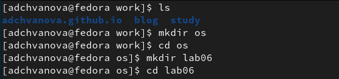
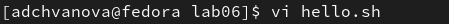
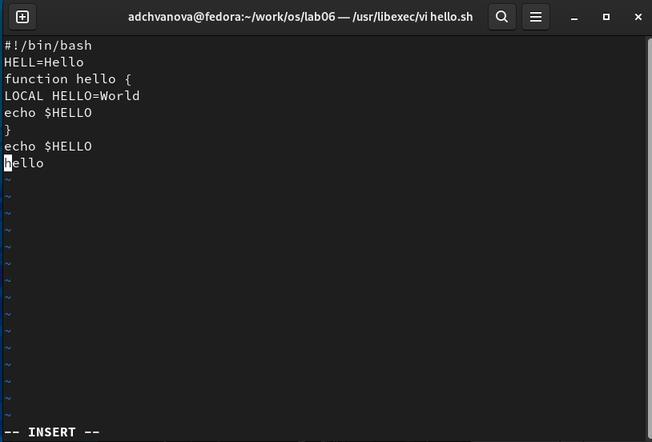
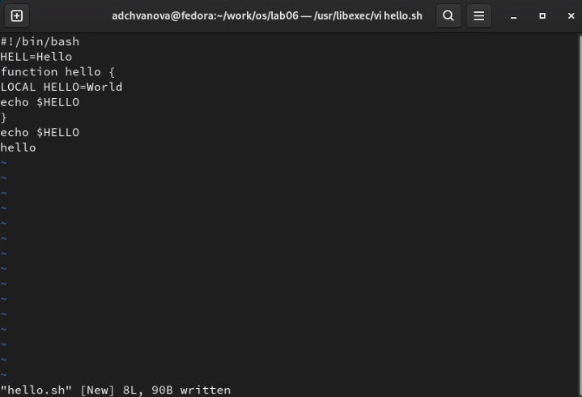
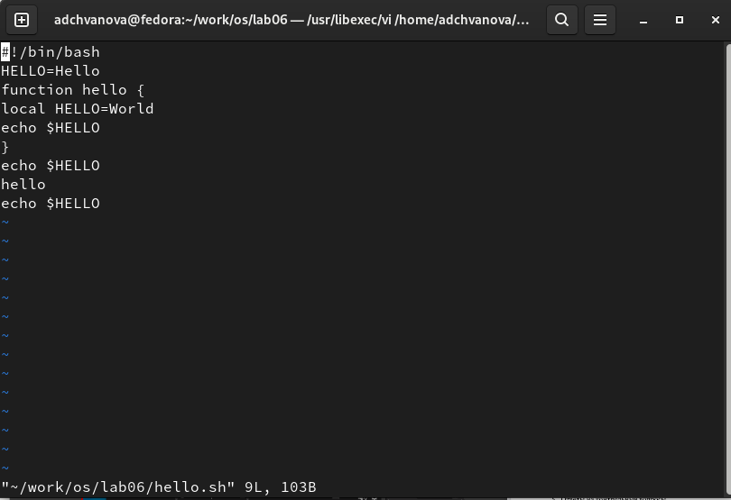

---
## Front matter
lang: ru-RU
title: Лабораторная работа № 8. Текстовой редактор vi

author: |
	Chvanova A.D.
institute: |
	RUDN University, Moscow, Russian Federation
	
date: NEC--2022, 11 May, Moscow

## Formatting
toc: false
slide_level: 2
theme: metropolis
header-includes: 
 - \metroset{progressbar=frametitle,sectionpage=progressbar,numbering=fraction}
 - '\makeatletter'
 - '\beamer@ignorenonframefalse'
 - '\makeatother'
aspectratio: 43
section-titles: true
---

## Цель работы

Познакомиться с операционной системой Linux. Получить практические навыки работы с редактором vi, установленным по умолчанию практически во всех дистрибутивах.

## Теоретическое введение

В большинстве дистрибутивов Linux в качестве текстового редактора по умолчанию устанавливается интерактивный экранный редактор vi (Visual display editor).

Редактор vi имеет три режима работы:

– командный режим — предназначен для ввода команд редактирования и навигации по редактируемому файлу;

– режим вставки — предназначен для ввода содержания редактируемого файла;

– режим последней (или командной) строки — используется для записи изменений в файл и выхода из редактора.

## Выполнение лабораторной работы

Задание 1. Создание нового файла с использованием vi

1. Создайте каталог с именем ~/work/os/lab06.Перейдите во вновь созданный каталог.(рис. [-@fig:001])

{ #fig:001 width=70% }

## Выполнение лабораторной работы

2. Вызовите vi и создайте файл hello.sh (рис. [-@fig:002])

vi hello.sh 

{ #fig:002 width=70% }

## Выполнение лабораторной работы

3. Нажмите клавишу i и вводите текст. Нажмите клавишу Esc для перехода в командный режим после завершения ввода текста. Нажмите : для перехода в режим последней строки и внизу вашего экрана появится приглашение в виде двоеточия.(рис. [-@fig:003])

{ #fig:003 width=70% }

## Выполнение лабораторной работы

4. Нажмите w (записать) и q (выйти), а затем нажмите клавишу Enter для сохранения вашего текста и завершения работы.(рис. [-@fig:004])

{ #fig:004 width=70% }

## Выполнение лабораторной работы

5. Сделайте файл исполняемым(рис. [-@fig:005])

{ #fig:005 width=70% }

## Выполнение лабораторной работы

Задание 2. Редактирование существующего файла

1. Вызовите vi на редактирование файла(рис. [-@fig:006])

vi ~/work/os/lab06/hello.sh

{ #fig:006 width=70% }

## Выполнение лабораторной работы

2. Установите курсор в конец слова HELL второй строки. Перейдите в режим вставки и замените на HELLO. Нажмите Esc для возврата в командный режим. Установите курсор на четвертую строку и сотрите слово LOCAL.
Перейдите в режим вставки и наберите следующий текст: local, нажмите Esc для возврата в командный режим. Установите курсор на последней строке файла. Вставьте после неё строку, содержащую следующий текст: echo $HELLO. Нажмите Esc для перехода в командный режим. Удалите последнюю строку.
Введите команду отмены изменений u для отмены последней команды.
Введите символ : для перехода в режим последней строки. Запишите произведённые изменения и выйдите из vi.(рис. [-@fig:007])

## Выполнение лабораторной работы

{ #fig:007 width=70% }

## Выводы

Мы познакомились с операционной системой Linux. Получили практические навыки работы с редактором vi, установленным по умолчанию практически во всех дистрибутивах.

# Спасибо за внимание!