---
## Front matter
lang: ru-RU
title: Лабораторная работа 9.Текстовой редактор emacs
author: |
	Chvanova A.D.
institute: |
	RUDN University, Moscow, Russian Federation

date: NEC--2022, 16 May, Moscow

## Formatting
toc: false
slide_level: 2
theme: metropolis
header-includes: 
 - \metroset{progressbar=frametitle,sectionpage=progressbar,numbering=fraction}
 - '\makeatletter'
 - '\beamer@ignorenonframefalse'
 - '\makeatother'
aspectratio: 43
section-titles: true
---

## Цель работы

Познакомиться с операционной системой Linux. Получить практические навыки работы с редактором Emacs.

## Задание

1.Открыть emacs.

2.Создать файл lab07.sh с помощью комбинации Ctrl-x Ctrl-f (C-x C-f).

3.Набрать текст

4.Сохранить файл с помощью комбинации Ctrl-x Ctrl-s (C-x C-s).

5.Проделать с текстом стандартные процедуры редактирования, каждое действие должно осуществляться комбинацией клавиш.

6.Научитесь использовать команды по перемещению курсора.

7.Управление буферами.

8.Управление окнами.

9.Режим поиска

## Теоретическое введение

Определение 1. Буфер — объект, представляющий какой-либо текст.

Буфер может содержать что угодно, например, результаты компиляции программы или встроенные подсказки. Практически всё взаимодействие с пользователем, в том числе интерактивное, происходит посредством буферов.

Определение 2. Фрейм соответствует окну в обычном понимании этого слова. Каждый фрейм содержит область вывода и одно или несколько окон Emacs.

Для работы с Emacs можно использовать как элементы меню, так и различные сочетания клавиш. Например, для выхода из Emacs можно воспользоваться меню File
и выбрать пункт Quit , а можно нажать последовательно Ctrl-x Ctrl-c.

## Выполнение лабораторной работы

1.Открыть emacs.(рис. [-@fig:001])

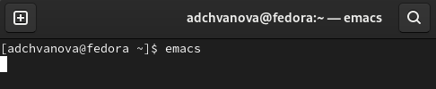{ #fig:001 width=70% }

## Выполнение лабораторной работы

2.Создать файл lab07.sh с помощью комбинации Ctrl-x Ctrl-f (C-x C-f).(рис. [-@fig:002])

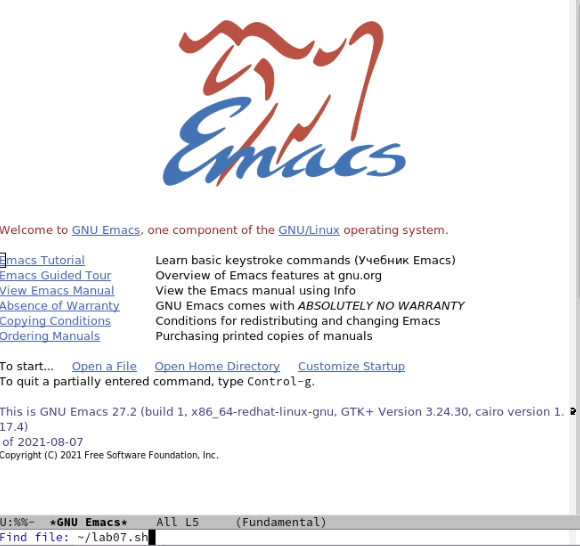{ #fig:002 width=70% }

## Выполнение лабораторной работы

3.Набрать текст и сохранить его комбинации Ctrl-x Ctrl-s (C-x C-s) (рис. [-@fig:003])

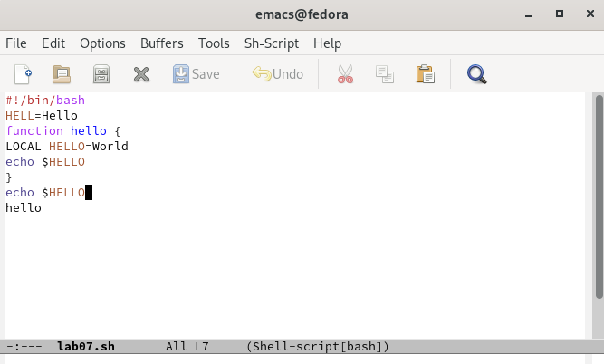{ #fig:003 width=70% }

## Выполнение лабораторной работы

4.Проделать с текстом стандартные процедуры редактирования, каждое действие должно осуществляться комбинацией клавиш.

4.1. Вырезать одной командой целую строку (С-k).

4.2. Вставить эту строку в конец файла (C-y).

4.3. Выделить область текста (C-space).

## Выполнение лабораторной работы

4.4. Скопировать область в буфер обмена (M-w).Вставить область в конец файла.(рис. [-@fig:007])

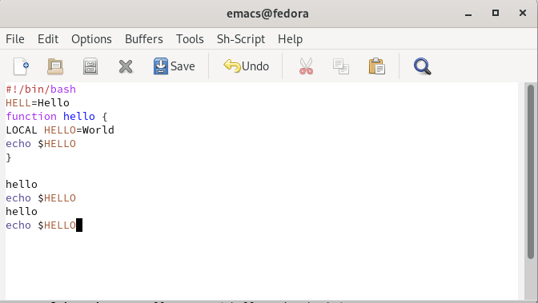{ #fig:007 width=70% }

## Выполнение лабораторной работы

4.5. Вновь выделить эту область и на этот раз вырезать её (C-w).

4.6. Отмените последнее действие (C-/).(рис. [-@fig:009])

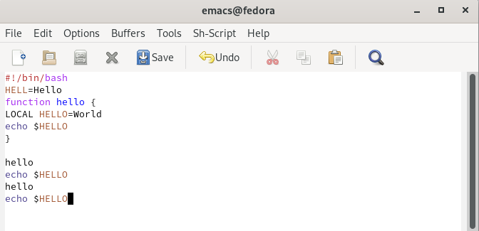{ #fig:009 width=70% }

## Выполнение лабораторной работы

5.Научитесь использовать команды по перемещению курсора.

5.1. Переместите курсор в начало строки (C-a).

5.2. Переместите курсор в конец строки (C-e).(рис. [-@fig:011])

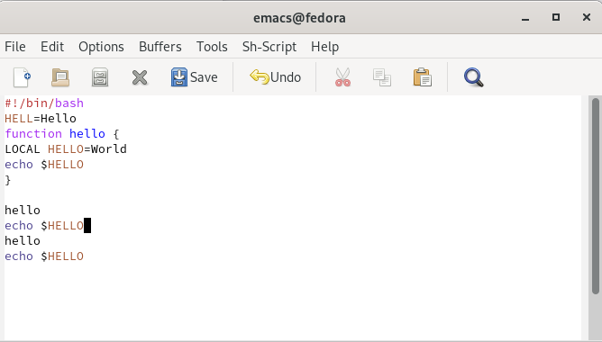{ #fig:011 width=70% }

## Выполнение лабораторной работы

5.3. Переместите курсор в начало буфера (M-<).

5.4. Переместите курсор в конец буфера (M->).(рис. [-@fig:013])

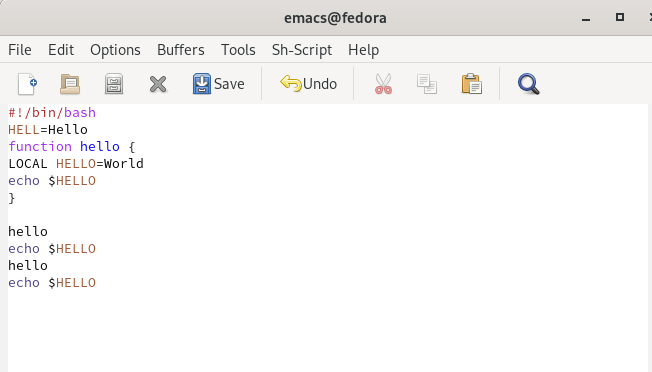{ #fig:013 width=70% }

## Выполнение лабораторной работы

6.Управление буферами.

6.1. Вывести список активных буферов на экран (C-x C-b).(рис. [-@fig:014])

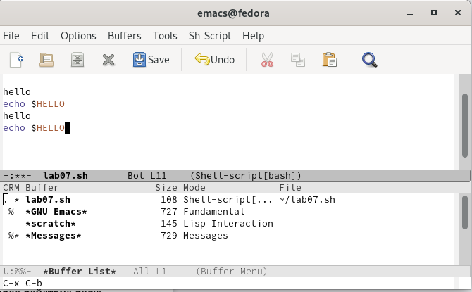{ #fig:014 width=70% }

## Выполнение лабораторной работы

6.2. Переместитесь во вновь открытое окно (C-x) o со списком открытых буферов и переключитесь на другой буфер.(рис. [-@fig:015])

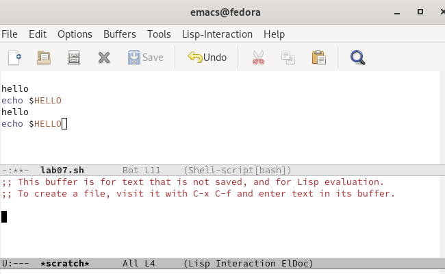{ #fig:015 width=70% }

## Выполнение лабораторной работы

6.3. Закройте это окно (C-x 0).(рис. [-@fig:016])

6.4. Теперь вновь переключайтесь между буферами, но уже без вывода их списка на экран (C-x b).

## Выполнение лабораторной работы

7.Управление окнами. Поделите фрейм на 4 части: разделите фрейм на два окна по вертикали (C-x 3), а затем каждое из этих окон на две части по горизонтали (C-x 2).В каждом из четырёх созданных окон откройте новый буфер (файл) и введите несколько строк текста.(рис. [-@fig:018])

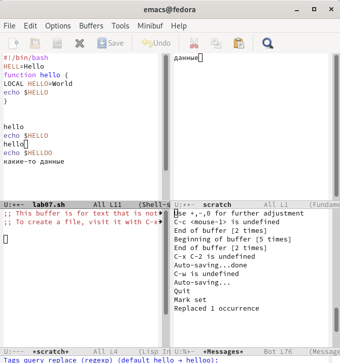{ #fig:018 width=70% }

## Выполнение лабораторной работы

8.Режим поиска(рис. [-@fig:019]- [-@fig:020])

8.1. Переключитесь в режим поиска (C-s) и найдите несколько слов, присутствующих в тексте.Переключайтесь между результатами поиска, нажимая C-s. Выйдите из режима поиска, нажав C-g.(рис. [-@fig:019])

{ #fig:019 width=70% }

## Выполнение лабораторной работы

8.2. Перейдите в режим поиска и замены (M-%), введите текст, который следует найти и заменить, нажмите Enter , затем введите текст для замены. После того как будут
подсвечены результаты поиска, нажмите ! для подтверждения замены. (рис. [-@fig:020])

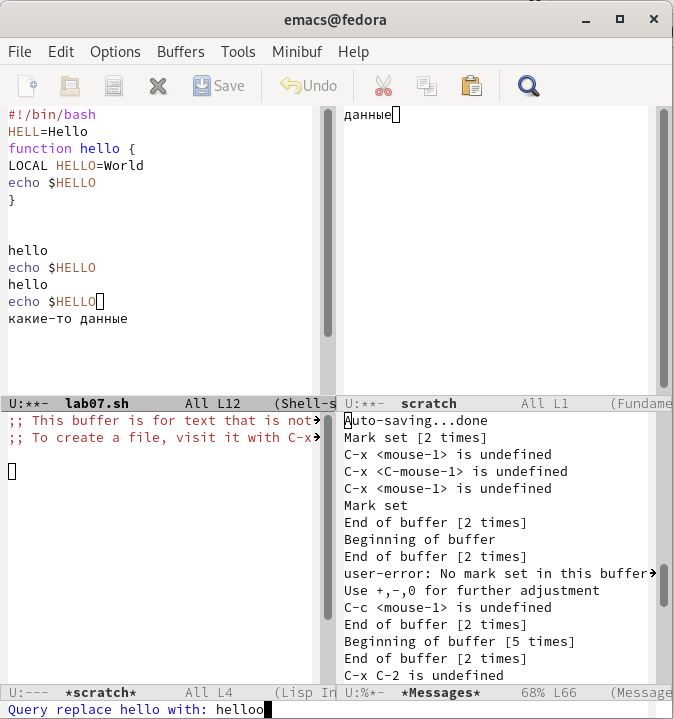{ #fig:020 width=70% }

## Выводы

Мы познакомились с операционной системой Linux и получили практические навыки работы с редактором Emacs.

# Спасибо за внимание!
