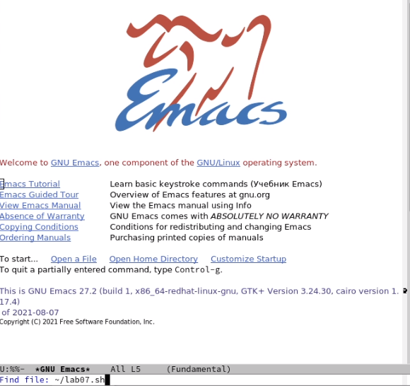
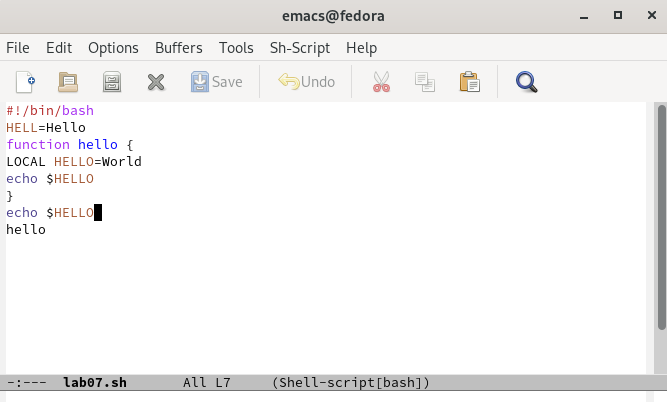
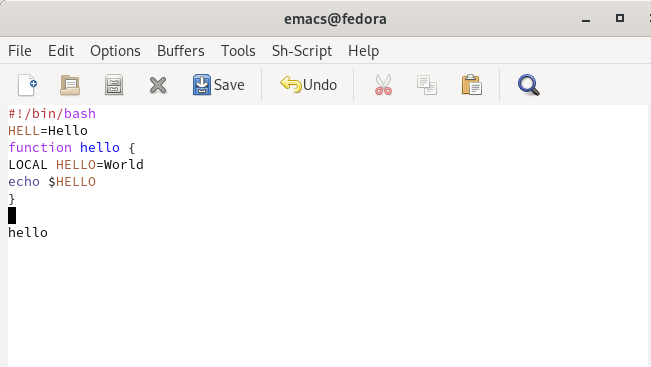
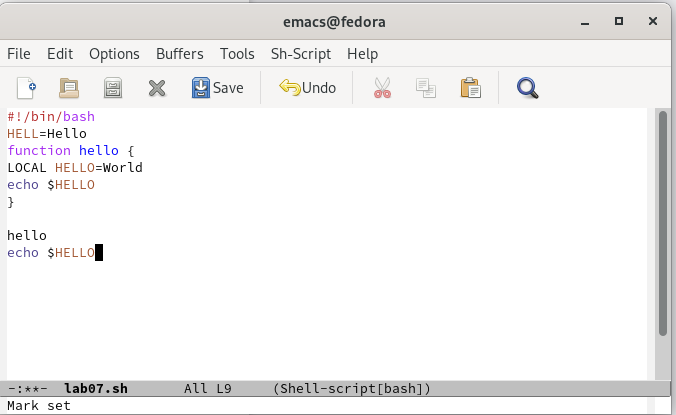
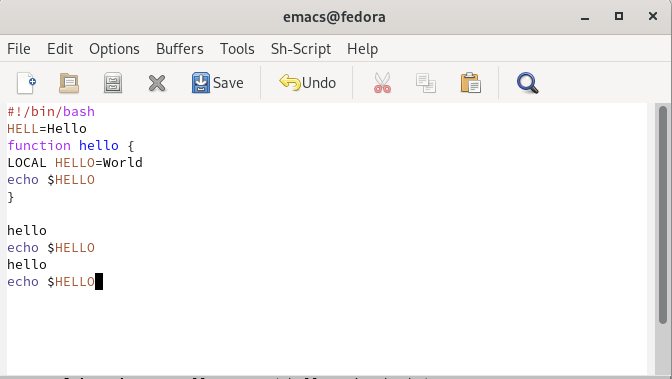
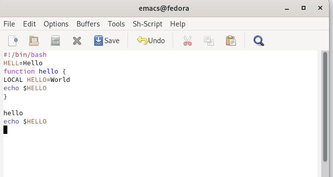
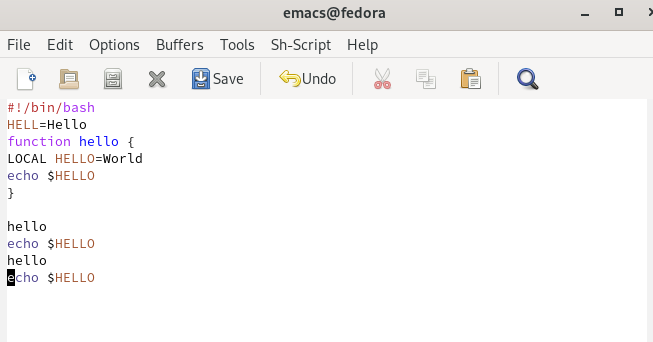
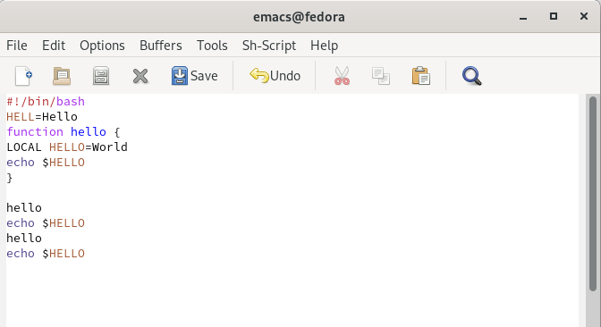
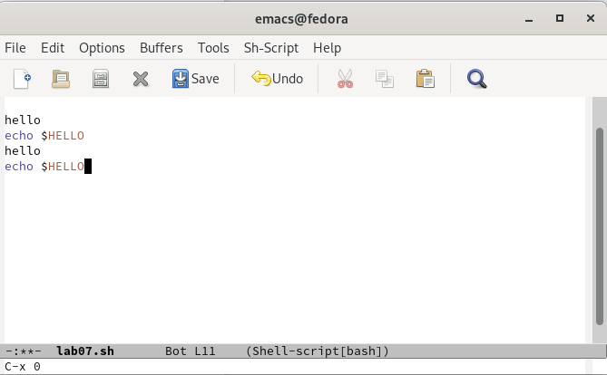

---
## Front matter
title: "Отчёта по лабораторной работе 9"
subtitle: "Текстовой редактор emacs"
author: "Ангелина Чванова Дмитриевна"

## Generic otions
lang: ru-RU
toc-title: "Содержание"

## Bibliography
bibliography: bib/cite.bib
csl: pandoc/csl/gost-r-7-0-5-2008-numeric.csl

## Pdf output format
toc: true # Table of contents
toc-depth: 2
lof: true # List of figures
lot: true # List of tables
fontsize: 12pt
linestretch: 1.5
papersize: a4
documentclass: scrreprt
## I18n polyglossia
polyglossia-lang:
  name: russian
  options:
	- spelling=modern
	- babelshorthands=true
polyglossia-otherlangs:
  name: english
## I18n babel
babel-lang: russian
babel-otherlangs: english
## Fonts
mainfont: PT Serif
romanfont: PT Serif
sansfont: PT Sans
monofont: PT Mono
mainfontoptions: Ligatures=TeX
romanfontoptions: Ligatures=TeX
sansfontoptions: Ligatures=TeX,Scale=MatchLowercase
monofontoptions: Scale=MatchLowercase,Scale=0.9
## Biblatex
biblatex: true
biblio-style: "gost-numeric"
biblatexoptions:
  - parentracker=true
  - backend=biber
  - hyperref=auto
  - language=auto
  - autolang=other*
  - citestyle=gost-numeric
## Pandoc-crossref LaTeX customization
figureTitle: "Рис."
tableTitle: "Таблица"
listingTitle: "Листинг"
lofTitle: "Список иллюстраций"
lotTitle: "Список таблиц"
lolTitle: "Листинги"
## Misc options
indent: true
header-includes:
  - \usepackage{indentfirst}
  - \usepackage{float} # keep figures where there are in the text
  - \floatplacement{figure}{H} # keep figures where there are in the text
---

# Цель работы

Познакомиться с операционной системой Linux. Получить практические навыки работы с редактором Emacs.

# Задание

1.Открыть emacs.

2.Создать файл lab07.sh с помощью комбинации Ctrl-x Ctrl-f (C-x C-f).

3.Набрать текст

4.Сохранить файл с помощью комбинации Ctrl-x Ctrl-s (C-x C-s).

5.Проделать с текстом стандартные процедуры редактирования, каждое действие должно осуществляться комбинацией клавиш.

5.1. Вырезать одной командой целую строку (С-k).

5.2. Вставить эту строку в конец файла (C-y).

5.3. Выделить область текста (C-space).

5.4. Скопировать область в буфер обмена (M-w).

5.5. Вставить область в конец файла.

5.6. Вновь выделить эту область и на этот раз вырезать её (C-w).

5.7. Отмените последнее действие (C-/).

6.Научитесь использовать команды по перемещению курсора.

6.1. Переместите курсор в начало строки (C-a).

6.2. Переместите курсор в конец строки (C-e).

6.3. Переместите курсор в начало буфера (M-<).

6.4. Переместите курсор в конец буфера (M->).

7.Управление буферами.

7.1. Вывести список активных буферов на экран (C-x C-b).

7.2. Переместитесь во вновь открытое окно (C-x) o со списком открытых буферов
и переключитесь на другой буфер.

7.3. Закройте это окно (C-x 0).

7.4. Теперь вновь переключайтесь между буферами, но уже без вывода их списка на
экран (C-x b).

8.Управление окнами.

8.1. Поделите фрейм на 4 части: разделите фрейм на два окна по вертикали (C-x 3), а затем каждое из этих окон на две части по горизонтали (C-x 2)

8.2. В каждом из четырёх созданных окон откройте новый буфер (файл) и введите несколько строк текста.

9.Режим поиска

9.1. Переключитесь в режим поиска (C-s) и найдите несколько слов, присутствующих в тексте.

9.2. Переключайтесь между результатами поиска, нажимая C-s.

9.3. Выйдите из режима поиска, нажав C-g.

9.4. Перейдите в режим поиска и замены (M-%), введите текст, который следует найти и заменить, нажмите Enter , затем введите текст для замены. После того как будут
подсвечены результаты поиска, нажмите ! для подтверждения замены.

9.5. Испробуйте другой режим поиска, нажав M-s o. Объясните, чем он отличается от обычного режима?

# Теоретическое введение

Определение 1. Буфер — объект, представляющий какой-либо текст.

Буфер может содержать что угодно, например, результаты компиляции программы или встроенные подсказки. Практически всё взаимодействие с пользователем, в том числе интерактивное, происходит посредством буферов.

Определение 2. Фрейм соответствует окну в обычном понимании этого слова. Каждый фрейм содержит область вывода и одно или несколько окон Emacs.

Определение 3. Окно — прямоугольная область фрейма, отображающая один из буферов.
Каждое окно имеет свою строку состояния, в которой выводится следующая информация: название буфера, его основной режим, изменялся ли текст буфера и как далеко вниз
по буферу расположен курсор. Каждый буфер находится только в одном из возможных основных режимов. Существующие основные режимы включают режим Fundamental
(наименее специализированный), режим Text, режим Lisp, режим С, режим Texinfo и другие. Под второстепенными режимами понимается список режимов, которые включены в данный момент в буфере выбранного окна.

Определение 4. Область вывода — одна или несколько строк внизу фрейма, в которой Emacs выводит различные сообщения, а также запрашивает подтверждения и дополнительную информацию от пользователя.

Определение 5. Минибуфер используется для ввода дополнительной информации и всегда отображается в области вывода.

Определение 6. Точка вставки — место вставки (удаления) данных в буфер

Для работы с Emacs можно использовать как элементы меню, так и различные сочетания клавиш. Например, для выхода из Emacs можно воспользоваться меню File
и выбрать пункт Quit , а можно нажать последовательно Ctrl-x Ctrl-c

1.Открыть emacs.(рис. [-@fig:001])

{ #fig:001 width=70% }

2.Создать файл lab07.sh с помощью комбинации Ctrl-x Ctrl-f (C-x C-f).(рис. [-@fig:002])

{ #fig:002 width=70% }

3.Набрать текст и сохранить его комбинации Ctrl-x Ctrl-s (C-x C-s) (рис. [-@fig:003])

{ #fig:003 width=70% }

4.Проделать с текстом стандартные процедуры редактирования, каждое действие должно осуществляться комбинацией клавиш.

4.1. Вырезать одной командой целую строку (С-k).(рис. [-@fig:004])

{ #fig:004 width=70% }

4.2. Вставить эту строку в конец файла (C-y).(рис. [-@fig:005])

{ #fig:005 width=70% }

4.3. Выделить область текста (C-space).(рис. [-@fig:006])

{ #fig:006 width=70% }

4.4. Скопировать область в буфер обмена (M-w).Вставить область в конец файла.(рис. [-@fig:007])

{ #fig:007 width=70% }

4.5. Вновь выделить эту область и на этот раз вырезать её (C-w).(рис. [-@fig:008])

{ #fig:008 width=70% }

4.6. Отмените последнее действие (C-/).(рис. [-@fig:009])

{ #fig:009 width=70% }

5.Научитесь использовать команды по перемещению курсора.

5.1. Переместите курсор в начало строки (C-a).(рис. [-@fig:010])

{ #fig:010 width=70% }

5.2. Переместите курсор в конец строки (C-e).(рис. [-@fig:011])

{ #fig:011 width=70% }

5.3. Переместите курсор в начало буфера (M-<).(рис. [-@fig:012])

{ #fig:012 width=70% }

5.4. Переместите курсор в конец буфера (M->).(рис. [-@fig:013])

{ #fig:013 width=70% }

6.Управление буферами.

6.1. Вывести список активных буферов на экран (C-x C-b).(рис. [-@fig:014])

{ #fig:014 width=70% }

6.2. Переместитесь во вновь открытое окно (C-x) o со списком открытых буферов и переключитесь на другой буфер.(рис. [-@fig:015])

{ #fig:015 width=70% }

6.3. Закройте это окно (C-x 0).(рис. [-@fig:016])

{ #fig:016 width=70% }

6.4. Теперь вновь переключайтесь между буферами, но уже без вывода их списка на экран (C-x b).(рис. [-@fig:017])

{ #fig:017 width=70% }

7.Управление окнами. Поделите фрейм на 4 части: разделите фрейм на два окна по вертикали (C-x 3), а затем каждое из этих окон на две части по горизонтали (C-x 2).В каждом из четырёх созданных окон откройте новый буфер (файл) и введите несколько строк текста.(рис. [-@fig:018])

{ #fig:018 width=70% }

8.Режим поиска(рис. [-@fig:019]- [-@fig:020])

8.1. Переключитесь в режим поиска (C-s) и найдите несколько слов, присутствующих в тексте.Переключайтесь между результатами поиска, нажимая C-s. Выйдите из режима поиска, нажав C-g.(рис. [-@fig:019])

{ #fig:019 width=70% }

8.2. Перейдите в режим поиска и замены (M-%), введите текст, который следует найти и заменить, нажмите Enter , затем введите текст для замены. После того как будут
подсвечены результаты поиска, нажмите ! для подтверждения замены. (рис. [-@fig:020])

{ #fig:020 width=70% }

# Выводы

Мы познакомились с операционной системой Linux и получили практические навыки работы с редактором Emacs.

# Контрольные вопросы

1. Кратко охарактеризуйте редактор emacs.

Emacs − один из наиболее мощных и широко распространённых редакторов, используемых в мире Unix. По популярности он соперничает с редактором vi и его клонами. В зависимости от ситуации, Emacs может быть текстовым редактором; программой для чтения почты и новостей Usenet; интегрированной средой разработки (IDE); операционной системой и т.д.Всё это разнообразие достигается благодаря архитектуре Emacs, которая позволяет расширять возможности редактора при помощи языка Emacs Lisp. На языке C написаны лишь самые базовые и низкоуровневые части Emacs, включая полнофункциональный. интерпретатор языка Lisp. Таким образом, Emacs имеет встроенный язык программирования, который может использоваться для настройки, расширения и изменения поведения редактора. В действительности, большая часть того редактора, с которым пользователи Emacs работают в наши дни,написана на языке Lisp.

2. Какие особенности данного редактора могут сделать его сложным для освоения новичком?

Новичкам может быть сложно из-за большого числа команд и непривычных комбинаций для этих команд, так как это отличается от того, что они привыкли видеть в windows и других редакторах.

3. Своими словами опишите, что такое буфер и окно в терминологии emacs’а.

Буфер –это объект, представляющий собой текст.
Если имеется несколько буферов, то редактировать можно только один. Обычно буфер считывает данные из файла или записывает в файл данные из буфера.Окно –это область экрана, отображающая буфер. При запуске редактора отображается одно окно, но при обращении к некоторым функциям могут открыться дополнительные окна.

4. Можно ли открыть больше 10 буферов в одном окне?

Да 

5. Какие буферы создаются по умолчанию при запуске emacs?

«scratch»(буфер для несохраненного текста)

«Messages»(журнал ошибок, включающий такжеинформацию, которая появляется в области EchoArea)

«GNUEmacs»(справочный буфер о редакторе).

6. Какие клавиши вы нажмёте, чтобы ввести следующую комбинацию C-c | и C-c C-|?

C-c |удерживаю «ctrl»,нажимаю «c»,после –отпускаю обе клавиши и нажимаю «|» C-c C-|удерживаю «ctrl»,нажимаю «с», после –отпускаю обе клавиши и, удерживаю «ctrl», нажимаю «|».

7. Как поделить текущее окно на две части?

Комбинации делят окно:

«Ctrl-x 3»(по вертикали)

«Ctrl-x 2» (по горизонтали).

8. В каком файле хранятся настройки редактора emacs?

Настройки Emacs хранятся в файле .emacs.

9. Какую функцию выполняет клавиша «←» и можно ли её переназначить?

По умолчанию клавиша «←» удаляет символ перед курсором. в редакторе её можно переназначить. Для её переназначения необхдимо изменить конфигурацию файла .emacs.

10. Какой редактор вам показался удобнее в работе vi или emacs? Поясните почему

Более удобным я считаю редактор emacs, потому что в нем можно использовать сразу несколько окон и проще открывать другие файлы.
