---
## Front matter
lang: ru-RU
title: Лабораторная работа № 10. Программирование в командном процессоре ОС UNIX. Командные файлы

author: |
	Chvanova A.D.
institute: |
	RUDN University, Moscow, Russian Federation
	
date: NEC--2022, 17 May, Moscow

## Formatting
toc: false
slide_level: 2
theme: metropolis
header-includes: 
 - \metroset{progressbar=frametitle,sectionpage=progressbar,numbering=fraction}
 - '\makeatletter'
 - '\beamer@ignorenonframefalse'
 - '\makeatother'
aspectratio: 43
section-titles: true
---

## Цель работы

Изучить основы программирования в оболочке ОС UNIX/Linux. Научиться писать
небольшие командные файлы.

## Задание

Написать 4 небольших командных файла.

## Теоретическое введение

Здесь описываются теоретические аспекты, связанные с выполнением работы.
Командный процессор bash обеспечивает возможность использования переменных
типа строка символов. Имена переменных могут быть выбраны пользователем. Пользователь имеет возможность присвоить переменной значение некоторой строки символов.

Оболочка bash поддерживает встроенные арифметические функции. Команда let
является показателем того, что последующие аргументы представляют собой выражение,
подлежащее вычислению. Простейшее выражение — это единичный терм (term), обычно
целочисленный.

## Выполнение лабораторной работы

1. Скрипт, который при запуске будет делать резервную копию самого себя (то есть файла, в котором содержится его исходный код) в другую директорию backup в вашем домашнем каталоге. При этом файл должен архивироваться одним из архиваторов на выбор zip, bzip2 или tar. Способ использования команд архивации необходимо узнать, изучив справку.

Создаем файл и изучаем архиваторы командой man, а также открываем emacs в фоновом режиме. (рис. [-@fig:001])

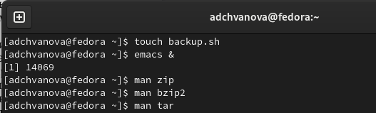{ #fig:001 width=70% }

## Выполнение лабораторной работы

Пишем программу.(рис. [-@fig:002])

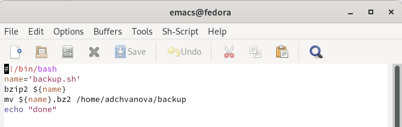{ #fig:002 width=70% }

## Выполнение лабораторной работы

Делаем файл исполняемым. (рис. [-@fig:003])

{ #fig:003 width=70% }

Запускаем программу и проверяем создание архива. (рис. [-@fig:004])

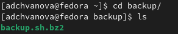{ #fig:004 width=70% }

## Выполнение лабораторной работы

2. Написать пример командного файла, обрабатывающего любое произвольное число аргументов командной строки, в том числе превышающее десять. Например, скрипт может последовательно распечатывать значения всех переданных аргументов.

Создаем файл, а также открываем emacs в фоновом режиме. После написания программы делаем файл исполняемым и запускаем. (рис. [-@fig:005])

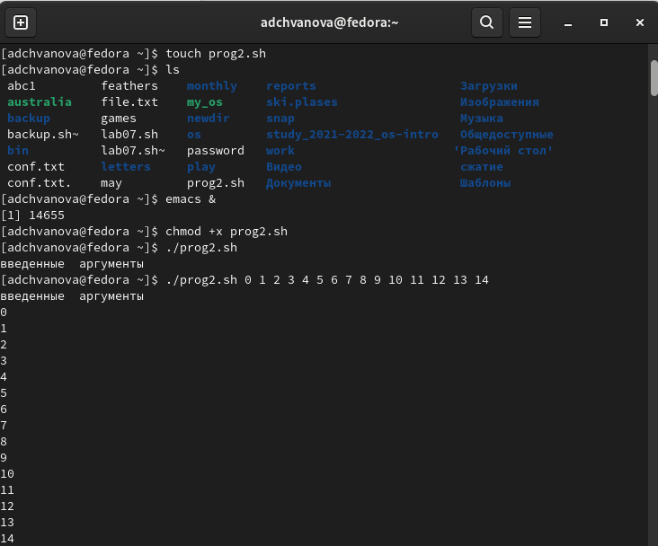{ #fig:005 width=70% }

## Выполнение лабораторной работы

Пишем программу.(рис. [-@fig:006])

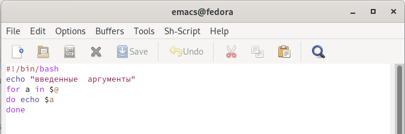{ #fig:006 width=70% }

## Выполнение лабораторной работы

3. Написать командный файл — аналог команды ls (без использования самой этой команды и команды dir). Требуется, чтобы он выдавал информацию о нужном каталоге и выводил информацию о возможностях доступа к файлам этого каталога.

Создаем файл , а также открываем emacs в фоновом режиме. (рис. [-@fig:007])

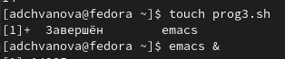{ #fig:007 width=70% }

## Выполнение лабораторной работы

Пишем программу.(рис. [-@fig:008])

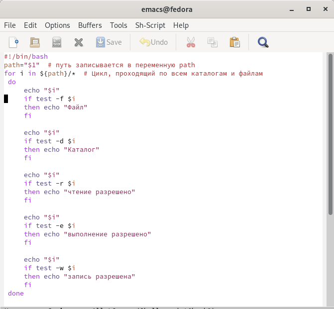{ #fig:008 width=70% }

## Выполнение лабораторной работы

Делаем файл исполняемым. Запускаем программу (рис. [-@fig:009])

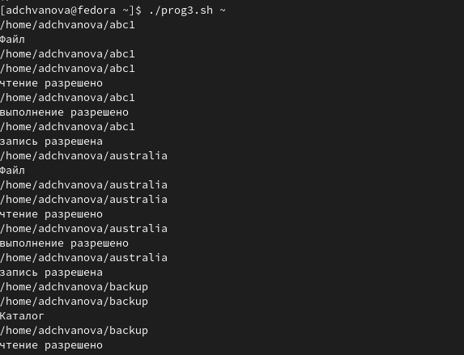{ #fig:009 width=70% }

## Выполнение лабораторной работы

4. Написать командный файл, который получает в качестве аргумента командной строки формат файла (.txt, .doc, .jpg, .pdf и т.д.) и вычисляет количество таких файлов в указанной директории. Путь к директории также передаётся в виде аргумента командной строки. 

Создаем файл , а также открываем emacs в фоновом режиме. После написания программы добавляем права на исполнение (рис. [-@fig:010])

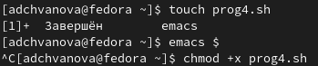{ #fig:010 width=70% }

## Выполнение лабораторной работы

Пишем программу.(рис. [-@fig:011])

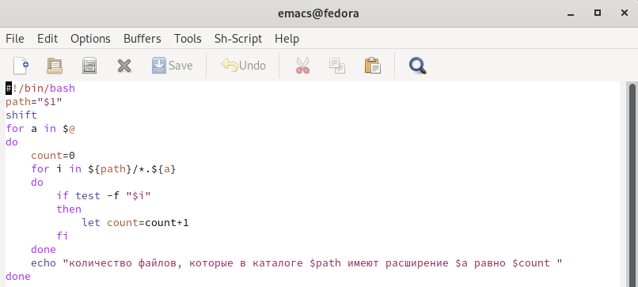{ #fig:011 width=70% }

## Выполнение лабораторной работы

Запускаем программу (рис. [-@fig:012])

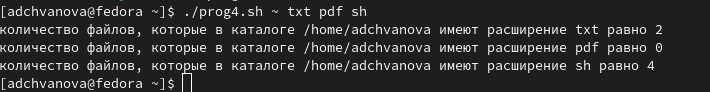{ #fig:012 width=70% }

## Выводы

Мы изучили основы программирования в оболочке ОС UNIX/Linux. Научились писать небольшие командные файлы. (скрипт, который при запуске  делает резервную копию самого себя; скрипт, обрабатывающий любое произвольное число аргументов командной строки; командный файл — аналог команды ls; командный файл, который получает в качестве аргумента командной строки формат файла (.txt, .doc, .jpg, .pdf и т.д.) и вычисляет количество таких файлов в указанной директории)

# Спасибо за внимание!
