---
## Front matter
title: "Отчёт по лабораторной работе 10"
subtitle: "Программирование в командном процессоре ОС UNIX. Командные файлы"
author: "Ангелина Дмитриевна Чванова"

## Generic otions
lang: ru-RU
toc-title: "Содержание"

## Bibliography
bibliography: bib/cite.bib
csl: pandoc/csl/gost-r-7-0-5-2008-numeric.csl

## Pdf output format
toc: true # Table of contents
toc-depth: 2
lof: true # List of figures
lot: true # List of tables
fontsize: 12pt
linestretch: 1.5
papersize: a4
documentclass: scrreprt
## I18n polyglossia
polyglossia-lang:
  name: russian
  options:
	- spelling=modern
	- babelshorthands=true
polyglossia-otherlangs:
  name: english
## I18n babel
babel-lang: russian
babel-otherlangs: english
## Fonts
mainfont: PT Serif
romanfont: PT Serif
sansfont: PT Sans
monofont: PT Mono
mainfontoptions: Ligatures=TeX
romanfontoptions: Ligatures=TeX
sansfontoptions: Ligatures=TeX,Scale=MatchLowercase
monofontoptions: Scale=MatchLowercase,Scale=0.9
## Biblatex
biblatex: true
biblio-style: "gost-numeric"
biblatexoptions:
  - parentracker=true
  - backend=biber
  - hyperref=auto
  - language=auto
  - autolang=other*
  - citestyle=gost-numeric
## Pandoc-crossref LaTeX customization
figureTitle: "Рис."
tableTitle: "Таблица"
listingTitle: "Листинг"
lofTitle: "Список иллюстраций"
lotTitle: "Список таблиц"
lolTitle: "Листинги"
## Misc options
indent: true
header-includes:
  - \usepackage{indentfirst}
  - \usepackage{float} # keep figures where there are in the text
  - \floatplacement{figure}{H} # keep figures where there are in the text
---

# Цель работы

Изучить основы программирования в оболочке ОС UNIX/Linux. Научиться писать
небольшие командные файлы.

# Задание

1. Написать скрипт, который при запуске будет делать резервную копию самого себя (то
есть файла, в котором содержится его исходный код) в другую директорию backup
в вашем домашнем каталоге. При этом файл должен архивироваться одним из архиваторов на выбор zip, bzip2 или tar. Способ использования команд архивации
необходимо узнать, изучив справку.

2. Написать пример командного файла, обрабатывающего любое произвольное число
аргументов командной строки, в том числе превышающее десять. Например, скрипт
может последовательно распечатывать значения всех переданных аргументов.

3. Написать командный файл — аналог команды ls (без использования самой этой команды и команды dir). Требуется, чтобы он выдавал информацию о нужном каталоге
и выводил информацию о возможностях доступа к файлам этого каталога.

4. Написать командный файл, который получает в качестве аргумента командной строки
формат файла (.txt, .doc, .jpg, .pdf и т.д.) и вычисляет количество таких файлов
в указанной директории. Путь к директории также передаётся в виде аргумента командной строки.

# Теоретическое введение

Здесь описываются теоретические аспекты, связанные с выполнением работы.
Командный процессор bash обеспечивает возможность использования переменных
типа строка символов. Имена переменных могут быть выбраны пользователем. Пользователь имеет возможность присвоить переменной значение некоторой строки символов.

Оболочка bash поддерживает встроенные арифметические функции. Команда let
является показателем того, что последующие аргументы представляют собой выражение,
подлежащее вычислению. Простейшее выражение — это единичный терм (term), обычно
целочисленный.
Целые числа можно записывать как последовательность цифр или в любом базовом
формате типа radix\#number, где radix (основание системы счисления) — любое число не более 26. Для большинства команд используются следующие основания систем
исчисления: 2 (двоичная), 8 (восьмеричная) и 16 (шестнадцатеричная). Простейшими
математическими выражениями являются сложение (+), вычитание (-), умножение (*),
целочисленное деление (/) и целочисленный остаток от деления (%).
Команда let берет два операнда и присваивает их переменной. Положительным моментом команды let можно считать то, что для идентификации переменной ей не
нужен знак доллара; вы можете писать команды типа let sum=x+7, и let будет искать
переменную x и добавлять к ней 7.

Стандартные переменные:

– HOME — имя домашнего каталога пользователя. Если команда cd вводится без аргументов, то происходит переход в каталог, указанный в этой переменной.
– IFS — последовательность символов, являющихся разделителями в командной строке,
например, пробел, табуляция и перевод строки (new line).
– MAIL — командный процессор каждый раз перед выводом на экран промптера проверяет содержимое файла, имя которого указано в этой переменной, и если содержимое
этого файла изменилось с момента последнего ввода из него, то перед тем как вывести
на терминал промптер, командный процессор выводит на терминал сообщение You
have mail (у Вас есть почта).
– TERM — тип используемого терминала.
– LOGNAME — содержит регистрационное имя пользователя, которое устанавливается автоматически при входе в систему.
В командном процессоре Си имеется ещё несколько стандартных переменных. Значение всех переменных можно просмотреть с помощью команды set.

# Выполнение лабораторной работы

1. Скрипт, который при запуске будет делать резервную копию самого себя (то есть файла, в котором содержится его исходный код) в другую директорию backup в вашем домашнем каталоге. При этом файл должен архивироваться одним из архиваторов на выбор zip, bzip2 или tar. Способ использования команд архивации необходимо узнать, изучив справку.

Создаем файл и изучаем архиваторы командой man, а также открываем emacs в фоновом режиме. (рис. [-@fig:001])

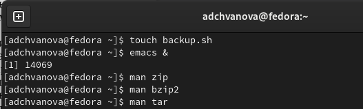{ #fig:001 width=70% }

Пишем программу.(рис. [-@fig:002])

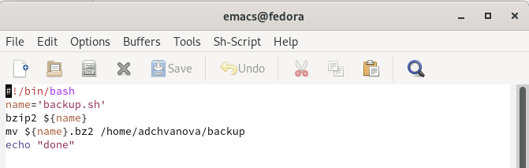{ #fig:002 width=70% }

Делаем файл исполняемым. (рис. [-@fig:003])

{ #fig:003 width=70% }

Запускаем программу и проверяем создание архива. (рис. [-@fig:004])

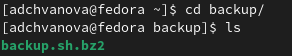{ #fig:004 width=70% }

2. Написать пример командного файла, обрабатывающего любое произвольное число аргументов командной строки, в том числе превышающее десять. Например, скрипт может последовательно распечатывать значения всех переданных аргументов.

Создаем файл, а также открываем emacs в фоновом режиме. После написания программы делаем файл исполняемым и запускаем. (рис. [-@fig:005])

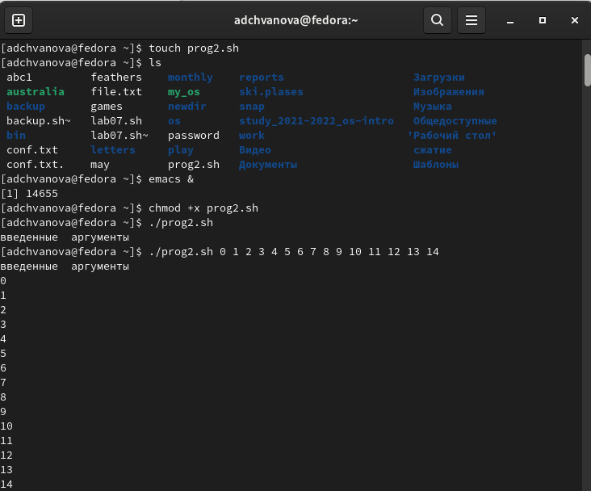{ #fig:005 width=70% }

Пишем программу.(рис. [-@fig:006])

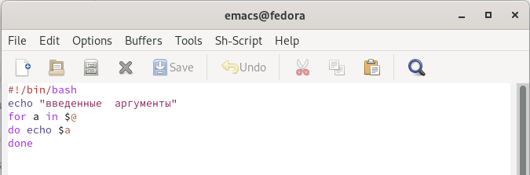{ #fig:006 width=70% }

3. Написать командный файл — аналог команды ls (без использования самой этой команды и команды dir). Требуется, чтобы он выдавал информацию о нужном каталоге и выводил информацию о возможностях доступа к файлам этого каталога.

Создаем файл , а также открываем emacs в фоновом режиме. (рис. [-@fig:007])

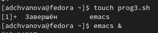{ #fig:007 width=70% }

Пишем программу.(рис. [-@fig:008])

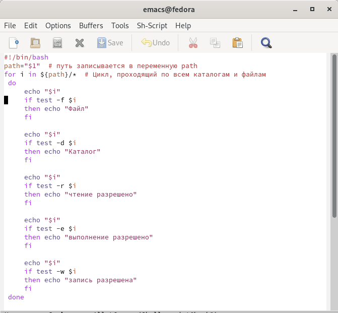{ #fig:008 width=70% }

Делаем файл исполняемым. Запускаем программу (рис. [-@fig:009])

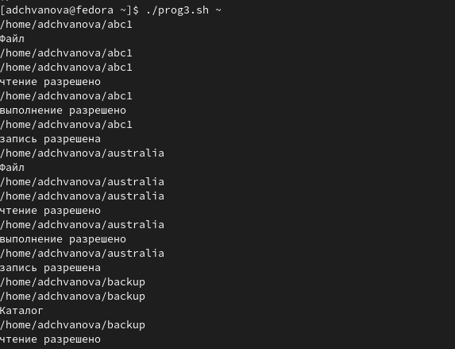{ #fig:009 width=70% }

4. Написать командный файл, который получает в качестве аргумента командной строки формат файла (.txt, .doc, .jpg, .pdf и т.д.) и вычисляет количество таких файлов в указанной директории. Путь к директории также передаётся в виде аргумента командной строки. 

Создаем файл , а также открываем emacs в фоновом режиме. После написания программы добавляем права на исполнение (рис. [-@fig:010])

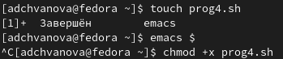{ #fig:010 width=70% }

Пишем программу.(рис. [-@fig:011])

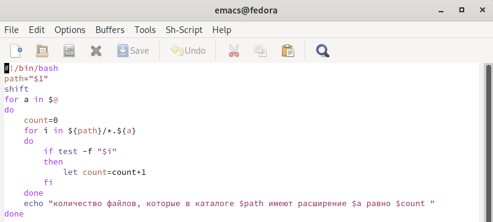{ #fig:011 width=70% }

Запускаем программу (рис. [-@fig:012])

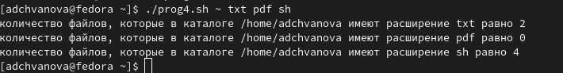{ #fig:012 width=70% }

# Выводы

Мы изучили основы программирования в оболочке ОС UNIX/Linux. Научились писать небольшие командные файлы. (скрипт, который при запуске  делает резервную копию самого себя; скрипт, обрабатывающий любое произвольное число аргументов командной строки; командный файл — аналог команды ls; командный файл, который получает в качестве аргумента командной строки формат файла (.txt, .doc, .jpg, .pdf и т.д.) и вычисляет количество таких файлов в указанной директории)

# Контрольные вопросы
1.Объясните понятие командной оболочки. Приведите примеры командных оболочек. Чем они отличаются?

В операционных системах типа UNIX/Linux наиболее часто используются
следующие реализации командных оболочек:

– оболочка Борна (Bourne shell или sh) — стандартная командная оболочка UNIX/Linux, содержащая базовый, но при этом полный набор функций;

– С-оболочка (или csh) — надстройка на оболочкой Борна, использующая С-подобный синтаксис команд с возможностью сохранения истории выполнения команд;

– оболочка Корна (или ksh) — напоминает оболочку С, но операторы управления программой совместимы с операторами оболочки Борна;

– BASH — сокращение от Bourne Again Shell (опять оболочка Борна), в основе своей совмещает свойства оболочек С и Корна (разработка компании Free Software Foundation).

2.Что такое POSIX?

POSIX (Portable Operating System Interface for Computer Environments) — набор стандартов описания интерфейсов взаимодействия операционной системы и прикладных программ. Стандарты POSIX разработаны комитетом IEEE (Institute of Electrical and Electronics Engineers) для обеспечения совместимости различных UNIX/Linux-подобных операционных систем и переносимости прикладных программ на уровне исходного кода. POSIX-совместимые оболочки разработаны на базе оболочки Корна

3.Как определяются переменные и массивы в языке программирования bash?

Командный процессор bash обеспечивает возможность использования переменных типа строка символов. Имена переменных могут быть выбраны пользователем. Пользователь имеет возможность присвоить переменной значение некоторой строки символов. Например, команда «mark=/usr/andy/bin» присваивает значение строки символов /usr/andy/bin переменной mark типа строка символов. Значение, присвоенное некоторой переменной, может быть впоследствии использовано. Для этого в соответствующем месте командной строки должно быть употреблено имя этой переменной, которому предшествует метасимвол .Например,команда«mvafile{mark}» переместит файл afile из текущего каталога в каталог с абсолютным полным именем /usr/andy/bin. Оболочка bash позволяет работать с массивами. Для создания массива используется команда setс флагом -A. За флагом следует имя переменной, а затем список значений, разделённых пробелами. Например, «set -Astates Delaware Michigan “New Jersey”». Далее можно сделать добавление в массив, например, states[49]=Alaska. Индексация массивов начинается с нулевого элемента.

4.Каково назначение операторов let и read?

Команда let является показателем того, что последующие аргументы представляют собой выражение, подлежащее вычислению. Простейшее выражение − это единичный терм (term), обычно целочисленный. Команда let берет два операнда и присваивает их переменной. Команда read позволяет читать значения переменных со стандартного ввода: «echo “Please enter Month and Day of Birth ?”» «read mon day trash». В переменные monи day будут считаны соответствующие значения, введённые с клавиатуры, а переменная trash нужна для того, чтобы отобрать всю избыточно введённую информацию и игнорировать её.

5.Какие арифметические операции можно применять в языке программирования bash?

В языке программирования bash можно применять такие арифметические операции как сложение (+), вычитание (-), умножение (*), целочисленное деление (/) и целочисленный остаток от деления (%).

6.Что означает операция (( ))?

В (( )) записывают условия оболочки bash, а также внутри двойных скобок можно вычислять арифметические выражения и возвращать результат.

7.Какие стандартные имена переменных Вам известны?

– HOME — имя домашнего каталога пользователя. Если команда cd вводится без аргументов, то происходит переход в каталог, указанный в этой переменной.
– IFS — последовательность символов, являющихся разделителями в командной строке,
например, пробел, табуляция и перевод строки (new line).
– MAIL — командный процессор каждый раз перед выводом на экран промптера проверяет содержимое файла, имя которого указано в этой переменной, и если содержимое
этого файла изменилось с момента последнего ввода из него, то перед тем как вывести
на терминал промптер, командный процессор выводит на терминал сообщение You
have mail (у Вас есть почта).
– TERM — тип используемого терминала.
– LOGNAME — содержит регистрационное имя пользователя, которое устанавливается автоматически при входе в систему.

8.Что такое метасимволы?

’ < > * ? | " &, являются метасимволами и имеют для командного процессора специальный смысл

9.Как экранировать метасимволы?

Снятие специального смысла с метасимвола называется экранированием мета символа. Экранирование может быть осуществлено с помощью предшествующего мета символу символа , который, в свою очередь, является мета символом. Для экранирования группы метасимволов нужно заключить её в одинарные кавычки. Строка, заключённая в двойные кавычки, экранирует все метасимволы, кроме $, ’ , , ". Например, –echo* выведет на экран символ , –echoab’|’cd выведет на экран строку ab|*cd.

10.Как создавать и запускать командные файлы?

Последовательность команд может быть помещена в текстовый файл. Такой файл называется командным. Далее этот файл можно выполнить по команде: «bash командный_файл [аргументы]». Чтобы не вводить каждый раз последовательности символов bash, необходимо изменить код защиты этого командного файла, обеспечив доступ к этому файлу по выполнению. Это может быть сделано с помощью команды «chmod +x имя_файла». Теперь можно вызывать свой командный файл на выполнение, просто вводя его имя с терминала так, как будтоон является выполняемой программой. 

11.Как определяются функции в языке программирования bash?

Группу команд можно объединить в функцию. Для этого существует ключевое слово function, после которого следует имя функции и список команд, заключённых в фигурные скобки. Удалить функцию можно с помощью команды unsetcфлагом -f

12.Каким образом можно выяснить, является файл каталогом или обычным файлом?

«test-f [путь до файла]» (для проверки, является ли обычным файлом)

«test -d[путь до файла]» (для проверки, является ли каталогом)

13.Каково назначение команд set, typeset и unset?

«set» можно использовать для вывода списка переменных окружения. В системах Ubuntu и Debia nкоманда «set» также выведет список функций командной оболочки после списка переменных командной оболочки. Поэтому для ознакомления со всеми элементами списка переменных окружения при работе с данными системами рекомендуется использовать команду «set| more». Команда «typeset» предназначена для наложения ограничений на переменные. Команду «unset» следует использовать для удаления переменной из окружения командной оболочки.

14.Как передаются параметры в командные файлы?

При вызове командного файла на выполнение параметры ему могут быть переданы точно таким же образом, как и выполняемой программе. С точки зрения командного файла эти параметры являются позиционными. Символ $ является метасимволом командного процессора.

15.Назовите специальные переменные языка bash и их назначение.

Специальные переменные:
1. $* −отображается вся командная строка или параметры оболочки;
2. $? −код завершения последней выполненной команды;
3. $ (2 Таких знака)  −уникальный  идентификатор  процесса,  в  рамках  которого выполняется командный процессор;
4. $! −номер процесса, в рамках которого выполняется последняя вызванная на выполнение в командном режиме команда;
5. $ значение флагов командного процессора;
6. ${#*} −возвращает целое число −количествослов, которые были результатом $*;
7. ${#name} −возвращает  целое  значение  длины  строки  в переменной name;
8. ${name[n]} −обращение к n-му элементу массива;
9. ${name[*]}−перечисляет  все  элементы  массива,  разделённые пробелом;
10. ${name[@]}−то  же  самое,  но  позволяет  учитывать  символы пробелы в самих переменных;
11. ${name:-value} −если значение переменной name не определено, то оно будет заменено на указанное value;
12. ${name:value} −проверяется факт существования переменной;
13. ${name=value} −если name не определено, то ему присваивается значение value;
14. ${name?value} −останавливает   выполнение,   если   имя переменной  не  определено,  и  выводит value как  сообщение об ошибке;
15. ${name+value} −это  выражение  работает  противоположно ${name-value}. Если переменная  определена,  то  подставляется value;
16. ${name#pattern} −представляет  значение  переменной name с удалённым самым коротким левым образцом (pattern);
17. ${#name[*]} и ${#name[@]}−эти  выражения  возвращают количество элементов в массиве name.
