---
## Front matter
lang: ru-RU
title: Лабораторная работа № 11. Программирование в командном процессоре ОС UNIX. Ветвления и циклы
author: |
	Chvanova A.D.
institute: |
	RUDN University, Moscow, Russian Federation
	
date: NEC--2022, 24 May, Moscow

## Formatting
toc: false
slide_level: 2
theme: metropolis
header-includes: 
 - \metroset{progressbar=frametitle,sectionpage=progressbar,numbering=fraction}
 - '\makeatletter'
 - '\beamer@ignorenonframefalse'
 - '\makeatother'
aspectratio: 43
section-titles: true
---

## Цель работы

Изучить основы программирования в оболочке ОС UNIX. Научится писать более
сложные командные файлы с использованием логических управляющих конструкций
и циклов.

## Задание

Написать 4 программных файла

## Теоретическое введение

Функция getopts включает две специальные переменные среды — OPTARG и OPTIND.
Если ожидается дополнительное значение, то OPTARG устанавливается в значение этого
аргумента (будет равна file_in.txt для опции i и file_out.doc для опции o. OPTIND
является числовым индексом на упомянутый аргумент.
Функция getopts также понимает переменные типа массив, следовательно, можно
использовать её в функции не только для синтаксического анализа аргументов функций,
но и для анализа введённых пользователем данных.

## Выполнение лабораторной работы

1. Используя команды getopts grep, написать командный файл, который анализирует
командную строку с ключами:

– -iinputfile — прочитать данные из указанного файла;

– -ooutputfile — вывести данные в указанный файл;

– -pшаблон — указать шаблон для поиска;

– -C — различать большие и малые буквы;

– -n — выдавать номера строк.

а затем ищет в указанном файле нужные строки, определяемые ключом -p.

## Выполнение лабораторной работы

Создаем файл , а также открываем emacs в фоновом режиме. (рис. [-@fig:001])

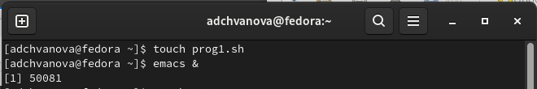{ #fig:001 width=70% }

## Выполнение лабораторной работы

Пишем программу.(рис. [-@fig:002])

{ #fig:002 width=70% }

## Выполнение лабораторной работы

Делаем файл исполняемым и проверяем его работу. (рис. [-@fig:003])

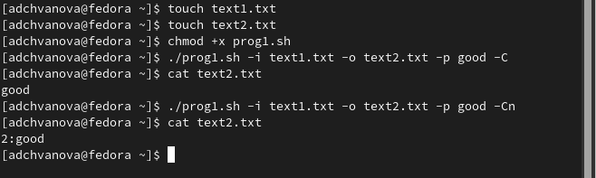{ #fig:003 width=70% }

## Выполнение лабораторной работы

2. Написать на языке Си программу, которая вводит число и определяет, является ли оно
больше нуля, меньше нуля или равно нулю. Затем программа завершается с помощью
функции exit(n), передавая информацию в о коде завершения в оболочку. Командный файл должен вызывать эту программу и, проанализировав с помощью команды
$?, выдать сообщение о том, какое число было введено.

## Выполнение лабораторной работы

Создаем файлы , а также открываем emacs в фоновом режиме. Делаем их исполняемыми (рис. [-@fig:004])

## Выполнение лабораторной работы

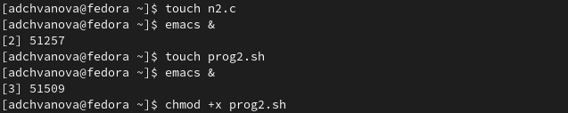{ #fig:004 width=70% }

## Выполнение лабораторной работы

Пишем программу на языке С.(рис. [-@fig:005])

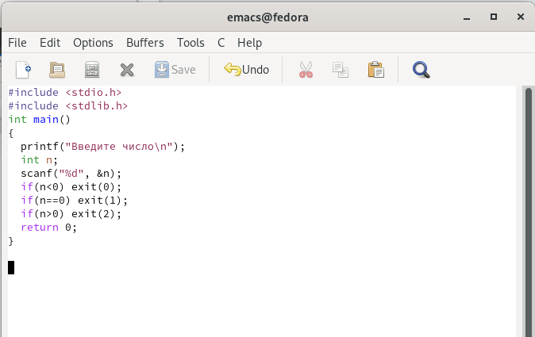{ #fig:005 width=70% }

## Выполнение лабораторной работы

Пишем командный файл .(рис. [-@fig:006])

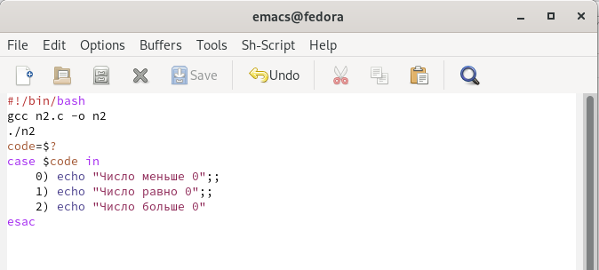{ #fig:006 width=70% }

## Выполнение лабораторной работы

Работа прграммы. (рис. [-@fig:007])

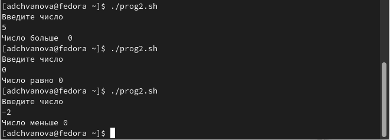{ #fig:007 width=70% }

## Выполнение лабораторной работы

3. Написать командный файл, создающий указанное число файлов, пронумерованных
последовательно от 1 до 𝑁 (например 1.tmp, 2.tmp, 3.tmp,4.tmp и т.д.). Число файлов,
которые необходимо создать, передаётся в аргументы командной строки. Этот же командный файл должен уметь удалять все созданные им файлы (если они существуют).

## Выполнение лабораторной работы

Создаем файл , а также открываем emacs в фоновом режиме. Делаем их исполняемыми (рис. [-@fig:008])

## Выполнение лабораторной работы

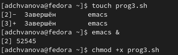{ #fig:008 width=70% }

## Выполнение лабораторной работы

Пишем программу.(рис. [-@fig:009])

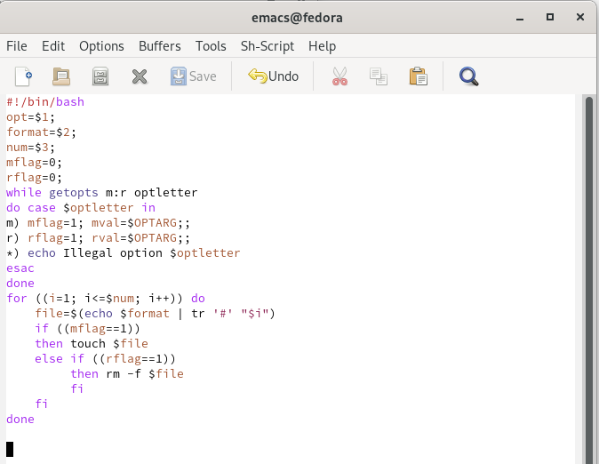{ #fig:009 width=70% }

## Выполнение лабораторной работы

Работа программы (рис. [-@fig:010] - [-@fig:011])

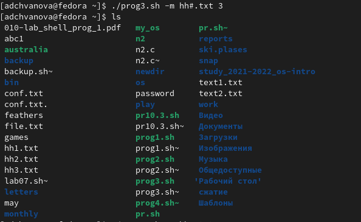{ #fig:010 width=70% }

## Выполнение лабораторной работы

{ #fig:011 width=70% }

## Выполнение лабораторной работы

4. Написать командный файл, который с помощью команды tar запаковывает в архив
все файлы в указанной директории. Модифицировать его так, чтобы запаковывались
только те файлы, которые были изменены менее недели тому назад (использовать
команду find).Описываются проведённые действия, в качестве иллюстрации даётся ссылка на иллюстрацию 

## Выполнение лабораторной работы

Создаем файл , а также открываем emacs в фоновом режиме. Делаем их исполняемыми (рис. [-@fig:012])

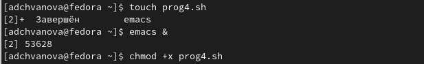{ #fig:012 width=70% }

## Выполнение лабораторной работы

Пишем программу.(рис. [-@fig:013])

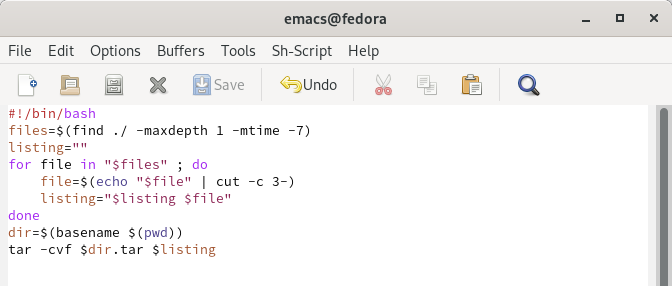{ #fig:013 width=70% }

## Выполнение лабораторной работы

Работа программы (рис. [-@fig:014])

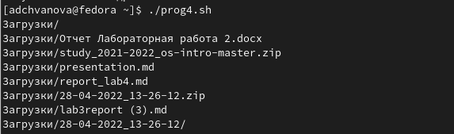{ #fig:014 width=70% }

## Выводы

Мы изучили основы программирования в оболочке ОС UNIX. Научились писать более сложные командные файлы с использованием логических управляющих конструкций и циклов.

# Спасибо за внимание!