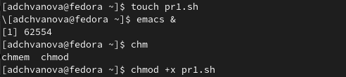
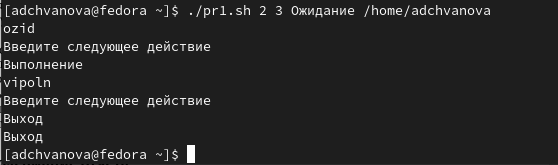
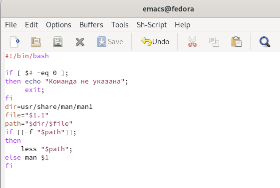
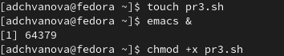
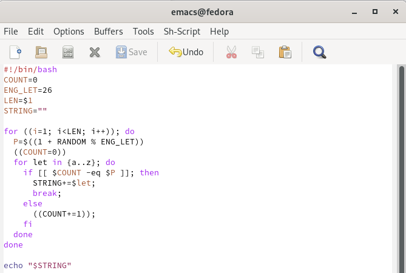
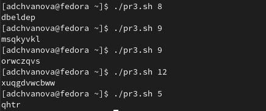

---
## Front matter
lang: ru-RU
title: Лабораторная работа 12. Программирование в командном процессоре ОС UNIX. Расширенное программирование
author: |
	Chvanova A.D.
institute: |
	RUDN University, Moscow, Russian Federation
	
date: NEC--2022, 24 May, Moscow

## Formatting
toc: false
slide_level: 2
theme: metropolis
header-includes: 
 - \metroset{progressbar=frametitle,sectionpage=progressbar,numbering=fraction}
 - '\makeatletter'
 - '\beamer@ignorenonframefalse'
 - '\makeatother'
aspectratio: 43
section-titles: true
---

## Цель работы

Изучить основы программирования в оболочке ОС UNIX. Научиться писать более сложные командные файлы с использованием логических управляющих конструкций и циклов

## Задание

Написать 3 программных файла

## Теоретическое введение

Выполнение условного оператора if сводится к тому, что сначала выполняется последовательность команд (операторов), которую задаёт список-команд в строке, содержащей
служебное слово if. Затем, если последняя выполненная команда из этой последовательности команд возвращает нулевой код завершения (истина), то будет выполнена
последовательность команд (операторов), которую задаёт список-команд в строке, содержащей служебное слово then. Фраза elif проверяется в том случае, когда предыдущая
проверка была ложной. Строка, содержащая служебное слово else, является необязательной. 

## Выполнение лабораторной работы

1. Написать командный файл, реализующий упрощённый механизм семафоров. Командный файл должен в течение некоторого времени t1 дожидаться освобождения
ресурса, выдавая об этом сообщение, а дождавшись его освобождения, использовать
его в течение некоторого времени t2<>t1, также выдавая информацию о том, что
ресурс используется соответствующим командным файлом (процессом). Запустить
командный файл в одном виртуальном терминале в фоновом режиме, перенаправив
его вывод в другой (> /dev/tty#, где # — номер терминала куда перенаправляется
вывод), в котором также запущен этот файл, но не фоновом, а в привилегированном
режиме. Доработать программу так, чтобы имелась возможность взаимодействия трёх
и более процессов.

## Выполнение лабораторной работы

Создаем файл , а также открываем emacs в фоновом режиме. Делаем файл исполняемым (рис. [-@fig:001])

{ #fig:001 width=70% }

## Выполнение лабораторной работы

Пишем программу.(рис. [-@fig:002] - [-@fig:003])

.png){ #fig:002 width=70% }

## Выполнение лабораторной работы

.png){ #fig:003 width=70% }

## Выполнение лабораторной работы

Проверяем его работу. (рис. [-@fig:004])

{ #fig:004 width=70% }

## Выполнение лабораторной работы

2. Реализовать команду man с помощью командного файла. Изучите содержимое каталога /usr/share/man/man1. В нем находятся архивы текстовых файлов, содержащих
справку по большинству установленных в системе программ и команд. Каждый архив
можно открыть командой less сразу же просмотрев содержимое справки. Командный
файл должен получать в виде аргумента командной строки название команды и в виде
результата выдавать справку об этой команде или сообщение об отсутствии справки,
если соответствующего файла нет в каталоге man1.

## Выполнение лабораторной работы

Создаем файл , а также открываем emacs в фоновом режиме. Делаем файл исполняемым (рис. [-@fig:005])

{ #fig:005 width=70% }

## Выполнение лабораторной работы

Пишем программу.(рис. [-@fig:006] )

{ #fig:006 width=70% }

## Выполнение лабораторной работы

3. Используя встроенную переменную $RANDOM, напишите командный файл, генерирующий случайную последовательность букв латинского алфавита. Учтите, что $RANDOM
выдаёт псевдослучайные числа в диапазоне от 0 до 32767.

## Выполнение лабораторной работы

Создаем файл , а также открываем emacs в фоновом режиме. Делаем файл исполняемым (рис. [-@fig:007])

{ #fig:007 width=70% }

## Выполнение лабораторной работы

Пишем программу.(рис. [-@fig:008] )

{ #fig:008 width=70% }

## Выполнение лабораторной работы

Проверяем его работу. (рис. [-@fig:009])

{ #fig:009 width=70% }

## Выводы

Мы изучили основы программирования в оболочке ОС UNIX. Научились писать более
сложные командные файлы с использованием логических управляющих конструкций
и циклов.

# Спасибо за внимание!

