---
## Front matter
lang: ru-RU
title: Лабораторная работа № 13. Средства, применяемые при разработке программного обеспечения в ОС типа UNIX/Linux
author: |
	Chvanova A.D.
institute: |
	RUDN University, Moscow, Russian Federation
	
date: NEC--2022, 24 May, Moscow

## Formatting
toc: false
slide_level: 2
theme: metropolis
header-includes: 
 - \metroset{progressbar=frametitle,sectionpage=progressbar,numbering=fraction}
 - '\makeatletter'
 - '\beamer@ignorenonframefalse'
 - '\makeatother'
aspectratio: 43
section-titles: true
---

## Цель работы

Приобрести простейшие навыки разработки, анализа, тестирования и отладки приложений в ОС типа UNIX/Linux на примере создания на языке программирования С калькулятора с простейшими функциями.

## Задание

1. В домашнем каталоге создайте подкаталог ~/work/os/lab_prog.

2. Создайте в нём файлы: calculate.h, calculate.c, main.c.
Это будет примитивнейший калькулятор, способный складывать, вычитать, умножать
и делить, возводить число в степень, брать квадратный корень, вычислять sin, cos, tan.
При запуске он будет запрашивать первое число, операцию, второе число. После этого программа выведет результат и остановится.

3. Выполните компиляцию программы посредством gcc.

4. При необходимости исправьте синтаксические ошибки.

5. Создайте Makefile.

6. С помощью gdb выполните отладку программы calcul (перед использованием gdb
исправьте Makefile).

## Теоретическое введение

Процесс разработки программного обеспечения обычно разделяется на следующие
этапы:

– планирование, включающее сбор и анализ требований к функционалу и другим характеристикам разрабатываемого приложения;

– проектирование, включающее в себя разработку базовых алгоритмов и спецификаций,
определение языка программирования;

– непосредственная разработка приложения:

– кодирование — по сути создание исходного текста программы (возможно
в нескольких вариантах);

– анализ разработанного кода;

– сборка, компиляция и разработка исполняемого модуля;

– тестирование и отладка, сохранение произведённых изменений;

– документирование

## Выполнение лабораторной работы

1. В домашнем каталоге создайте подкаталог ~/work/os/lab_prog.(рис. [-@fig:001])

{ #fig:001 width=70% }

## Выполнение лабораторной работы

2. Создайте в нём файлы: calculate.h, calculate.c, main.c.(рис. [-@fig:002])
Это будет примитивнейший калькулятор, способный складывать, вычитать, умножать  и делить, возводить число в степень, брать квадратный корень, вычислять sin, cos, tan. (рис. [-@fig:003],[-@fig:004],[-@fig:005],[-@fig:006])
При запуске он будет запрашивать первое число, операцию, второе число. После этого программа выведет результат и остановится.

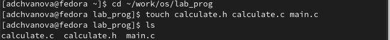{ #fig:002 width=70% }

## Выполнение лабораторной работы

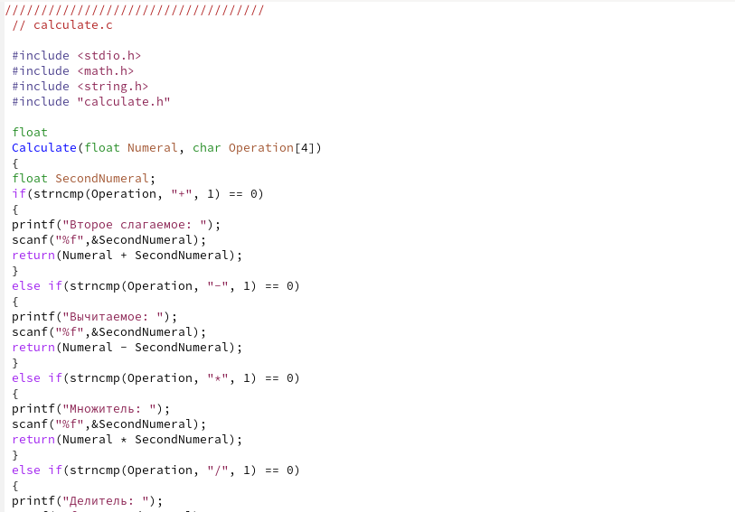{ #fig:003 width=70% }

## Выполнение лабораторной работы

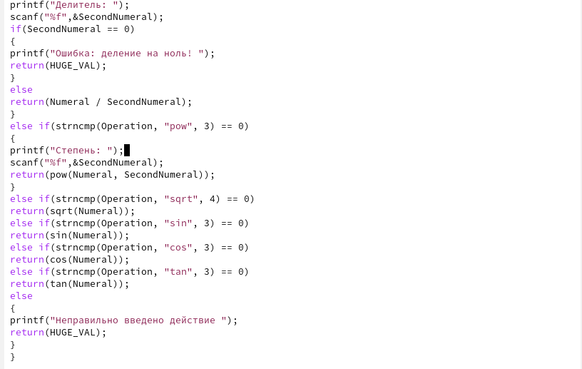{ #fig:004 width=70% }

## Выполнение лабораторной работы

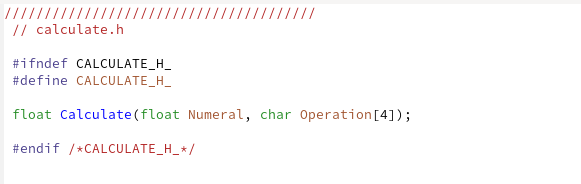{ #fig:005 width=70% }

## Выполнение лабораторной работы

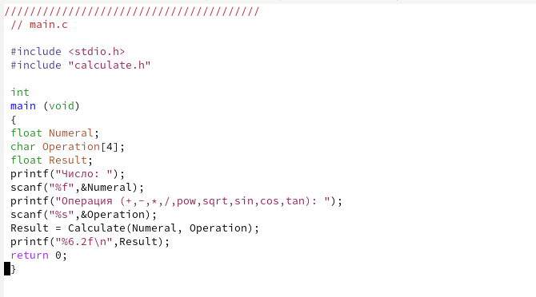{ #fig:006 width=70% }

## Выполнение лабораторной работы

3. Выполните компиляцию программы посредством gcc.(рис. [-@fig:007])

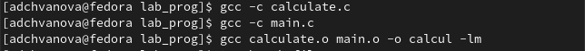{ #fig:007 width=70% }

4. При необходимости исправьте синтаксические ошибки.

Ошибок нет.

## Выполнение лабораторной работы

5. Создайте Makefile.(рис. [-@fig:008],[-@fig:009])

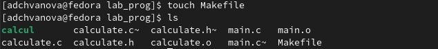{ #fig:008 width=70% }

## Выполнение лабораторной работы

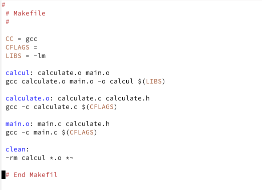{ #fig:009 width=70% }

## Выполнение лабораторной работы

6. С помощью gdb выполните отладку программы calcul (перед использованием gdb
исправьте Makefile). (рис. [-@fig:010],[-@fig:011],[-@fig:012])

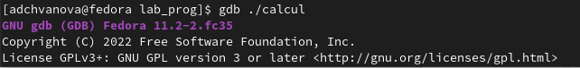{ #fig:010 width=70% }

## Выполнение лабораторной работы

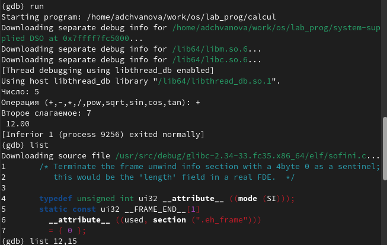{ #fig:011 width=70% }

## Выполнение лабораторной работы

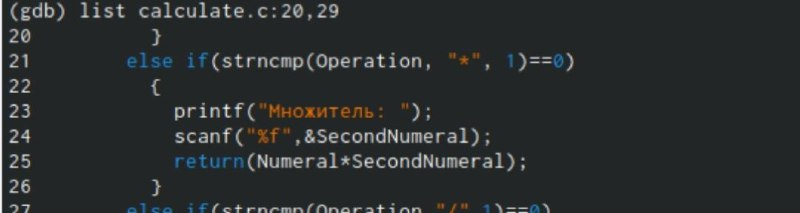{ #fig:012 width=70% }

## Выводы

Мы приобрели простейшие навыки разработки, анализа, тестирования и отладки приложений в ОС типа UNIX/Linux на примере создания на языке программирования С калькулятора с простейшими функциями.

# Спасибо за внимание!
