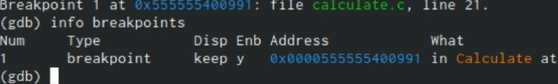

---
## Front matter
title: Отчёт по лабораторной работе 13"
subtitle: "Средства, применяемые при разработке программного обеспечения в ОС типа UNIX/Linux"
author: "Ангелина Дмитриевна Чванова"

## Generic otions
lang: ru-RU
toc-title: "Содержание"

## Bibliography
bibliography: bib/cite.bib
csl: pandoc/csl/gost-r-7-0-5-2008-numeric.csl

## Pdf output format
toc: true # Table of contents
toc-depth: 2
lof: true # List of figures
lot: true # List of tables
fontsize: 12pt
linestretch: 1.5
papersize: a4
documentclass: scrreprt
## I18n polyglossia
polyglossia-lang:
  name: russian
  options:
	- spelling=modern
	- babelshorthands=true
polyglossia-otherlangs:
  name: english
## I18n babel
babel-lang: russian
babel-otherlangs: english
## Fonts
mainfont: PT Serif
romanfont: PT Serif
sansfont: PT Sans
monofont: PT Mono
mainfontoptions: Ligatures=TeX
romanfontoptions: Ligatures=TeX
sansfontoptions: Ligatures=TeX,Scale=MatchLowercase
monofontoptions: Scale=MatchLowercase,Scale=0.9
## Biblatex
biblatex: true
biblio-style: "gost-numeric"
biblatexoptions:
  - parentracker=true
  - backend=biber
  - hyperref=auto
  - language=auto
  - autolang=other*
  - citestyle=gost-numeric
## Pandoc-crossref LaTeX customization
figureTitle: "Рис."
tableTitle: "Таблица"
listingTitle: "Листинг"
lofTitle: "Список иллюстраций"
lotTitle: "Список таблиц"
lolTitle: "Листинги"
## Misc options
indent: true
header-includes:
  - \usepackage{indentfirst}
  - \usepackage{float} # keep figures where there are in the text
  - \floatplacement{figure}{H} # keep figures where there are in the text
---

# Цель работы

Приобрести простейшие навыки разработки, анализа, тестирования и отладки приложений в ОС типа UNIX/Linux на примере создания на языке программирования С калькулятора с простейшими функциями.

# Задание

1. В домашнем каталоге создайте подкаталог ~/work/os/lab_prog.

2. Создайте в нём файлы: calculate.h, calculate.c, main.c.
Это будет примитивнейший калькулятор, способный складывать, вычитать, умножать
и делить, возводить число в степень, брать квадратный корень, вычислять sin, cos, tan.
При запуске он будет запрашивать первое число, операцию, второе число. После этого программа выведет результат и остановится.

3. Выполните компиляцию программы посредством gcc.

4. При необходимости исправьте синтаксические ошибки.

5. Создайте Makefile.

6. С помощью gdb выполните отладку программы calcul (перед использованием gdb
исправьте Makefile).

# Теоретическое введение

Процесс разработки программного обеспечения обычно разделяется на следующие
этапы:

– планирование, включающее сбор и анализ требований к функционалу и другим характеристикам разрабатываемого приложения;

– проектирование, включающее в себя разработку базовых алгоритмов и спецификаций,
определение языка программирования;

– непосредственная разработка приложения:

– кодирование — по сути создание исходного текста программы (возможно
в нескольких вариантах);

– анализ разработанного кода;

– сборка, компиляция и разработка исполняемого модуля;

– тестирование и отладка, сохранение произведённых изменений;

– документирование

# Выполнение лабораторной работы

1. В домашнем каталоге создайте подкаталог ~/work/os/lab_prog.(рис. [-@fig:001])

{ #fig:001 width=70% }

2. Создайте в нём файлы: calculate.h, calculate.c, main.c.(рис. [-@fig:002])
Это будет примитивнейший калькулятор, способный складывать, вычитать, умножать  и делить, возводить число в степень, брать квадратный корень, вычислять sin, cos, tan. (рис. [-@fig:003],[-@fig:004],[-@fig:005],[-@fig:006])
При запуске он будет запрашивать первое число, операцию, второе число. После этого программа выведет результат и остановится.

{ #fig:002 width=70% }

{ #fig:003 width=70% }

{ #fig:004 width=70% }

{ #fig:005 width=70% }

{ #fig:006 width=70% }

3. Выполните компиляцию программы посредством gcc.(рис. [-@fig:007])

{ #fig:007 width=70% }

4. При необходимости исправьте синтаксические ошибки.

Ошибок нет.

5. Создайте Makefile.(рис. [-@fig:008],[-@fig:009])

{ #fig:008 width=70% }

{ #fig:009 width=70% }

6. С помощью gdb выполните отладку программы calcul (перед использованием gdb
исправьте Makefile). (рис. [-@fig:010],[-@fig:011],[-@fig:012],[-@fig:013],[-@fig:014])

{ #fig:010 width=70% }

{ #fig:011 width=70% }

{ #fig:012 width=70% }

{ #fig:013 width=70% }

{ #fig:014 width=70% }

# Выводы

Мы приобрели простейшие навыки разработки, анализа, тестирования и отладки приложений в ОС типа UNIX/Linux на примере создания на языке программирования С калькулятора с простейшими функциями.

# Контрольные вопросы

1). Чтобы получить информацию о возможностях программ gcc, make, gdbи др.нужно воспользоваться командой manили опцией -help(-h)для каждой команды.

2). Процесс разработки программного обеспечения обычно разделяется на следующие этапы: 

1. планирование,  включающее  сбор  и  анализ  требований  к 
функционалу  и  другим  характеристикам  разрабатываемого приложения; 
2. проектирование,  включающее  в  себя  разработку  базовых алгоритмов    и    спецификаций,    определение    языка программирования; 
3. непосредственная разработка приложения: oкодирование −по  сути  создание  исходного  текста программы (возможно в нескольких вариантах); –анализ разработанного кода; oсборка, компиляция и разработка исполняемого модуля; oтестирование  и  отладка,  сохранение  произведённых изменений; 
4. документирование. Для  создания  исходного  текста  программы  разработчик  может воспользоваться любым удобным для него редактором текста: vi, vim, mceditor, emacs, geanyи др. После  завершения  написания  исходного  кода  программы  (возможно состоящей из нескольких файлов), необходимо её скомпилировать и получить исполняемый модуль.

3). Для имени  входного  файла  суффикс  определяет  какая  компиляция требуется. Суффиксы указывают на тип объекта. Файлы с расширением (суффиксом) .cвоспринимаются gccкак программы на языке С, файлы с  расширением  .ccили  .C−как  файлы  на  языке C++,  а  файлы cрасширением .oсчитаются объектными.Например, в команде «gcc-cmain.c»:gccпо расширению (суффиксу) .cраспознает тип файла для компиляции и формирует объектный модуль −файл с расширением .o. Если требуется получить исполняемый файл с определённым именем (например, hello), то требуется воспользоваться опцией -oи в качестве параметра задать имя создаваемого файла: «gcc-ohellomaiВ  ходе  выполнения  данной  лабораторной  работы  я  приобрелапростейшие  навыки  разработки,  анализа,  тестирования  и  отладки приложений  в  ОС  типа UNIX/Linuxна  примере  создания  на  языке программирования С калькулятора с простейшими функциями.n.c».

4). Основное  назначение  компилятора языка  Си  в UNIX заключается в компиляции всей программы и получении исполняемого файла/модуля.

5). Для сборки разрабатываемого приложения и собственно компиляции полезно   воспользоваться   утилитой make.   Она   позволяет автоматизировать процесс преобразования файлов программы из одной формы в другую, отслеживает взаимосвязи между файлами.

6). Для работы с утилитой makeнеобходимо в корне рабочего каталога с Вашим проектом создать файл с названием makefileили Makefile, в котором  будут  описаны  правила  обработки  файлов  Вашего программного комплекса. В самом простом случае Makefile имеет следующий синтаксис: <цель_1> <цель_2> ... : <зависимость_1> <зависимость_2> ...<команда 1>...<команда n>Сначала задаётся список целей, разделённых пробелами, за которым идёт двоеточие и список зависимостей. Затем в следующих строках указываются  команды.  Строки  с  командами  обязательно  должны начинаться с табуляции. В качестве цели в Makefileможет выступать имя файла или название какого-то действия. Зависимость задаёт исходные параметры (условия) для  достижения  указанной  цели.  Зависимость  также  может  быть названием  какого-то  действия.  Команды  −  собственно  действия, которые необходимо выполнить для достижения цели.Общий синтаксис Makefileимеет вид: target1 [target2...]:[:] [dependment1...][(tab)commands] [#commentary][(tab)commands] [#commentary]. Здесь знак # определяет начало комментария (содержимое от знака # и до  конца  строки  не  будет  обрабатываться.  Одинарное  двоеточие указывает на то, что последовательность команд должна содержаться в 
одной строке. Для переноса можно в длинной строке команд можно использовать обратный слэш (\). Двойное двоеточие указывает на то, что  последовательность  команд  может  содержаться  в  нескольких последовательных строках.Пример более сложного синтаксиса Makefile:## Makefile for abcd.c#CC = gccCFLAGS =# Compile abcd.c normalyabcd: abcd.c$(CC) -o abcd $(CFLAGS) abcd.cclean:-rm abcd *.o *~# EndMakefileforabcd.c. В этом примере в начале файла заданы три переменные: CC и CFLAGS. Затем указаны цели, их зависимости и соответствующие команды. В командах  происходит  обращение  к  значениям  переменных.  Цель  с именем cleanпроизводит очистку каталога от файлов, полученных в результате  компиляции. Для  её  описания  использованы  регулярные выражения.

7). Во  время  работы  над  кодом  программы  программист  неизбежно сталкивается с появлением ошибок в ней. Использование отладчика для поиска и устранения ошибок в программе существенно облегчает жизнь программиста. В комплект программ GNUдля ОС типа UNIXвходит отладчик GDB(GNUDebugger). Для использования GDB необходимо скомпилировать анализируемый код  программы  таким  образом,  чтобы  отладочная  информация содержалась  в  результирующем  бинарном  файле.  Для  этого  следует воспользоваться опцией -gкомпилятора gcc: gcc-cfile.c-g. После этого для начала работы с gdbнеобходимо в командной строке ввести  одноимённую  команду,  указав  в  качестве  аргумента анализируемый бинарный файл: gdbfile.o

8). Основные команды отладчика gdb:
1. backtrace − вывод на экран пути к текущей точке останова (по сутивывод − названий всех функций);
2. break − установить точку останова (в качестве параметра можетбыть указан номер строки или название функции);
3. clear − удалить все точки останова в функции;
4. continue − продолжить выполнение программы;
5. delete − удалить точку останова;
6. display − добавить  выражение  в  список  выражений,  значения которых  отображаются  при  достижении  точки  останова программы;
7. finish − выполнить программу до момента выхода из функции;
8. info breakpoints −вывести на экран список используемых точек останова;
9. info  watchpoints −вывести  на  экран  список  используемых контрольных выражений;
10. list − вывести на экран исходный код (вВ  ходе  выполнения  данной  лабораторной  работы  я  приобрелапростейшие  навыки  разработки,  анализа,  тестирования  и  отладки приложений  в  ОС  типа UNIX/Linuxна  примере  создания  на  языке программирования С калькулятора с простейшими функциями. качестве параметра может быть указано название файла и через двоеточие номера начальнойи конечной строк);
11. next − выполнить  программу  пошагово,  но  без  выполнения вызываемых в программе функций;
12. print − вывести  значение  указываемого  в  качестве  параметра выражения;
13. run − запуск программы на выполнение;
14. set − установить новое значение переменной;
15. step − пошаговое выполнение программы;
16. watch − установить  контрольное  выражение,  при  изменении значения которого программа будет остановлена. Для выхода из gdbможно воспользоваться командой quit (или её сокращённым  вариантом q)  или  комбинацией  клавиш Ctrl-d. Более подробную информацию по работе с gdb можно получить с помощью команд gdb-hи mangdb.

9). Cхема отладки программы показана в 6 пункте лабораторной работы.

10). При первом запуске компилятор не выдал никаких ошибок, но в коде программы main.c допущена  ошибка,  которую  компилятор  мог пропустить (возможно, из-за версии 8.3.0-19): в строке  scanf(“%s”, &Operation); нужно убрать знак &, потому что имя массивасимволов уже является указателемна первый элементэтого массива.

11). Система  разработки приложений UNIX предоставляет  различные средства, повышающие понимание исходного кода. К ним относятся:cscope −исследование функций, содержащихся в программе,lint −критическая проверка программ, написанных на языке Си.

12). Утилита splint анализирует  программный  код,  проверяет корректность  задания  аргументов  использованных  в  программе функций   и   типов   возвращаемых   значений,   обнаруживает синтаксические и семантические ошибки. В отличие от компилятора Cанализатор splintгенерирует комментарии с описанием разбора кода программы и осуществляет общий контроль, обнаруживая такие ошибки, как одинаковые объекты, определённые в разных файлах, или объекты, чьи значения не используются в работt программы,  переменные  с  некорректно  заданными  значениямии типами и многое другое.

# Библиография

1. Программное обеспечение GNU/Linux. Лекция 9. Хранилище и дистрибутив (Г. Курячий, МГУ)

2. Программное обеспечение GNU/Linux. Лекция 10. Минимальный набор знаний (Г. Курячий, МГУ)

3. Программное обеспечение GNU/Linux. Лекция 11. udev, DBus, PolicyKit (Г. Курячий, МГУ)

3. Электронный ресурс: https://vunivere.ru/work23597

4. Электронный ресурс: https://it.wikireading.ru/34160 
