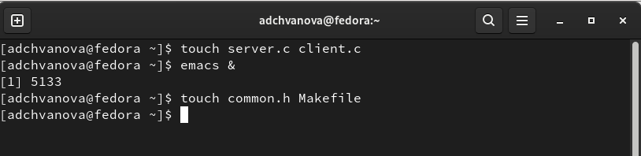
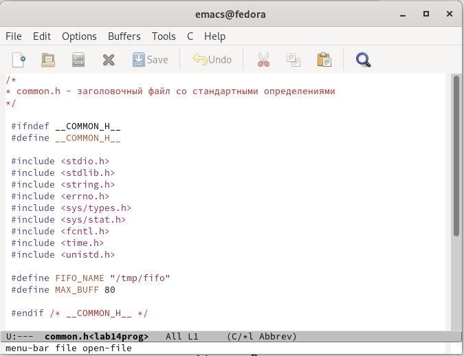
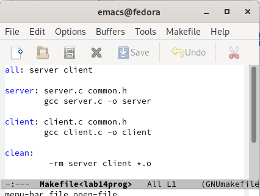
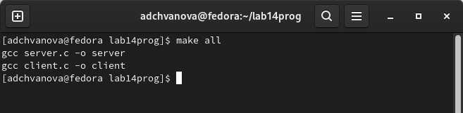
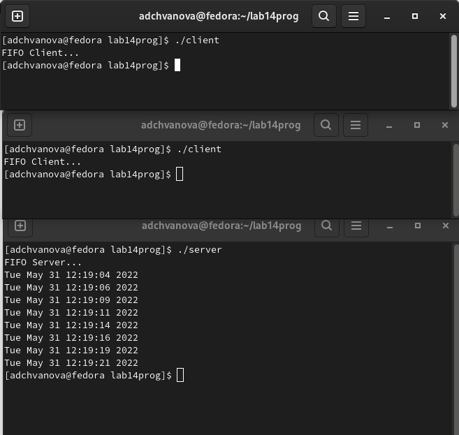

---
## Front matter
lang: ru-RU
title: Лабораторная работа № 14. Именованные каналы
author: |
	Chvanova A.D.
institute: |
	RUDN University, Moscow, Russian Federation

date: NEC--2022, 31 May, Moscow

## Formatting
toc: false
slide_level: 2
theme: metropolis
header-includes: 
 - \metroset{progressbar=frametitle,sectionpage=progressbar,numbering=fraction}
 - '\makeatletter'
 - '\beamer@ignorenonframefalse'
 - '\makeatother'
aspectratio: 43
section-titles: true
---

## Цель работы

Приобретение практических навыков работы с именованными каналами.

## Задание

Изучите приведённые в тексте программы server.c и client.c. Взяв данные примеры
за образец, напишите аналогичные программы, внеся следующие изменения:

1. Работает не 1 клиент, а несколько (например, два).

2. Клиенты передают текущее время с некоторой периодичностью (например, раз в пять
секунд). Используйте функцию sleep() для приостановки работы клиента.

3. Сервер работает не бесконечно, а прекращает работу через некоторое время (например, 30 сек). Используйте функцию clock() для определения времени работы сервера.
Что будет в случае, если сервер завершит работу, не закрыв канал?

## Выполнение лабораторной работы

1). Я создала необходимые файлы с помощью команды «touch common.h server.c client.c Makefile» и открыла редактор emacs для их редактирования (рис. [-@fig:001]) 

{ #fig:001 width=70% }

## Выполнение лабораторной работы

2). Далее я изменила  коды  программ,  представленных  в  тексте лабораторной работы (рис. [-@fig:002],[-@fig:003],[-@fig:004],[-@fig:005],[-@fig:006],[-@fig:007])

{ #fig:002 width=70% }

## Выполнение лабораторной работы

.png){ #fig:003 width=70% }

## Выполнение лабораторной работы

.png){ #fig:004 width=70% }

## Выполнение лабораторной работы

.png){ #fig:005 width=70% }

## Выполнение лабораторной работы

.png){ #fig:006 width=70% }

## Выполнение лабораторной работы

{ #fig:007 width=70% }

## Выполнение лабораторной работы

3).Используя команду «make all», скомпилировала необходимые файлы (рис. [-@fig:008]). 

{ #fig:008 width=70% }

## Выполнение лабораторной работы

Открыла 3 консоли  (терминала)  и  запустила:  «./server», 2 раза – «./client». Каждый терминал-клиент вывел по 4 сообщения. (рис. [-@fig:009])

{ #fig:009 width=70% }

Если сервер завершит свою работу, не закрыв канал, то, когда мы будем запускать  этот  сервер  снова,  появится  ошибка «Невозможно  создать FIFO», так как у нас уже есть один канал.

## Выводы

Мы приобрели практические навыки работы с именованными каналами.

# Спасибо за внимание!