---
## Front matter
lang: ru-RU
title: Отчёт по первому этапу Индивидуального проекта. Персональный сайт научного работника
author: |
	Chvanova A.D.
institute: |
	RUDN University, Moscow, Russian Federation

date: NEC--2022, 29 April 

## Formatting
toc: false
slide_level: 2
theme: metropolis
header-includes: 
 - \metroset{progressbar=frametitle,sectionpage=progressbar,numbering=fraction}
 - '\makeatletter'
 - '\beamer@ignorenonframefalse'
 - '\makeatother'
aspectratio: 43
section-titles: true
---

## Цель этапа и задание

Размещение на Github pages заготовки для персонального сайта.

Задания:

-Установить необходимое программное обеспечение.

-Скачать шаблон темы сайта.

-Разместить его на хостинге git.

-Установить параметр для URLs сайта.

-Разместить заготовку сайта на Github pages.

## Теоретическое введение

Сайт  — это интернет-ресурс, состоящий из одной, нескольких или множества виртуальных страниц. Все страницы связаны между собой ссылками и обычно объединены общей темой или задачей.

Hugo — один из самых популярных генераторов статических сайтов с открытым исходным кодом, написан на языке Go.

## Выполнение первого этапа проекта

Скачиваем Hugo из GitHub https://github.com/gohugoio/hugo/releases (рис.[-@fig:001])

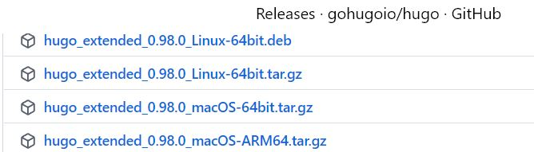{ #fig:001 width=70% }

## Выполнение первого этапа проекта

Затем данный файл переносился в папку bin в домашней папке.

Создавалась репозитория bloge и она копировалась на компьютер рис.[-@fig:002]

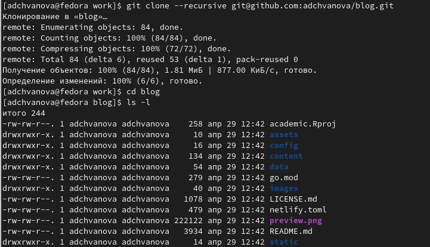{ #fig:002 width=70% }

## Выполнение первого этапа проекта

Выполнялась команда ~bin/hugo server рис.[-@fig:003], после чего нами была получена ссылка на сайт рис.[-@fig:004]

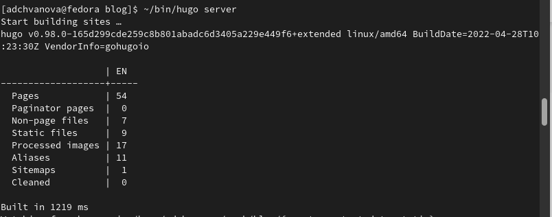{ #fig:003 width=70% } 

## Выполнение первого этапа проекта

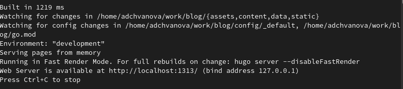{ #fig:004 width=70% }

## Выполнение первого этапа проекта

Переносим сайт на репозиторий, чтобы смотреть сайт не только с локального компьютера, а с любого. А для этого создаем репозиторий (рис.[-@fig:005]) и клонируем его (рис.[-@fig:006])

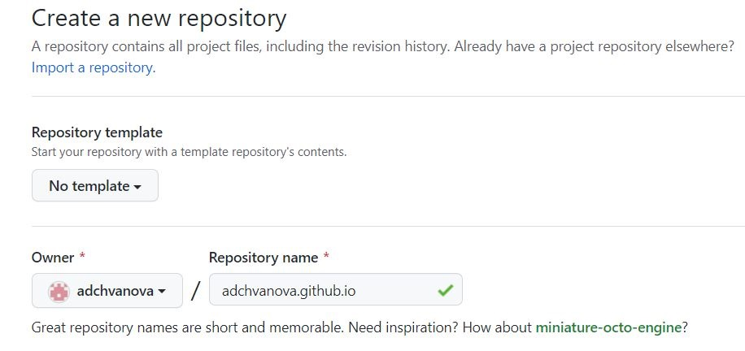{ #fig:005 width=70% }

## Выполнение первого этапа проекта

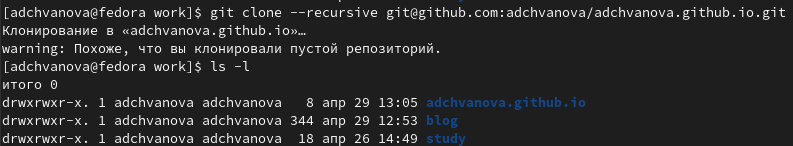{ #fig:006 width=70% }

## Выполнение первого этапа проекта

Создаем новую ветку и переключаемся на неё (рис.[-@fig:007]).Создаем пустой файл, чтобы репозиторию можно было запушить и дальше с ней работать(рис.[-@fig:007]).

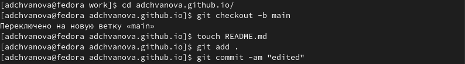{ #fig:007 width=70% }

## Выполнение первого этапа проекта

Избавляемся от игнорирования каталогов с названием public. Для этого в mc в папке .gitignore комментируем public.(рис.[-@fig:008])

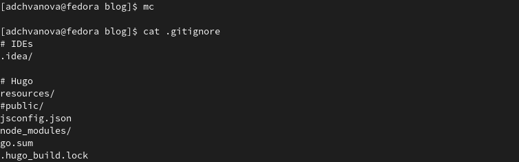{ #fig:008 width=70% }

## Выполнение первого этапа проекта

Подключаем новосозданную репозиторию к папке public внутри нашего bloge. Каталог public создастся  автоматически. С помощью команды ~/bin/hugo автоматически генирируем файлы.(рис.[-@fig:009])

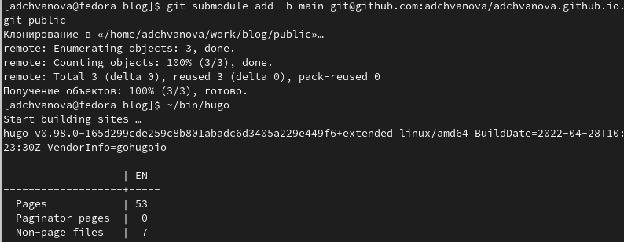{ #fig:009 width=70% }

## Выполнение первого этапа проекта

 Проверяем, что каталог подключен к репозиторию. Пушим все на GitHub.(рис.[-@fig:010])

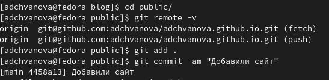{ #fig:010 width=70% }

## Выполнение первого этапа проекта

Обновляем наш сайт и убеждаемся, что все получилось.(рис.[-@fig:011])

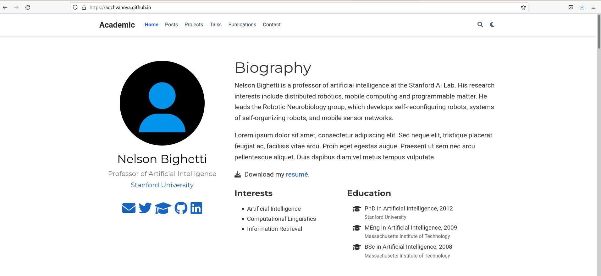{ #fig:011 width=70% }

проверяем на GitHub все наши репозитории.(рис.[-@fig:012])

## Выполнение первого этапа проекта

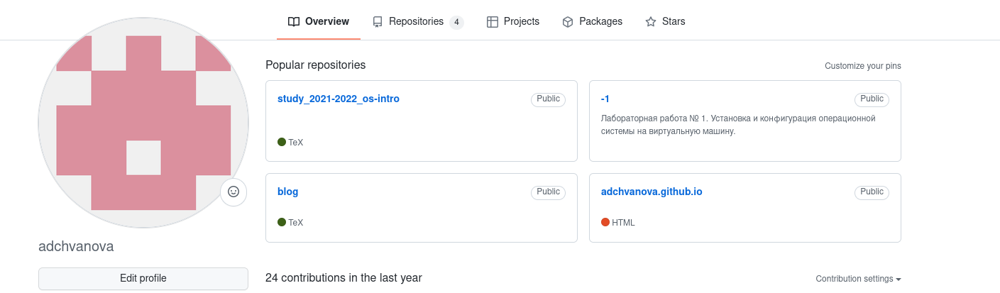{ #fig:012 width=70% }

## Выводы

На первом этапе выполнения удалось выполнить все поставленные задачи. Было установлено необходимое программное обеспечение, скачен шаблон темы сайта. Сайт получилось зазместить на хостинге git.Были устанолены параметры для URLs сайта. Заготовка сайта была размещенана Github pages.

# Спасибо за внимание!
