---
## Front matter
title: "Отчёт по первому этапу Индивидуального проекта "
subtitle: "Персональный сайт научного работника"
author: "Ангелина Дмитриевна Чванова"

## Generic otions
lang: ru-RU
toc-title: "Содержание"

## Bibliography
bibliography: bib/cite.bib
csl: pandoc/csl/gost-r-7-0-5-2008-numeric.csl

## Pdf output format
toc: true # Table of contents
toc-depth: 2
lof: true # List of figures
#lot: true # List of tables
fontsize: 12pt
linestretch: 1.5
papersize: a4
documentclass: scrreprt
## I18n polyglossia
polyglossia-lang:
  name: russian
  options:
	- spelling=modern
	- babelshorthands=true
polyglossia-otherlangs:
  name: english
## I18n babel
babel-lang: russian
babel-otherlangs: english
## Fonts
mainfont: PT Serif
romanfont: PT Serif
sansfont: PT Sans
monofont: PT Mono
mainfontoptions: Ligatures=TeX
romanfontoptions: Ligatures=TeX
sansfontoptions: Ligatures=TeX,Scale=MatchLowercase
monofontoptions: Scale=MatchLowercase,Scale=0.9
## Biblatex
biblatex: true
biblio-style: "gost-numeric"
biblatexoptions:
  - parentracker=true
  - backend=biber
  - hyperref=auto
  - language=auto
  - autolang=other*
  - citestyle=gost-numeric
## Pandoc-crossref LaTeX customization
figureTitle: "Рис."
tableTitle: "Таблица"
listingTitle: "Листинг"
lofTitle: "Список иллюстраций"
lotTitle: "Список таблиц"
lolTitle: "Листинги"
## Misc options
indent: true
header-includes:
  - \usepackage{indentfirst}
  - \usepackage{float} # keep figures where there are in the text
  - \floatplacement{figure}{H} # keep figures where there are in the text
---

# Цель этапа

Размещение на Github pages заготовки для персонального сайта.

# Задание

-Установить необходимое программное обеспечение.

-Скачать шаблон темы сайта.

-Разместить его на хостинге git.

-Установить параметр для URLs сайта.

-Разместить заготовку сайта на Github pages.

# Теоретическое введение

Сайт  — это интернет-ресурс, состоящий из одной, нескольких или множества виртуальных страниц. Все страницы связаны между собой ссылками и обычно объединены общей темой или задачей.

Hugo — один из самых популярных генераторов статических сайтов с открытым исходным кодом, написан на языке Go.

Content & data. Основной контент или содержимое сайта храниться в формате .md в папке content. В роле контента могут выступать ваши статьи, новости, продукты интернет магазина и прочее. Каталог «data» используется для хранения файлов конфигурации, которые Hugo может использовать при создании вашего веб-сайта. Вы можете записать эти файлы в формате YAML, JSON или TOML.

Archetypes. Архетипы используют для создания содержимого сайта на основе заготовок. Можно создавать свои собственные архетипы с предварительно настроенными полями основного материала

Resources. Hugo использует этот каталог для хранения кеша. Это ускоряет сборку сайта.

Static. Здесь храниться весь статический контент (CSS, JavaScript, и т.п).

Layouts. Хранит шаблоны в виде файлов .html, которые определяют, как просмотры вашего контента будут отображаться на статическом веб-сайте.

Themes. Для хранения различных тем.

Public. Сгенерированные исходники веб-сайта. Именно эту директорию следует заливать на хостинг.

# Выполнение первого этапа проекта

Скачиваем Hugo из GitHub https://github.com/gohugoio/hugo/releases (рис.[-@fig:001])

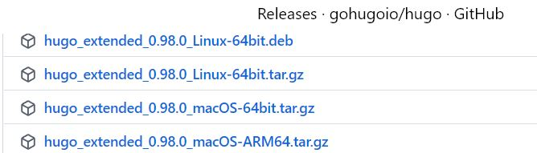{ #fig:001 width=70% }

Затем данный файл переносился в папку bin в домашней папке.

Создавалась репозитория bloge и она копировалась на компьютер[-@fig:002]

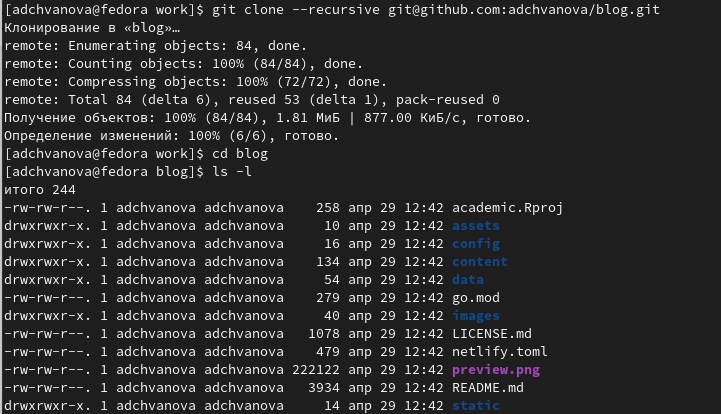{ #fig:002 width=70% }

Выполнялась команда ~bin/hugo server [-@fig:003], после чего нами была получена ссылка на сайт [-@fig:004]

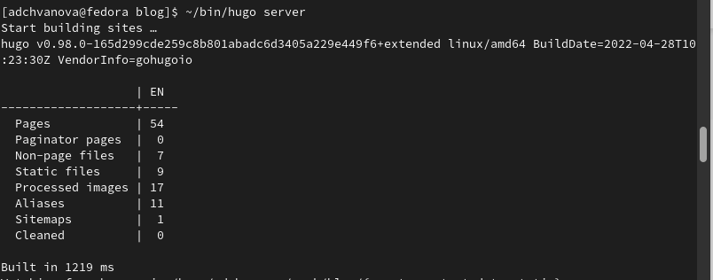{ #fig:003 width=70% } 

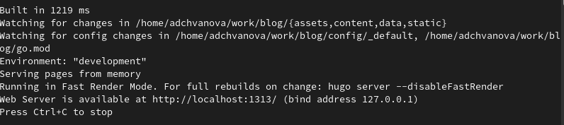{ #fig:004 width=70% }

Переносим сайт на репозиторий, чтобы смотреть сайт не только с локального компьютера, а с любого. А для этого создаем репозиторий (рис.[-@fig:005]) и клонируем его (рис.[-@fig:006])

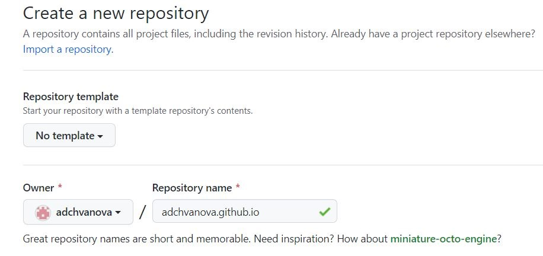{ #fig:005 width=70% }

Переходим в public 

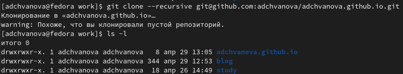{ #fig:006 width=70% }

Создаем новую ветку и переключаемся на неё (рис.[-@fig:007]).Создаем пустой файл, чтобы репозиторию можно было запушить и дальше с ней работать(рис.[-@fig:007]).

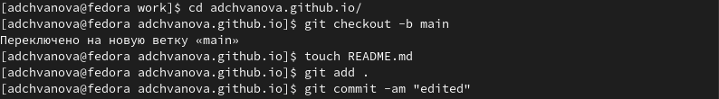{ #fig:007 width=70% }

Избавляемся от игнорирования каталогов с названием public. Для этого в mc в папке .gitignore комментируем public.(рис.[-@fig:008])

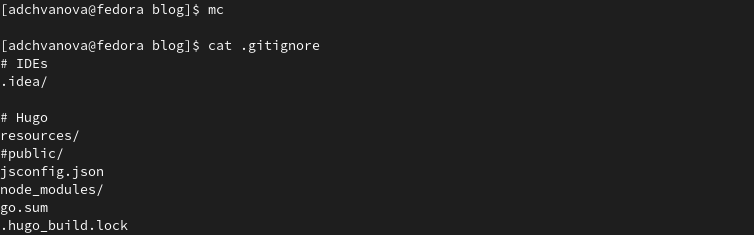{ #fig:008 width=70% }

Подключаем новосозданную репозиторию к папке public внутри нашего bloge. Каталог public создастся  автоматически. С помощью команды ~/bin/hugo автоматически генирируем файлы.(рис.[-@fig:009])

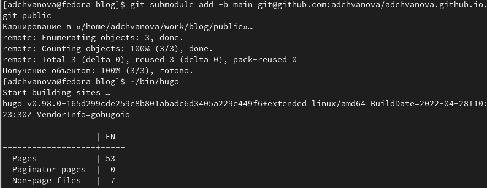{ #fig:009 width=70% }

 Проверяем, что каталог подключен к репозиторию. Пушим все на GitHub.(рис.[-@fig:010])

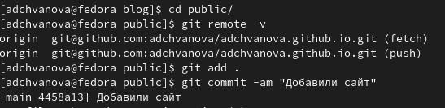{ #fig:010 width=70% }

Обновляем наш сайт и убеждаемся, что все получилось.(рис.[-@fig:011])

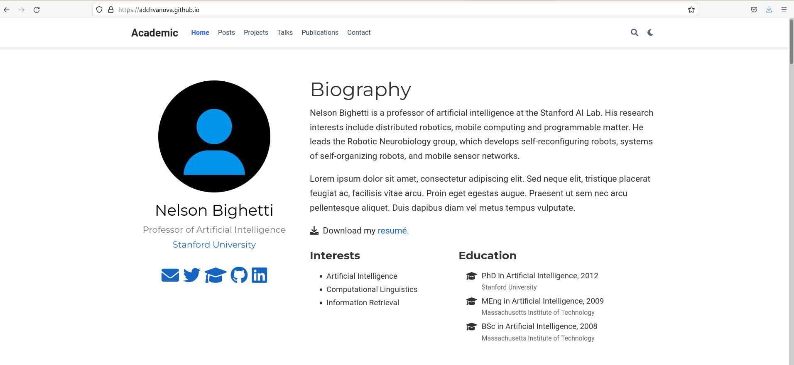{ #fig:011 width=70% }

проверяем на GitHub все наши репозитории.(рис.[-@fig:012])

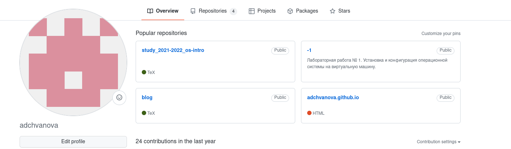{ #fig:012 width=70% }

# Выводы
На первом этапе выполнения удалось выполнить все поставленные задачи. Было установлено необходимое программное обеспечение, скачен шаблон темы сайта. Сайт получилось зазместить на хостинге git.Были устанолены параметры для URLs сайта. Заготовка сайта была размещенана Github pages.

# Список литературы{.unnumbered}
1. https://yamadharma.github.io/ru/post/2022/04/12/creating-hugo-site/

2. https://yamadharma.github.io/ru/course/os-intro/educational-project-researcher-website/

3. https://habr.com/ru/post/532738/
