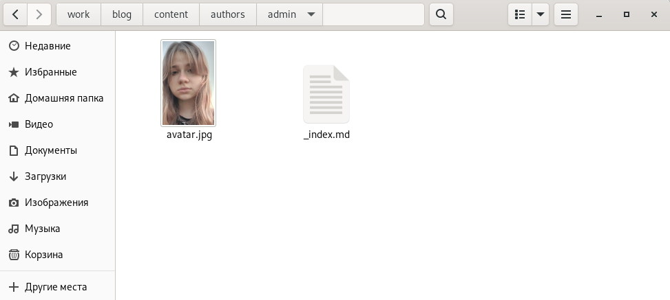
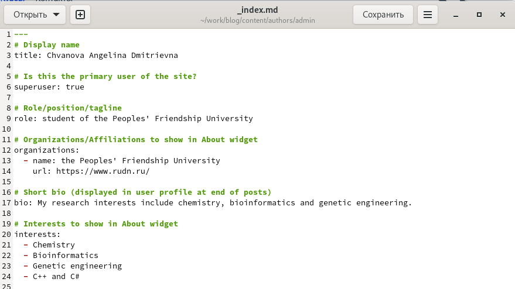
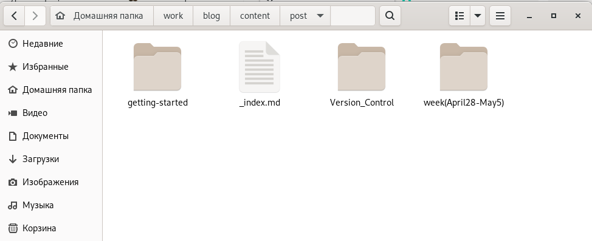
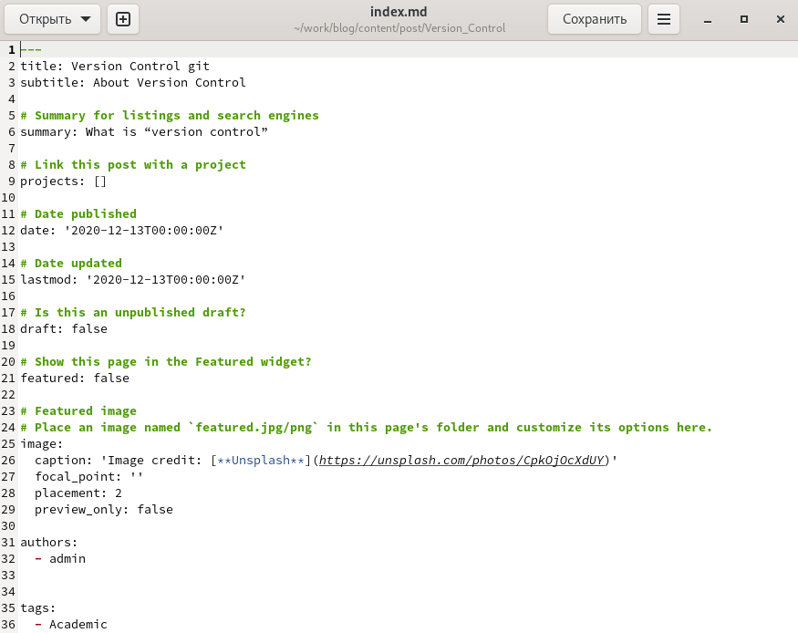
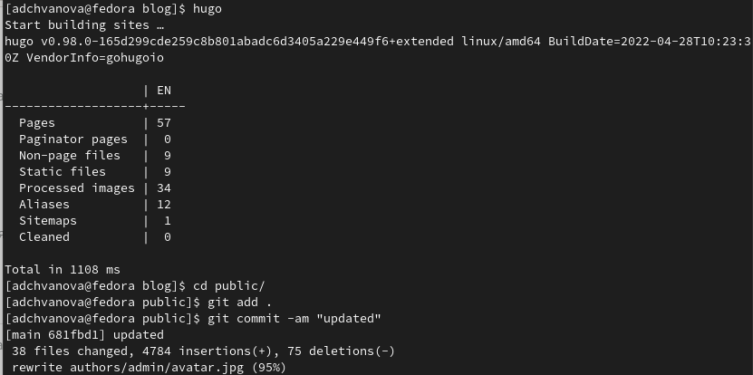
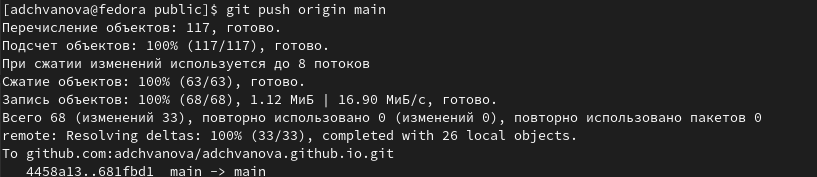
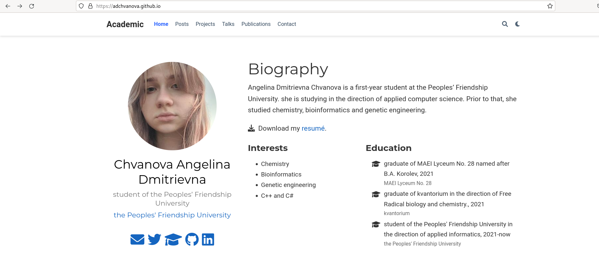

---
## Front matter
lang: ru-RU
title: Индивидуальный проект этап 2. Персональный сайт научного работника
author: |
	Chvanova A.D
institute: |
	RUDN University, Moscow, Russian Federation
	
date: NEC--2022, 5 May, Moscow
## Formatting
toc: false
slide_level: 2
theme: metropolis
header-includes: 
 - \metroset{progressbar=frametitle,sectionpage=progressbar,numbering=fraction}
 - '\makeatletter'
 - '\beamer@ignorenonframefalse'
 - '\makeatother'
aspectratio: 43
section-titles: true
---

## Цель работы

Добавление к нашему персональному сайту данных о себе.

Задачи: 

Разместить фотографию владельца сайта.

Разместить краткое описание владельца сайта (Biography).

Добавить информацию об интересах (Interests).

Добавить информацию об образовании (Education).

Сделать пост по прошедшей неделе.

Добавить пост на тему по выбору:

Управление версиями. Git. или Непрерывная интеграция и непрерывное развертывание (CI/CD).

## Теоретическое введение

Сайт  — это интернет-ресурс, состоящий из одной, нескольких или множества виртуальных страниц. Так как мы создаем  персональный сайт научного работника необходимо выгрузить на него персональную информацию, это нужно для того, чтобы посетитель сайта мог узнать о работнике больше.

Для этого и выгружаются следующие данные : фотографию владельца сайта, краткое описание владельца сайта, информацию об интересах и образовании, а также посты.

## Выполнение лабораторной работы

Переходим в папку work/blog/content/author/admin и меняем аватар на своё фото (рис. [-@fig:001])

{ #fig:001 width=70% }

## Выполнение лабораторной работы

Редактируем страницу сайта в файле _index.md , меняем имя, добавляем биографию, информацию об интересах и образовании. (рис. [-@fig:002])

{ #fig:002 width=70% }

## Выполнение лабораторной работы

Создаем две папки для постов. (рис. [-@fig:003])

{ #fig:003 width=70% }

## Выполнение лабораторной работы

Пишем посты путем редактирования файлов index.md в папках для постов. (рис. [-@fig:004])

{ #fig:004 width=70% }

## Выполнение лабораторной работы

Пишу hugo в терминале, а затем отправляю на GitHub все созданные и измененные файлы. (рис. [-@fig:005] - [-@fig:006] )

{ #fig:005 width=70% }

## Выполнение лабораторной работы

{ #fig:006 width=70% }

## Выполнение лабораторной работы

Обновляем сайт и смотрим на изменения.(рис. [-@fig:007] - [-@fig:008] )

{ #fig:007 width=70% }

## Выполнение лабораторной работы

{ #fig:008 width=70% }

## Выводы

На сайт были успешно добавлены все необходимые персональные данные: имя, биография, информация об интересах и образовании. Были написаны два поста: один о прошлой неделе, а второй о управлении версиями Git.

# Спасибо за внимание!
