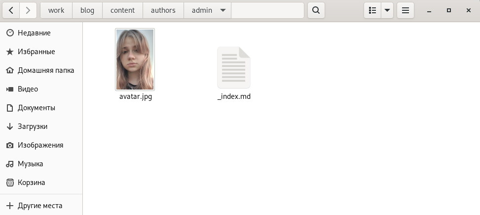
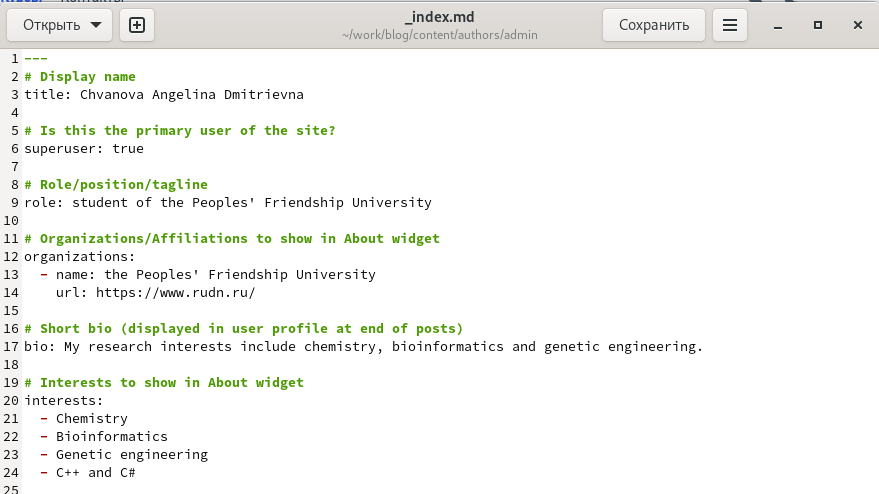
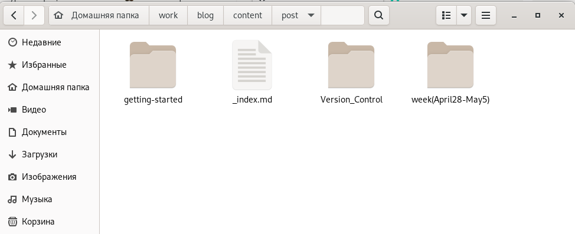
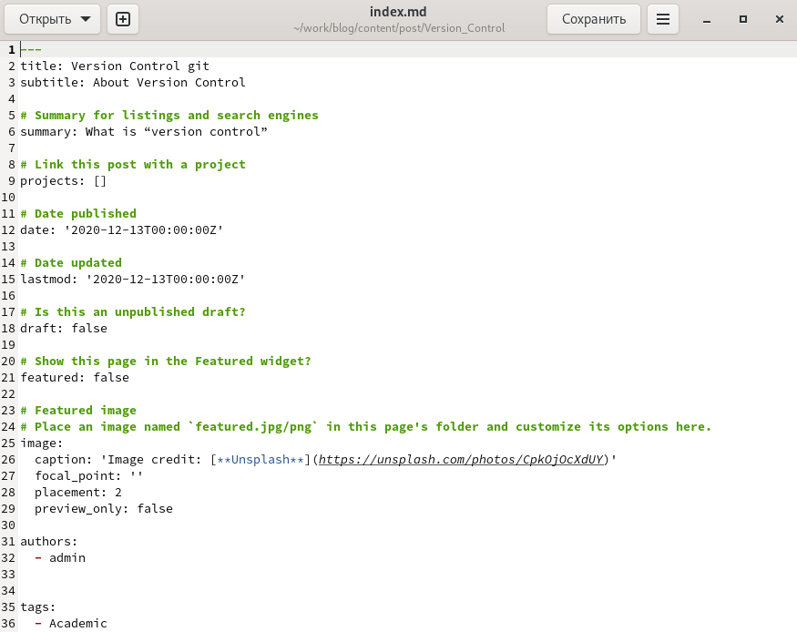
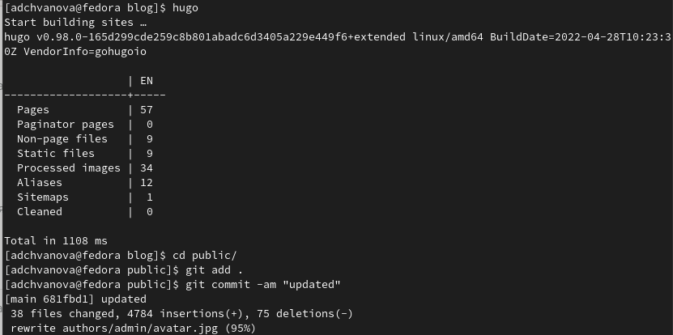
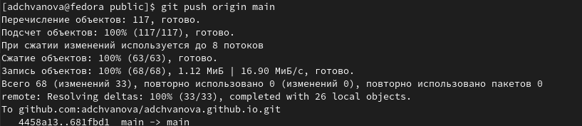
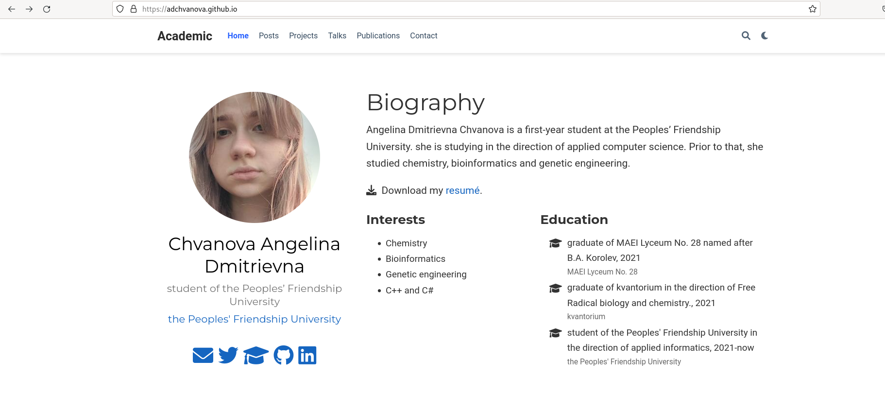
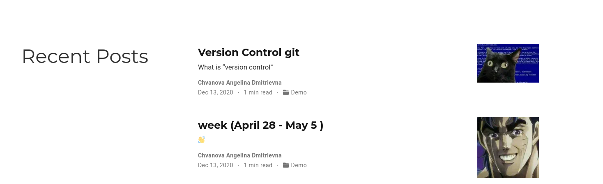

---
## Front matter
title: " Отчёт по Индивидуальному проекту этап 2"
subtitle: " Персональный сайт научного работника"
author: "Ангелина Дмитриевна Чванова"

## Generic otions
lang: ru-RU
toc-title: "Содержание"

## Bibliography
bibliography: bib/cite.bib
csl: pandoc/csl/gost-r-7-0-5-2008-numeric.csl

## Pdf output format
toc: true # Table of contents
toc-depth: 2
lof: true # List of figures
lot: true # List of tables
fontsize: 12pt
linestretch: 1.5
papersize: a4
documentclass: scrreprt
## I18n polyglossia
polyglossia-lang:
  name: russian
  options:
	- spelling=modern
	- babelshorthands=true
polyglossia-otherlangs:
  name: english
## I18n babel
babel-lang: russian
babel-otherlangs: english
## Fonts
mainfont: PT Serif
romanfont: PT Serif
sansfont: PT Sans
monofont: PT Mono
mainfontoptions: Ligatures=TeX
romanfontoptions: Ligatures=TeX
sansfontoptions: Ligatures=TeX,Scale=MatchLowercase
monofontoptions: Scale=MatchLowercase,Scale=0.9
## Biblatex
biblatex: true
biblio-style: "gost-numeric"
biblatexoptions:
  - parentracker=true
  - backend=biber
  - hyperref=auto
  - language=auto
  - autolang=other*
  - citestyle=gost-numeric
## Pandoc-crossref LaTeX customization
figureTitle: "Рис."
tableTitle: "Таблица"
listingTitle: "Листинг"
lofTitle: "Список иллюстраций"
lotTitle: "Список таблиц"
lolTitle: "Листинги"
## Misc options
indent: true
header-includes:
  - \usepackage{indentfirst}
  - \usepackage{float} # keep figures where there are in the text
  - \floatplacement{figure}{H} # keep figures where there are in the text
---

# Цель работы

Добавление к нашему персональному сайту данных о себе.

# Задание

Добавить к сайту данные о себе.

Список добавляемых данных. 

Разместить фотографию владельца сайта.

Разместить краткое описание владельца сайта (Biography).

Добавить информацию об интересах (Interests).

Добавить информацию об образовании (Education).

Сделать пост по прошедшей неделе.

Добавить пост на тему по выбору:

Управление версиями. Git. или Непрерывная интеграция и непрерывное развертывание (CI/CD).

# Теоретическое введение

Сайт  — это интернет-ресурс, состоящий из одной, нескольких или множества виртуальных страниц. Так как мы создаем  персональный сайт научного работника необходимо выгрузить на него персональную информацию, это нужно для того, чтобы посетитель сайта мог узнать о работнике больше.

Для этого и выгружаются следующие данные : фотографию владельца сайта, краткое описание владельца сайта, информацию об интересах и образовании, а также посты.

# Выполнение лабораторной работы

Переходим в папку work/blog/content/author/admin и меняем аватар на своё фото (рис. [-@fig:001])

{ #fig:001 width=70% }

Редактируем страницу сайта в файле _index.md , меняем имя, добавляем биографию, информацию об интересах и образовании. (рис. [-@fig:002])

{ #fig:002 width=70% }

Создаем две папки для постов. (рис. [-@fig:003])

{ #fig:003 width=70% }

Пишем посты путем редактирования файлов index.md в папках для постов. (рис. [-@fig:004])

{ #fig:004 width=70% }

Пишу hugo в терминале, а затем отправляю на GitHub все созданные и измененные файлы. (рис. [-@fig:005] - [-@fig:006] )

{ #fig:005 width=70% }

{ #fig:006 width=70% }

Обновляем сайт и смотрим на изменения.(рис. [-@fig:007] - [-@fig:008] )

{ #fig:007 width=70% }

{ #fig:008 width=70% }

# Выводы

На сайт были успешно добавлены все необходимые персональные данные: имя, биография, информация об интересах и образовании. Были написаны два поста: один о прошлой неделе, а второй о управлении версиями Git.

