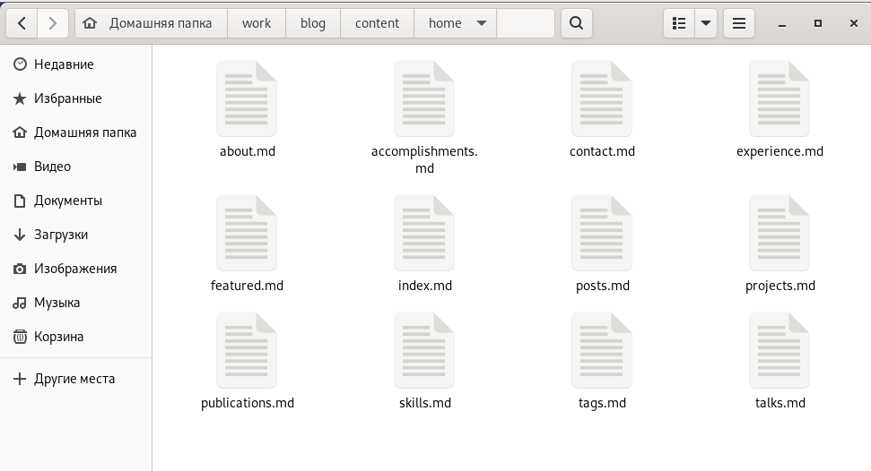
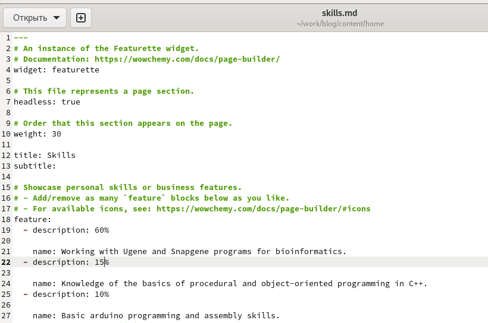
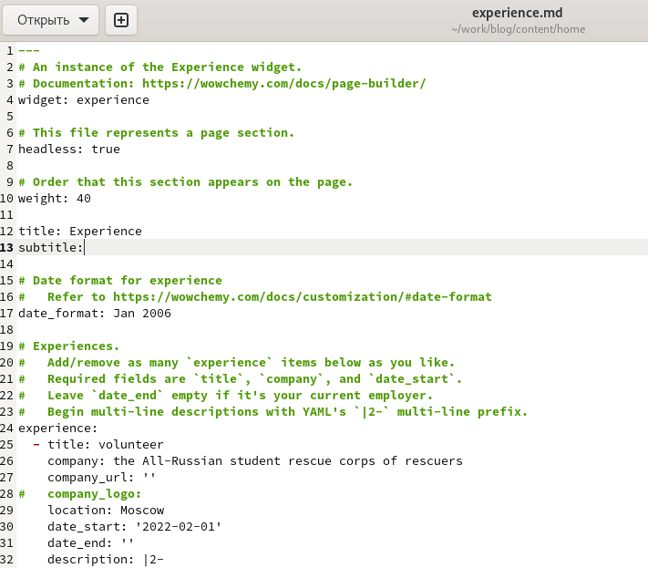
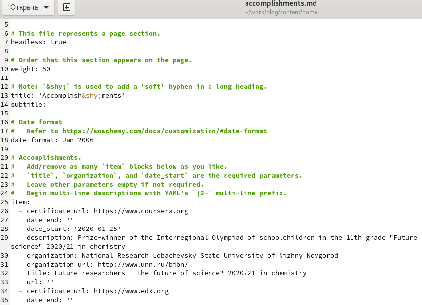
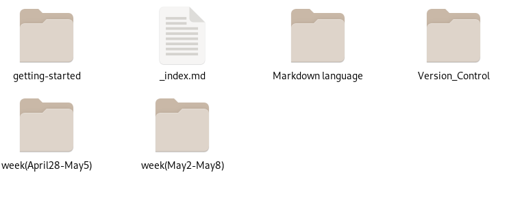
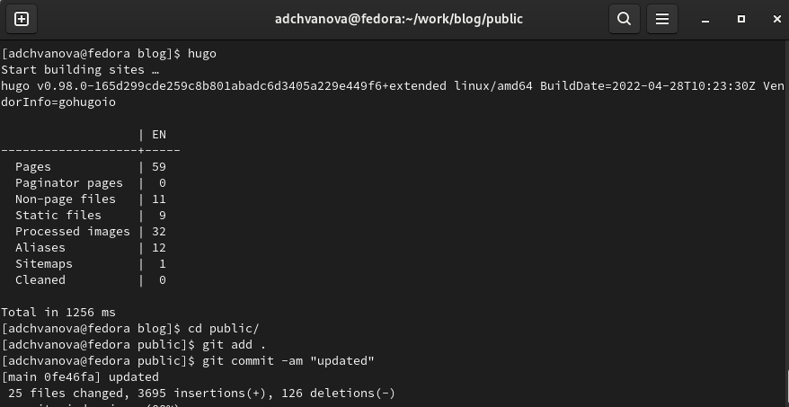
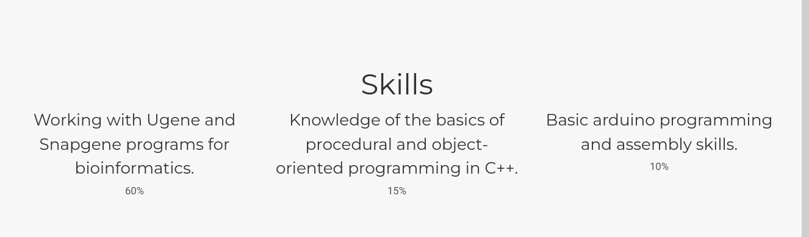
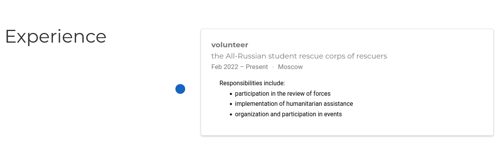
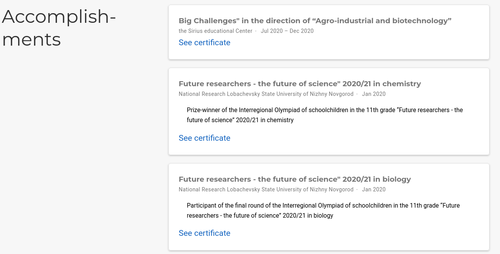
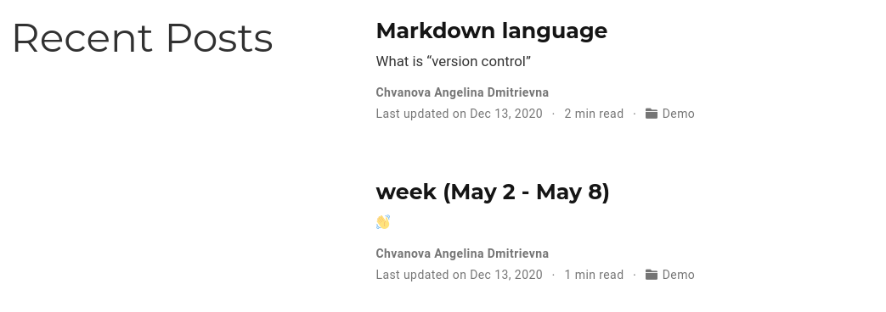

---
## Front matter
lang: ru-RU
title: Индивидуальный проект этап 3. Персональный сайт научного работника
author: |
	Chvanova A.D
institute: |
	RUDN University, Moscow, Russian Federation
	
date: NEC--2022, 12 May, Moscow
## Formatting
toc: false
slide_level: 2
theme: metropolis
header-includes: 
 - \metroset{progressbar=frametitle,sectionpage=progressbar,numbering=fraction}
 - '\makeatletter'
 - '\beamer@ignorenonframefalse'
 - '\makeatother'
aspectratio: 43
section-titles: true
---

## Цель работы

Добавление на персональный сайт научного работника список достижений.
(информация о навыках (Skills), информация об опыте (Experience), информация о достижениях (Accomplishments)), а также написание постов на сайт.

## Задание

Добавить к сайту достижения.

Список достижений.

Добавить информацию о навыках (Skills).

Добавить информацию об опыте (Experience).

Добавить информацию о достижениях (Accomplishments).

Сделать пост по прошедшей неделе.

Добавить пост на тему по выбору:

Легковесные языки разметки или Языки разметки. LaTeX. или Язык разметки Markdown.

## Теоретическое введение

Сайт  — это интернет-ресурс, состоящий из одной, нескольких или множества виртуальных страниц. Так как мы создаем  персональный сайт научного работника необходимо выгрузить на него информацию о достижениях, навыках и опыте работы, это нужно для того, чтобы посетитель сайта мог узнать о работнике больше.

## Выполнение лабораторной работы

Открываем папку с файлами, которые нужно отредактироватьдля добавления данных о навыках, опыте, достижениях. (рис. [-@fig:001])

{ #fig:001 width=70% }

## Выполнение лабораторной работы

Редактируем информацию о навыках. (рис. [-@fig:002])

{ #fig:002 width=70% }

## Выполнение лабораторной работы

Редактируем информацию об опыте. (рис. [-@fig:003])

{ #fig:003 width=70% }

## Выполнение лабораторной работы

Редактируем информацию о достижениях. (рис. [-@fig:004])

{ #fig:004 width=70% }

## Выполнение лабораторной работы

Создаем папки в которых будут необходимые файлы для постов. (рис. [-@fig:005])

{ #fig:005 width=70% }

## Выполнение лабораторной работы

Выгружаем все на GitHub. (рис. [-@fig:006])

{ #fig:006 width=70% }

## Выполнение лабораторной работы

Проверяем измения на сайте. (рис. [-@fig:007], [-@fig:008], [-@fig:009], [-@fig:010])

{ #fig:007 width=70% }

## Выполнение лабораторной работы

{ #fig:008 width=70% }

## Выполнение лабораторной работы

{ #fig:009 width=70% }

## Выполнение лабораторной работы

{ #fig:010 width=70% }

## Выводы

Мы добавили на персональный сайт научного работника список достижений.
(информация о навыках (Skills), информация об опыте (Experience), информация о достижениях (Accomplishments)), а также написали посты на сайт.(о прошлой неделе и о Языке разметки Markdown.)

# Спасибо за внимание!
