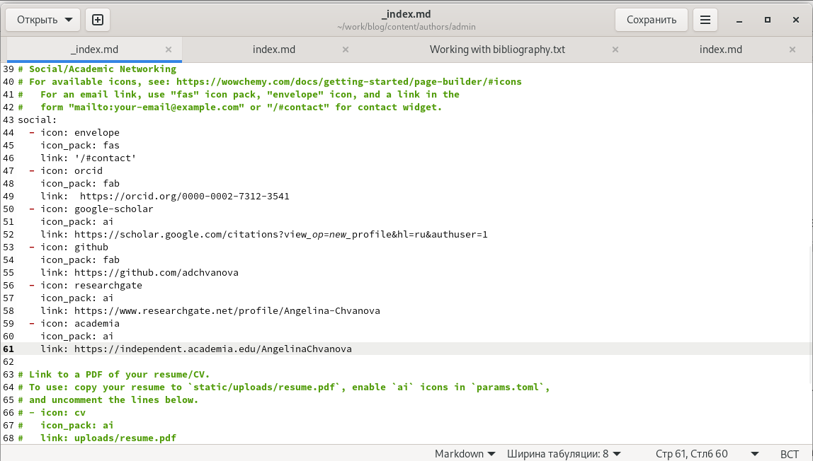
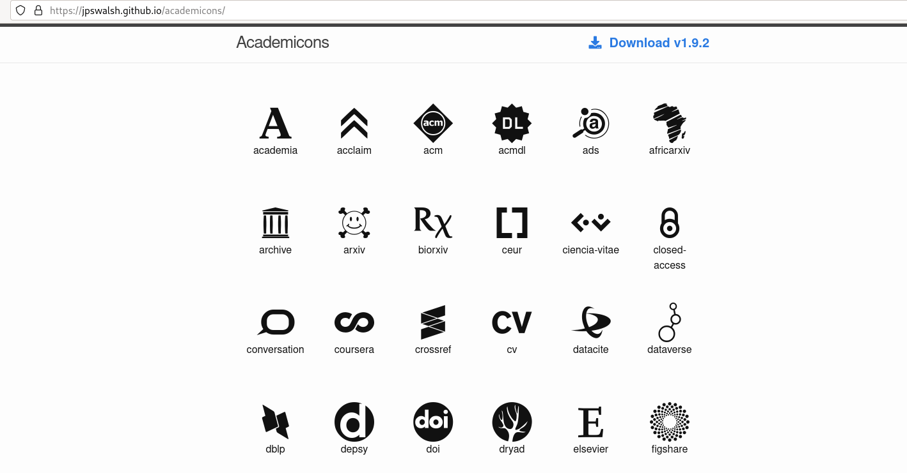
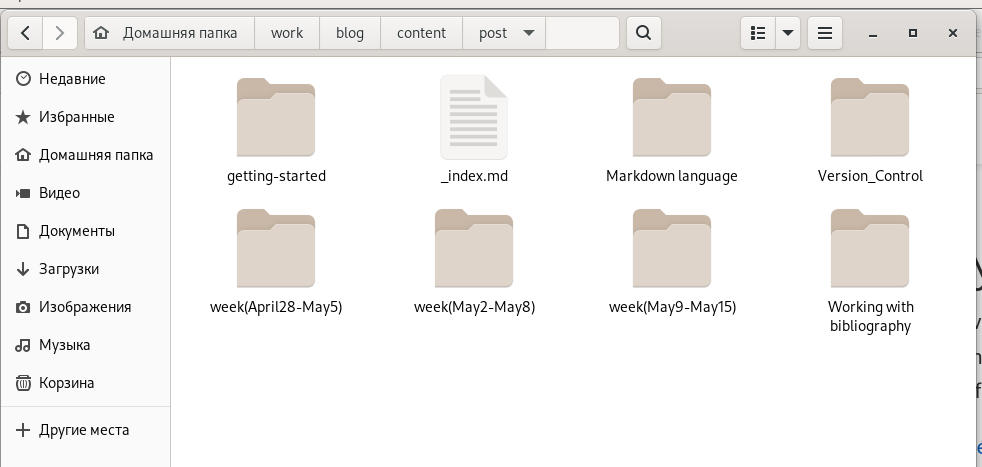
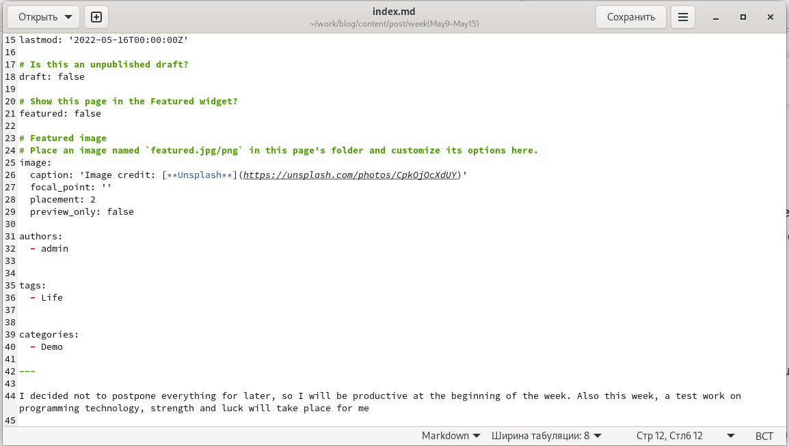
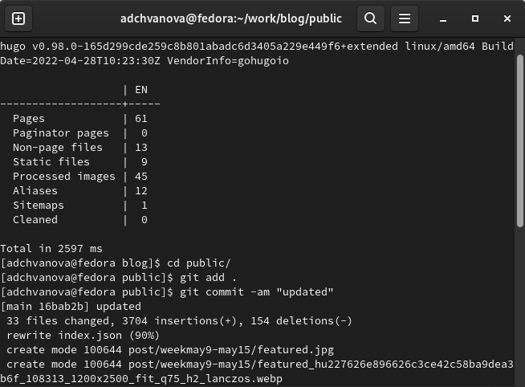
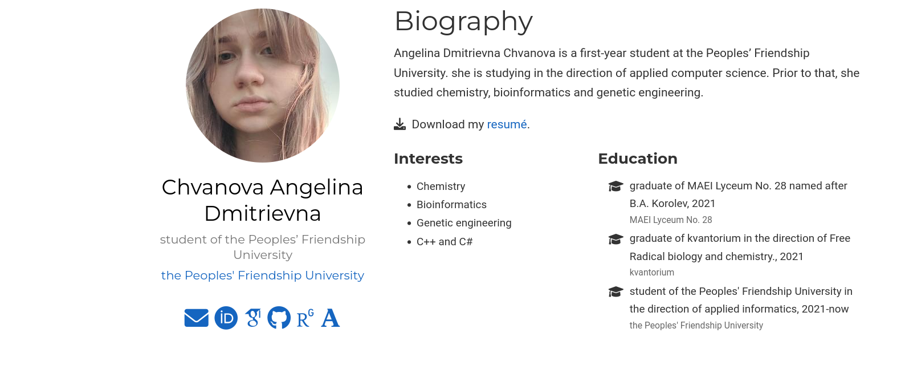
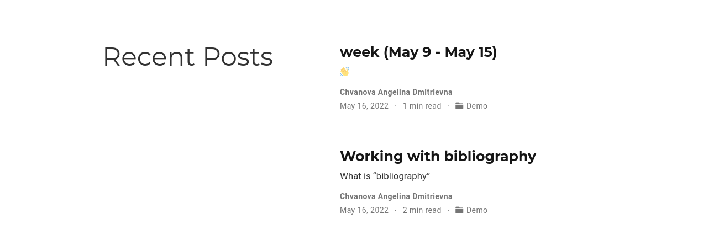

---
## Front matter
lang: ru-RU
title: Индивидуальный проект этап 4. Персональный сайт научного работника
author: |
	Chvanova A.D
institute: |
	RUDN University, Moscow, Russian Federation
	
date: NEC--2022, 12 May, Moscow
## Formatting
toc: false
slide_level: 2
theme: metropolis
header-includes: 
 - \metroset{progressbar=frametitle,sectionpage=progressbar,numbering=fraction}
 - '\makeatletter'
 - '\beamer@ignorenonframefalse'
 - '\makeatother'
aspectratio: 43
section-titles: true
---

## Цель работы

Добавление к сайту ссылок на научные и библиометрические ресурсы. Написание двух постов.

## Задание

Добавить к сайту ссылки на научные и библиометрические ресурсы.

Зарегистрироваться на соответствующих ресурсах и разместить на них ссылки на сайте:

Google Scholar : https://scholar.google.com/;

ORCID : https://orcid.org/;

ResearchGate : https://www.researchgate.net/;

Academia.edu : https://www.academia.edu/;

arXiv : https://arxiv.org/;

github : https://github.com/.

Сделать пост по прошедшей неделе.

Добавить пост на тему по выбору:

Оформление отчёта. или Создание презентаций. или Работа с библиографией.

## Теоретическое введение

Сайт  — это интернет-ресурс, состоящий из одной, нескольких или множества виртуальных страниц. Так как мы создаем  персональный сайт научного работника необходимо выгрузить на него информацию м ссылки на научные и библиометрические ресурсы, это нужно для того, чтобы посетитель сайта мог найти наши рабы и публикации на других научных ресурсах.

## Выполнение лабораторной работы

Открываем папку с файлом, который нужно отредактировать и пеходим в пунк social . (рис. [-@fig:001])

{ #fig:001 width=70% }

## Выполнение лабораторной работы

Подбираем иконки для научных и библиометрических ресурсов. (рис. [-@fig:002])

{ #fig:002 width=70% }

## Выполнение лабораторной работы

Создаем папки в которых будут необходимые файлы для постов. (рис. [-@fig:003])

{ #fig:003 width=70% }

## Выполнение лабораторной работы

Пишем посты. Пост о прошлой неделе и о работе с библиографией.(рис. [-@fig:004])

{ #fig:004 width=70% }

## Выполнение лабораторной работы

Выгружаем все на GitHub. (рис. [-@fig:005])

{ #fig:005 width=70% }

## Выполнение лабораторной работы

Проверяем изменения на сайте. (рис. [-@fig:006], [-@fig:007])

{ #fig:006 width=70% }

## Выполнение лабораторной работы

{ #fig:007 width=70% }

## Выводы

Мы добавили на персональный сайт научного работника научные и библиометрические ресурсы,а также написали посты на сайт.(о прошлой неделе и о работе с библиографией.)

# Спасибо за внимание!
