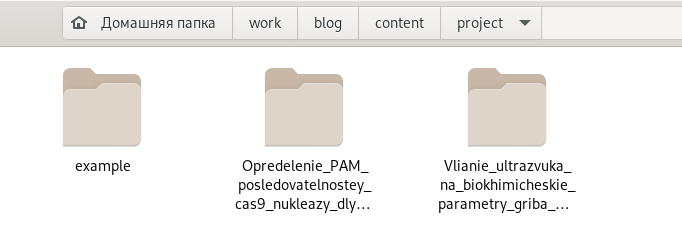
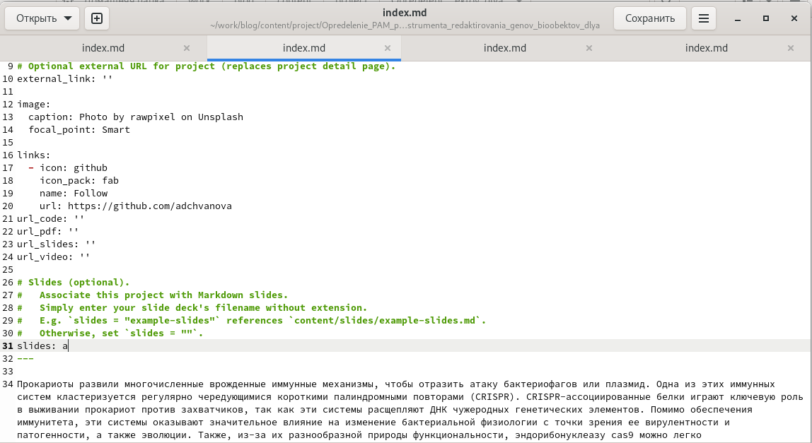
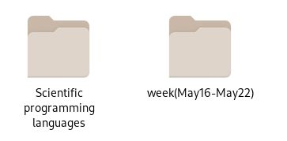
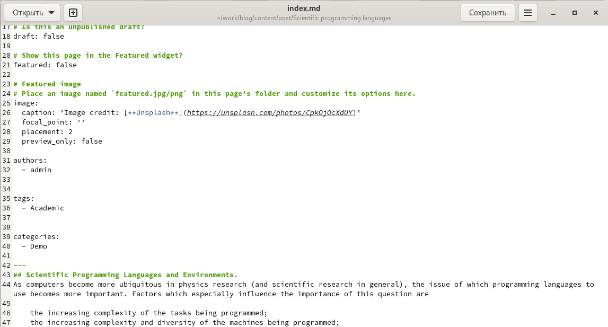
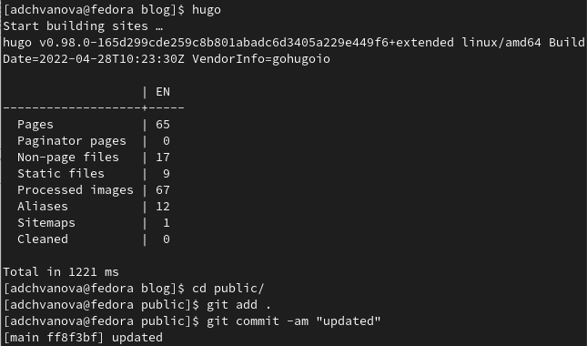
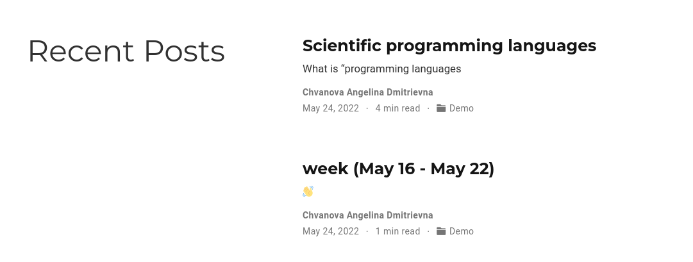
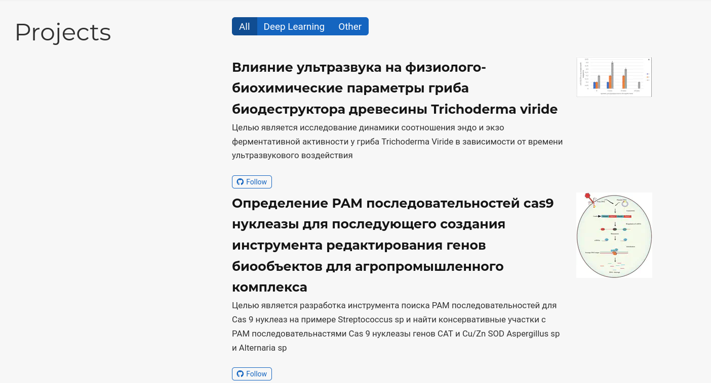

---
## Front matter
lang: ru-RU
title: 5 этап Индивидуального проекта.Персональный сайт научного работника
author: |
	Chvanova A.D.
institute: |
	RUDN University, Moscow, Russian Federation
date: NEC--2022, 24 May, Moscow
## Formatting
toc: false
slide_level: 2
theme: metropolis
header-includes: 
 - \metroset{progressbar=frametitle,sectionpage=progressbar,numbering=fraction}
 - '\makeatletter'
 - '\beamer@ignorenonframefalse'
 - '\makeatother'
aspectratio: 43
section-titles: true
---

## Цель работы

Добавление к сайту записей для персональных проектов и двух постов( по по прошедшей неделе, пост на тему языки научного программирования.)

## Задание

Добавить с сайту все остальные элементы.

Сделать записи для персональных проектов.

Сделать пост по прошедшей неделе.

Добавить пост на тему по выбору. (Языки научного программирования.)

## Теоретическое введение

Сайт  — это интернет-ресурс, состоящий из одной, нескольких или множества виртуальных страниц. Так как мы создаем  персональный сайт научного работника необходимо выгрузить на него персональные проекты, это нужно для того, чтобы посетитель сайта мог посмотреть наши работы.

## Выполнение лабораторной работы

Создаем папки для персональных проектов. (рис. [-@fig:001])

{ #fig:001 width=70% }

## Выполнение лабораторной работы

Меняем файл, вставляя информацию о проекте. (рис. [-@fig:002])

{ #fig:002 width=70% }

## Выполнение лабораторной работы

Создаем папки в которых будут необходимые файлы для постов. (рис. [-@fig:003])

{ #fig:003 width=70% }

## Выполнение лабораторной работы

Пишем посты. Пост о прошлой неделе и о языках научного программирования.(рис. [-@fig:004])

{ #fig:004 width=70% }

## Выполнение лабораторной работы

Выгружаем все на GitHub. (рис. [-@fig:005])

{ #fig:005 width=70% }

## Выполнение лабораторной работы

Проверяем измения на сайте. (рис. [-@fig:006], [-@fig:007])

{ #fig:006 width=70% }

## Выполнение лабораторной работы

{ #fig:007 width=70% }

## Выводы

Мы добавили к сайту записи для персональных проектов и два поста (по по прошедшей неделе, пост на тему языки научного программирования.)

# Спасибо за внимание!