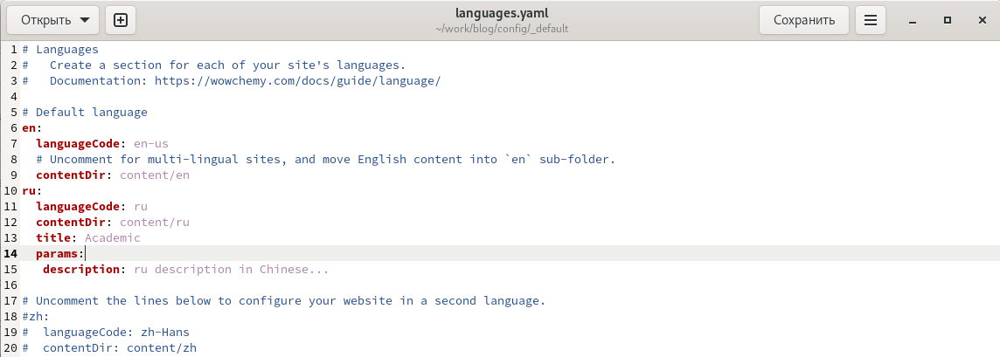
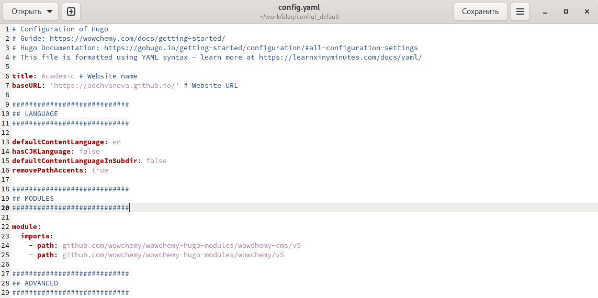
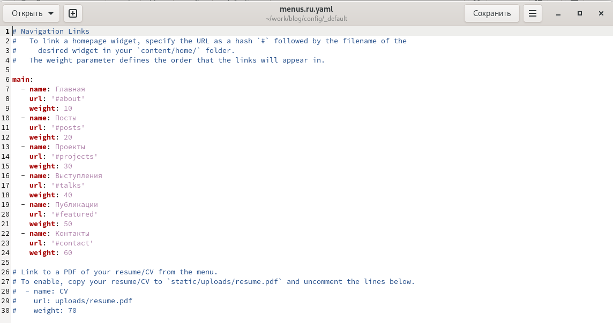
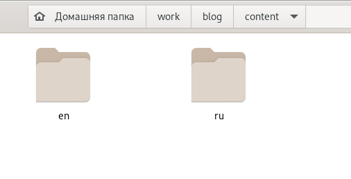
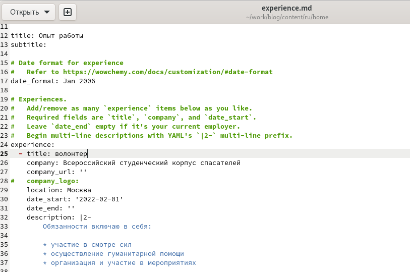
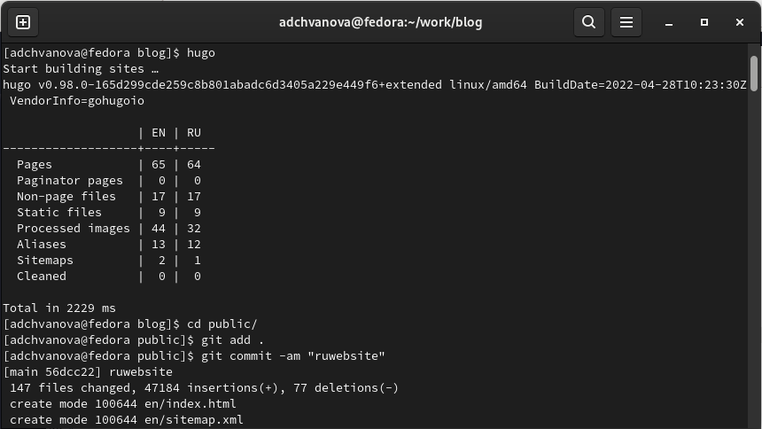
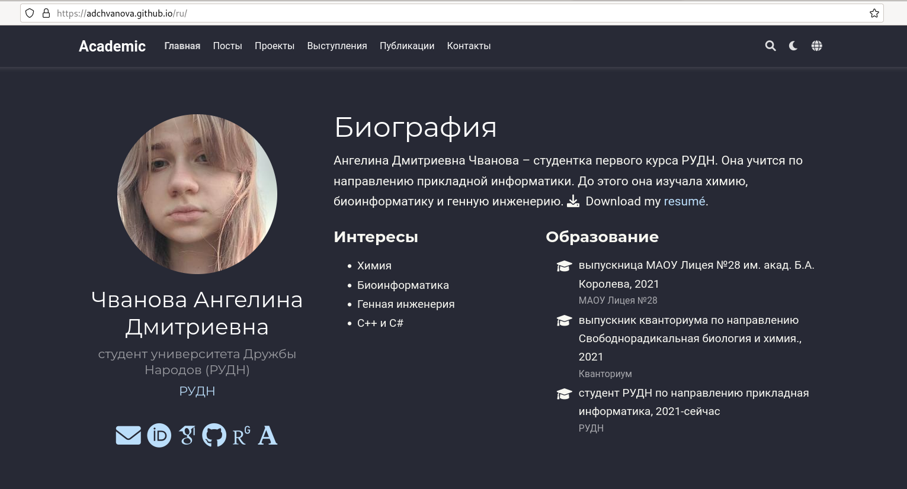
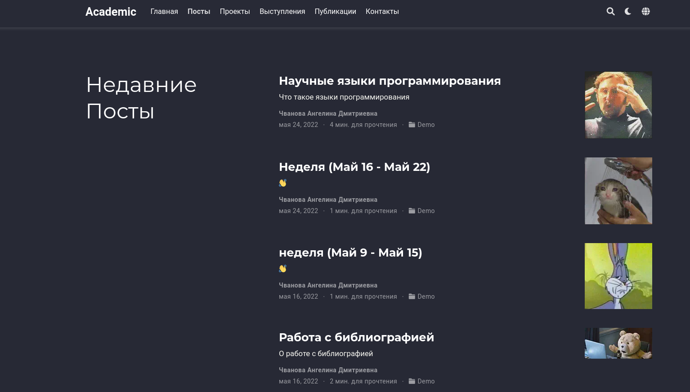

---
## Front matter
lang: ru-RU
title: 6 этап Индивидуального проекта.Персональный сайт научного работника
author: |
	Chvanova A.D.
institute: |
	RUDN University, Moscow, Russian Federation
date: NEC--2022, 31 May, Moscow
## Formatting
toc: false
slide_level: 2
theme: metropolis
header-includes: 
 - \metroset{progressbar=frametitle,sectionpage=progressbar,numbering=fraction}
 - '\makeatletter'
 - '\beamer@ignorenonframefalse'
 - '\makeatother'
aspectratio: 43
section-titles: true
---

## Цель работы

Выполнение поддержки английского и русского языков на сайте, размещение элементов сайта и контент на обоих языках

## Задание

Сделать поддержку английского и русского языков.

Разместить элементы сайта на обоих языках.

Разместить контент на обоих языках.

Сделать пост по прошедшей неделе.

Добавить пост на тему по выбору (на двух языках).

## Теоретическое введение

Сайт  — это интернет-ресурс, состоящий из одной, нескольких или множества виртуальных страниц. Так как мы создаем  персональный сайт научного работника необходимо адаптировать сайт для двух языко, чтобы даже иностранный посетитель сайта мог посмотреть его.

## Выполнение лабораторной работы

Открываем папку work/blog/config/_default и редактируем там файл languages,добавляя русский язык (рис. [-@fig:001])

{ #fig:001 width=70% }

## Выполнение лабораторной работы

В папке work/blog/config/_default редактируем там файл config ,добавляя ссылку на наш сайт (рис. [-@fig:002])

{ #fig:002 width=70% }

## Выполнение лабораторной работы

Делаем русское меню (рис. [-@fig:003])

{ #fig:003 width=70% }

## Выполнение лабораторной работы

Создаем в папке content две папки для русского контента и английского (рис. [-@fig:004])

{ #fig:004 width=70% }

## Выполнение лабораторной работы

Переводим все, что до этого заполняли на английском на русский (рис. [-@fig:005])

{ #fig:005 width=70% }

## Выполнение лабораторной работы

Используем hugo и пушим на GitHub (рис. [-@fig:006])

{ #fig:006 width=70% }

## Выполнение лабораторной работы

Проверяем измения на сайте. (рис. [-@fig:007], [-@fig:008])

{ #fig:007 width=70% }

## Выполнение лабораторной работы

{ #fig:008 width=70% }

## Выводы

Мы выполнили поддержку английского и русского языков на сайте, разместили элементы сайта и контент на обоих языках.

# Спасибо за внимание!
