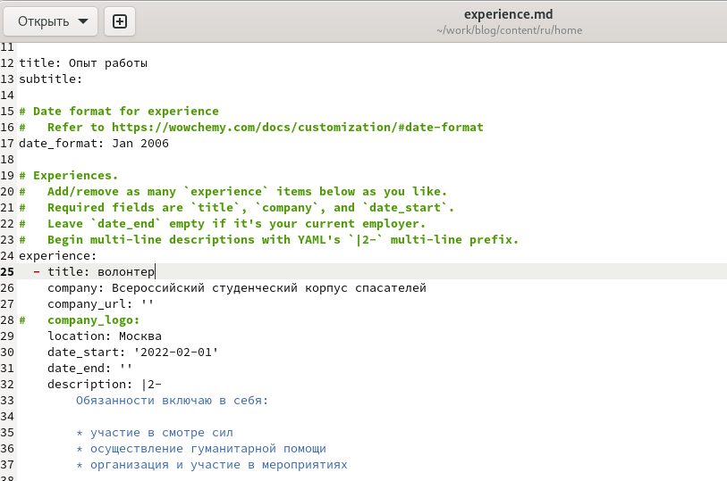

---
## Front matter
title: "Отчёт по 6 этапу Индивидуального проекта"
subtitle: "Персональный сайт научного работника"
author: "Ангелина Чванова Дмитриевна"

## Generic otions
lang: ru-RU
toc-title: "Содержание"

## Bibliography
bibliography: bib/cite.bib
csl: pandoc/csl/gost-r-7-0-5-2008-numeric.csl

## Pdf output format
toc: true # Table of contents
toc-depth: 2
lof: true # List of figures
lot: true # List of tables
fontsize: 12pt
linestretch: 1.5
papersize: a4
documentclass: scrreprt
## I18n polyglossia
polyglossia-lang:
  name: russian
  options:
	- spelling=modern
	- babelshorthands=true
polyglossia-otherlangs:
  name: english
## I18n babel
babel-lang: russian
babel-otherlangs: english
## Fonts
mainfont: PT Serif
romanfont: PT Serif
sansfont: PT Sans
monofont: PT Mono
mainfontoptions: Ligatures=TeX
romanfontoptions: Ligatures=TeX
sansfontoptions: Ligatures=TeX,Scale=MatchLowercase
monofontoptions: Scale=MatchLowercase,Scale=0.9
## Biblatex
biblatex: true
biblio-style: "gost-numeric"
biblatexoptions:
  - parentracker=true
  - backend=biber
  - hyperref=auto
  - language=auto
  - autolang=other*
  - citestyle=gost-numeric
## Pandoc-crossref LaTeX customization
figureTitle: "Рис."
tableTitle: "Таблица"
listingTitle: "Листинг"
lofTitle: "Список иллюстраций"
lotTitle: "Список таблиц"
lolTitle: "Листинги"
## Misc options
indent: true
header-includes:
  - \usepackage{indentfirst}
  - \usepackage{float} # keep figures where there are in the text
  - \floatplacement{figure}{H} # keep figures where there are in the text
---

# Цель работы

Выполнение поддержки английского и русского языков на сайте, размещение элементов сайта и контент на обоих языках

# Задание

Сделать поддержку английского и русского языков.

Разместить элементы сайта на обоих языках.

Разместить контент на обоих языках.

Сделать пост по прошедшей неделе.

Добавить пост на тему по выбору (на двух языках).

# Теоретическое введение

Сайт  — это интернет-ресурс, состоящий из одной, нескольких или множества виртуальных страниц. Так как мы создаем  персональный сайт научного работника необходимо адаптировать сайт для двух языко, чтобы даже иностранный посетитель сайта мог посмотреть его.

# Выполнение лабораторной работы

Открываем папку work/blog/config/_default и редактируем там файл languages,добавляя русский язык (рис. [-@fig:001])

{ #fig:001 width=70% }

В папке work/blog/config/_default редактируем там файл config ,добавляя ссылку на наш сайт (рис. [-@fig:002])

{ #fig:002 width=70% }

Делаем русское меню (рис. [-@fig:003])

{ #fig:003 width=70% }

Создаем в папке content две папки для русского контента и английского (рис. [-@fig:004])

{ #fig:004 width=70% }

Переводим все, что до этого заполняли на английском на русский (рис. [-@fig:005])

{ #fig:005 width=70% }

Используем hugo и пушим на GitHub (рис. [-@fig:006])

{ #fig:006 width=70% }

Проверяем измения на сайте. (рис. [-@fig:007], [-@fig:008])

{ #fig:007 width=70% }

{ #fig:008 width=70% }

# Выводы

Мы выполнили поддержку английского и русского языков на сайте, разместили элементы сайта и контент на обоих языках.
